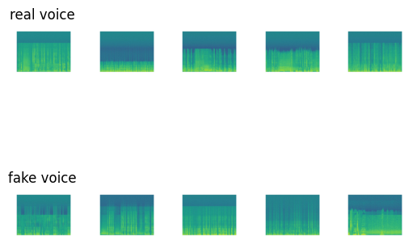
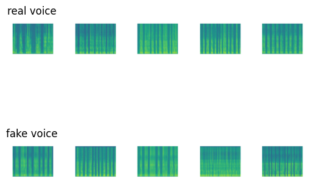
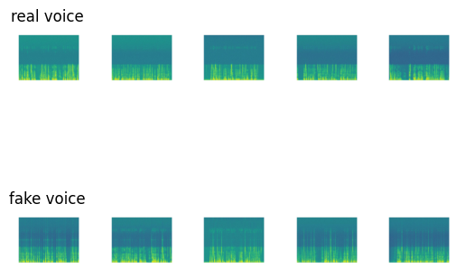
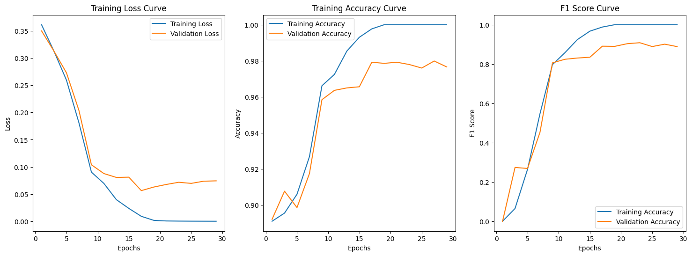
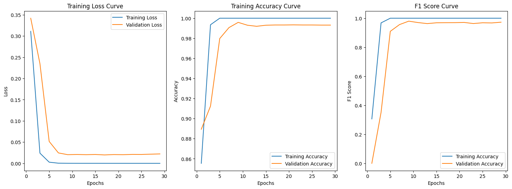
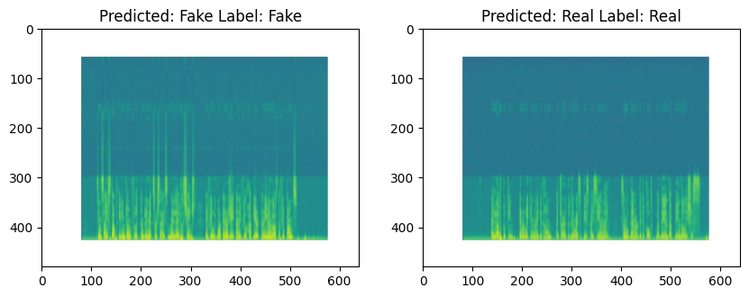
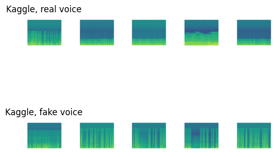
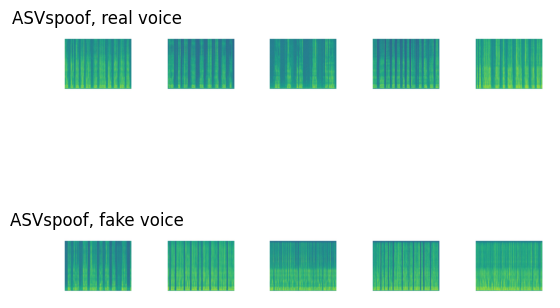

## Introduction
AI-generated (conversion) voices/speech have become increasingly popular, but they also present challenges in fraud prevention, such as impersonating someone to make fraudulent calls.

The problem that our deep fake voice detector aims to solve is the proliferation of audio-based misinformation and fraudulent activities facilitated by the advancement of deep learning techniques. With the rise of deep fake technology, individuals can manipulate audio recordings to create convincing fake voices that can be used for various malicious purposes, such as spreading false information, impersonating others, or committing fraud.


We think this project is crucial for safeguarding the authenticity and reliability of audio content, thereby preserving trust in communication channels and preventing harm caused by misinformation or malicious activities.

## Appoarch
To address this issue, we wish to implement a deep learning model to detect whether a piece of audio comes from a real person or is AI-generated, specifically focusing on the fake voices generated by deep learning models, e.g. Audio Deepfake (AD).

### Current Appoarch
Current approaches, such as the work from Bird et al., rely on classical statistical learning models like XGBoost and SVM for this task. Also, most approaches have various limitations, such as requiring special data processing to perform well, not resisting noises,  and being limited to English speeches. Also, Bird et al. approach the dataset size as related to small. We aim to explore the performance of deep learning models in this problem domain, with a focus on resolving some limitations in the current approaches.

### End to End Piplines

The proposed approach involves four steps:

- Converting the length of audio into a fixed length (30 seconds in this project).
- Converting the raw audio (signal) into a spectrogram, which is a visual representation of its Fourier transformation.
- Applying a CNN model, treating the spectrogram as an RGB image, to find the unique features within it.
- Performing binary classification on these features to detect whether the audio is AI-generated or from a real human.

![download (1).png](data:image/png;base64,iVBORw0KGgoAAAANSUhEUgAAA3MAAAFOCAYAAAAsMkQgAAAAAXNSR0IArs4c6QAAAARnQU1BAACxjwv8YQUAAAAJcEhZcwAADsMAAA7DAcdvqGQAAP+lSURBVHhe7J0JoBxVmbbf3rvvkh2SsASBCIOiBhFUQAHFEXVwZkB/0UEFRhBBBVeCElRwBNwAFRyDI6AIMgijMCooCiiLBpWoIANGlgQhIevde+//fU53JZcYICFAcuG8N5XuruVsXV11nvq+853UTbfe3Nr7FXspKioqKioqKioqKioqauwo3XmNioqKioqKioqKioqKGkOKMBcVFRUVFRUVFRUVFTUGFWEuKioqKioqKioqKipqDCrCXFRUVFRUVFRUVFRU1BhUhLmoqKioqKioqKioqKgxqAhzUVFRUVFRUVFRUVFRY1AR5qKioqKioqKioqKiosagIsxFRUVFRUVFRUVFRUWNQUWYi4qKioqKioqKioqKGoOKMBcVFRUVFRUVFRUVFTUGFWEuKioqKioqKioqKipqDCrCXFRUVFRUVFRUVFRU1BhUhLmoqKioqKioqKioqKgxqAhzUVFRUVFRUVFRUVFRY1AR5qKioqKioqKioqKiosagIsxFRUVFRUVFRUVFRUWNQUWYi4qKioqKioqKioqKGoOKMBcVFRUVFRUVFRUVFTUGFWEuKioqKioqKioqKipqDCrCXFRUVFRUVFRUVFRU1BhUhLmoqKioqKioqKioqKgxqAhzUVFRUVFRUVFRUVFRY1AR5qKioqKioqKioqKiosagIsxFRUVFRUVFRUVFRUWNQUWYi4qKioqKioqKioqKGoOKMBcVFRUVFRUVFRUVFTUGFWEuKioqKioqKioqKipqDCrCXFRUVFRUVFRUVFRU1BhUhLmoqKioqKioqKioqKgxqAhzUVFRUVFRUVFRUVFRY1AR5qKioqKioqKioqKiosagIsxFRUVFRUVFRUVFRUWNQUWYi4qKioqKioqKioqKGoOKMBcVFRUVFRUVFRUVFTUGFWEuKioqKioqKioqKipqDCrCXFRUVFRUVFRUVFRU1BhUhLmoqKioqKioqKioqKgxqAhzUVFRUVFRUVFRUVFRY1AR5qKioqKioqKioqKiosagIsxFRUVFRUVFRUVFRUWNQUWYi4qKioqKioqKioqKGoOKMBcVFRUVFRUVFRUVFTUGFWEuKioqKioqKioqKipqDCrCXFRUVFRUVFRUVFRU1BhUhLmoqKioqKioqKioqKgxqAhzUVFRUVFRUVFRUVFRY1AR5qKioqKioqKioqKiosagIsxFRUVFRUVFRUVFRUWNQUWYi4qKioqKioqKioqKGoOKMBcVFRUVFRUVFRUVFTUGFWEuKioqKioqKioqKipqDCrCXFRUVFRUVFRUVFRU1BhUhLmoqKioqKioqKioqKgxqAhzUVFRUVFRUVFRUVFRY1AR5qKioqKioqKioqKiosagIsxFRUVFRUVFRUVFRUWNQUWYi4qKioqKioqKioqKGoOKMBcVFRUVFRUVFRUVFTUGFWEuKioqKioqKioqKipqDCrCXFRUVFRUVFRUVFRU1BhUhLmoqKioqKhng5bM0413Le582AS69VQde+KFWtT5uPiP1+juZZ0P69Ciy4/Ssedc3/kUFRUVFfVkFGFuA3XLOa/Xse8atRzzbp3+nZvU3+jsEPVoDdykK791lRbF9tnMVNXiG87S6R8+6NHn8kU+lzt7jFUt+tlZuvJ3g51PUVHPHS2+6XxddsXNWt75vN763Rk6/mQfe/Lr9YWfD3RWjtLwVfrCu47SlQ90Pq+XFuqW7/m3+NuVnc8bKcowChSjoqKiotqKMPckNPmgc3Xut6/Vef91hU557/7Sr0/TZy6Y19ka9Sg9cJtu/tUvdHdf53PUZqBB3XLO23Xq5Q9oh7eepdO+eoW+dO5FOuX4Q7TzVtM0rrPX2NRK3f2ba3TzHxZ0PkdFbZ4KVqnRDwaTxcCysNXZaQM17ZDzdd7Jh2hy5/P6aVA3/vx6TdvrLTrg5TN1380/1drGtOU3/EL3zXiN9t2us2K9NEMHf+5anXTgxM7njdTdf9WDnbdRUVFRUWuUuunWm1t7v2KvzseoJxKWuZ9sda5OfetMpTrrRn4+Wx+5uEtHXHCK9uisi4raXLX8xydozuUFHfylM3XApM7KqKioTaQFuvLEM6Vj5+rg7ZK7SmfdUR9W9vLP6Jq7VmraP5+vUw6ZoUU3nKoLrrhNi/uqUiavya/6uD525KvCQxgA8fSH3qHzjt+/7fI4b099dIfrNffq+eovS7lt9tfbjp+tvaa2cwkavkbnfOB6zfrqmdq3fIVO/9Av9MIzv6Y3T0vKslLXnHqo5u12kU45aJpGbp+rsy+5VouWYP3Oa9yuh+u4jxyibTP+SJ4/mKGTzjxc24Y6HKfF/3Ktjn0l6VR179VzNPcHLkstr5Lh8JA9Fuvi+w9sl9f733jOWbrqzgUacVlVnKE93vtlHbF7r/pvPkNf+N7NWu4sSz3dyunlOvSrH9Isko2Kiop6jivC3AZqXTCnBy7UnDkL9YZvn6K9kpvwMSeq6/KTddUdK6XdZ+tc36xSjcW6Ze5puuK3vlnVuLHurYOOnK0DZuZDMqQ93zfMWXfO0WXzFqrW4EZ5iA573+HatTfs0t5nzyu0110f0gW/8j5bvl2zzzhcM1KDuuPy03Txz9o3bRWnafvXfUjvfeusUZYW73P1l3Xlj9wRGHZHINejaW880x2Eme1to4+ftIv2fccpetuend7+kms096vna/7CtvtabvxMvfCdn9XRe06UBubryq+fFcZq1HCn7Jqmbd8wWyf98y5rtY3lm/1x7mCcvNt8nXfx9VpOXl0zNesdc3T0q6exh9RYoOu+dqaunk8bsH2ixuXYsJ32+8SZOnA676OenBbqyk8cpZt3PlNfevfjd4X677hQ3/jWFbpvWbvTOG6XR5+LyXc5x9/luev4LpdffZzm/GYfnXra2zVl9Y+lfQ5fVpyjc967j7/r9fhNrHW+01HM/fIMzb3k5vZ57LKVtt5bh354tvbw6Zr8Rk/zbzRorTz+7nxLfrPvPE768Rm6jt/suuobFfW06LFg7kOaV5uhnd86R4e9cppyXAsNTCMP3KVlW+yibbv8uTZfF3x8tkb+3zUBmP4O5ubepmmv/7w+9tZdVMpUdce33q3zlr1bX/r4gSqFfDoPd+44sLNuUNed/hbdsusFBrfOhXbJpTr1Y7/RnmefrQO5HSy7S3drR+08xb/Rxkpd9/m368aZX/U98flKPQ7MjXjbSRdL/+9U3wsmu+gPXqovfupCLXrx7A7MDWrRPYs1ZceZLqu333GW5nxpQG8+3/tnvflRaUdFRUVFJYpulk+BRhb8n5YXe8W9ta0B3XH+abp7l9k65csX6bQj9zb4Deq2r79fVwy8Xid89Vqd9+2rddL+Q/rJf8zRjcOdw6w7LjpN977iVH3xAu/zn2fpAF2t805/9DiBh68+UVc136Hjv+C0P/EWgxw38Q/rvBukAz55hdO+Vud87nBNuXWOzr58jbtZ2OeaIe114iU6x/l/6cwzdcQ+7Q7vois+pPNun6FDP+f8fPwZRz5fd3/9WF22AH8fA8A5Z2nRCz6rL1EuH3vGh9+tfXdou8/cdtGJujF3iObMZdu1+tJnPqSDZj3O7Xb+WTrnrpfruLPbaZ1ySI/uvsCd6BXtzXc4vSuX7K2PfrOd3hmH7qRyZZYOPSuC3Mbrr1r8oLTjTk/wTPu+C3X2l65W/g1ntb/zuefrzZOub5+Lo8c/+rs8+zG+y8l7v0bbLvyhfh7OoY6Gr9Ft8/OatadBLvwmjlv3b2JozTFrn+/bPnyh5n7zr9r5Q5eE8+O8uZfquEMO1A7rtDIO6pavHaeLF71A7zyzfW5/6cP7aPllx+m8W0ePq1uo675+obIHfdO/Daf5pTnaddWluuDy2zvbo6KeaVVV2/UoHQHI8RHLl1XargNyKDdLOz/Pv5EHH8uteA8dEECO93ntuv/+mrwAGEu0WDff8lfNem0Cdz3a+5WztOSma1e7ei6fd5MW7/Ia7Zv8vqbs0gY5lJmonWfO0PKHnsgBclA333Czevd7u17Z8QHNbfN2veGVnXSCerTtTm2QQ7ldZ2lGc5GvV0/S5zQqKirqOaIIcxuj4ZW699a5OvvK2zXt9QeNcvlYqeXbHaXjD5qlaVOmaXKvb1grrtV1t+2oNxx3UOdGnNe01x2lPafM17zRncoXv0X/ttv09s27a6YOePdbNO3Bm3XbqIHny9P76Lj37K8dSHt8j9fcpKt/8oB2PexMHbAdn30jnLK/jvi3vbX8x5foltD5TvY5Qwds3+v08ypNmaltg7vNPF137YD2eudxmtW5SY978XE64MWrNO/m+Rp9K812OgWl7ff0DT2s6iivXOdsKk2dpV075Vi39tab/31/TVvdDm/Xbj136Z7QH1mge+4e1OTd9mm77Vjj9ttfO1X+qnvjTf0p0gxN26rz9jF0248u1eJZ79fxr+t0rnLTtNcRR2nWskt19aOGh/q79Lm4zu9y0uu1164rdfttd60+h0bmXa+7xx+kfXfzB34T82bqDe9/86N/E1v8QfN+veY38ffne0fpTkcw16Mddpu17nFCD39f1/1ukg5475pzu7TT23X0gdN0xw++/6iHJJP3e7/evEtP+7c3aU8d8trdVF7wB3d3o6I2jXbc5e8fuvT/8VKdd/Khmv2B9nLFHx/nurjljNXX0SB+M+UBrX5+uOAq3fLI3tpzVDalPffTTktv1m8fIN0FuvGmBdr5la9ZbcmrPXiNLjj13avzP/tn6xMVZbH6V0nTtxnl0WJNHp9Yx63GSt1x9ak6tZPu7A98TXfES35UVFTUEyrC3JMQ7mPHMVD9mEN1zuV/1rS3ztVJwVVxjXZ+MZaHUbr7Tj3Ymq8r33fgqMHux+nGJb45r1jTXZy81VoWrak7atviQi1+qPPZmvySPR7dcX1ggRY31tFB3+UF2qbBk02/T/ZZl2XrgT/r3vJK3XJ6Uq72cvHtLY2s8h2YgexHHa1x8z6u4084QXMvv16LRlkT93j3HM1aeq5Oet9R+sJ3rtLduOU9ntzB2GZ0B0M96qIzH6BzpnbYIa/lC/68OkJo/w3X6570JE3eov05amP16PPp77VAi0w5f3cuZmZph+3bVoDVfay1O4uP+i57tO+r9tbArf7+wgErdeMv5weL3Q589G9ikfybOGb0eeffxOLWo38Ta5/v0w/XEYdO0u1nvEWzTz1DV966QCOjrYWjdb/rqm01ba3ADZNnvkClhxc+CuboaI5WiYo4XTwzo6I2C91+lj5z1i80+fBv64yvfi8sh7x4NB5tmO6d9wvV9j5Qs0b/hrsO1B4vWaR5t9zlS8EvNO+RWZq1Z+chypIr9MU552tkv7NX53/C6zYoKspjav4F79F5t07TYV9up3vGV9+vXZ981aKioqKeM4ow9yS0Opqll3O+fLaO2G+79tP8J9TeOuyi9nGjl9Vje55qlWuqd94+sWbogNP+vmyMZQj30+0P0cfOvkKnvfdAjb/vGzr9uEPXuKn17qMjPne1vvTJo7Tz4NU672OH6NQrnnw0wVlHfl4HDJ2v2UccpOOPPkhzrqro1R85Wft2xzv7xstgY6BfeJ87ahssn08bSjZ7vkYvqV6jG39vmltyjeYtmKk9Xj36fPdvYu1zzstpb31+Z/u6te0bz9QZ/3m+f3uT9NfLPqSPnHCqbllHRPXHVLm6Ab+NqKjNQ4sW/Fkjs96ht3XGlPKApP9JRwqepxtv8E9077+3/u21z34qz7tJN95+m/pnHah9g+XcuvdOLdryIB306jURKpf3rY/teprGTZCWLXv0vsPDyY92ge79y6B2Peho7ZDcTFesUAyCHBUVFfXEijD3TOl5MzQ19WffjB/fbwSL1EjnfdCSv2pR+Qnc4rZ7gbZfy3oXdN9ftDjjzvs2fr/NdpqW8T4Ptzc9StvN1HRvW3Tf6DFE61Jek3c5UG/7+Pd02sGTdcfV33+UC1ppuz315vedr3Pev7eW/+8luq2zfoP10G90x8o9dMR/Xa1z5nr58pk6OEaheIpkmHrZDPXfcMnjwM9M7fD8vJY/tNaMTo07tfDBv3eVelxl9tG+e/Xozt/erIcZe7PrQXpdEknPv4lp4jfR+byhyk3Tzq8+Wh87+3wdOOEWXffThZ0No7TzC42vi7R4LU+w5Q8uUG36jBhIIWpMacqkSb6uz9cd4aFKVctv+KpuCO6QT0K/+4Xmb/nPOmBdzxJn7aMXjFyrq25Y7LcEJ+lowmSVHrlLd3fGN4/cM1c/mbc++XfG4l1zvm7pTIJXe/AKXTMvmYOuDXsL75rftoTXFuvGS76vRaN7KMVe5Vb6frghD22ioqKingOKMPdMafpbdMBL67rx66fpxgc60MSYu9uvX31jDLrnEl14w8PtG9rwXbrqG5do8cwDn2B+nz11wD9upzsuPlU3dlwca8uu1wXfvVmT3/gO7YULTWZ/vXbfSd5ntq67v303HOlboLtDWfbRQW+cobsvP1lX3r64czMd1OK7rtH80Am+S7f8bL4WJ66VvtHeca8xbqoBUSs1/+fX696BjmtlY1B3/+Wvqm1JR/1J6iFDZ880TYtn59OibQ8+UQdMmaeLP3Giv++F6ud79fe9/MH5uvH2NlnNet0hmjb/azrPnbmkc3XLBedr/pS366A9wy7rrZ333l9dv7taF/9mgXbec5/VY2/Cb2L3mm48z+ft4/0m1taC63XdXYtXu1bWls3XgytamrLVjPaK0Zr0eh2w5wpd9425unuovWrknks195rF2vVf3hJhLmpMqbTfUXrzVr/Ref/+eh17xCE6+979ddwhu3S2bphuuel6TX75/usea5rZR3vuUdNI7dHj6bTLu/XOV63Q1R/BJfogfeYHk3XYe1+zXp4ppf3m6H37Demqj7ePnXPJgF578N6drT064NCjNfmPc3Q87tbHzdG9rzxNb97em5InR7u9XQe/8C+6+Dhv//czNL+zOioqKuq5rjg1wQYqCXv+qKkJHqVHh2N+lAiRftEZuurXd7XD/xP+fPuDdOhHj9asrk7aUz+kvRdeqp8Q5l9/Hx7978Kur1ZV915zhi648uZ2iPjHmppg9PQDuR7tfOg3dfzrcJlZa9oC512asYfefNQpBklD5alnuMPtDjQ9+0eFbV+p275xsr73uwXtuYHCcXvrkA905jJa19QEP5ihE8N0CqxAa7XZ8E2a+7HTNH/0E9iumdrjqDPCnENRT4F8Lt522Vm66pd/1vLwfVthSokTddI/vyB8rC24Qud/60Ld8aC3P9bUBP4uZz8qVPi6zv/FumrO4bpmyX46+uuzHz0+Z31+E2uf7wsu1enf+H5nnitrrXP976cm8Dl6yWd0xQ3Og/N3nVMTrOM3u876RUVFRUVFRUVtPoowtxnpiUHxOaCB63Xe7G9Ib/2s3rbrmsiFy66bo3N+8QIdPTdOFBsVFRUVFRUVFRWFoiNb1Gal5b/6oe7oOVAH7TdTkwlF31l2fvkemjI6pHZUVFRUVFRUVFTUc1wR5qI2K02evp1yj9ysW+5ZE4yltmyervzutVq2yyzt2lkXFRUVFRUVFRUV9VxXhLmozUu7Hafj37at7v7y21fPPfbRz5yru7c6Sqd8/M2jxv9FRUVFRUVFRUVFPbcVx8xFRUVFRUVtCi2ZpxtXzNC+uzzp2L/PUl2v8959iaZ9Zq4Ofl4qtlNUVFTU4yha5qKioqKiojaBFt90vi674mZ1pl576tS4SXOPPk4XX3jUag+Hv1tOvFBrzSS5Qbr7okN13q2PM8fckms09+RD1uR3zLt1+g//3Nm4YXp0O83XxR84VbeE91FRUVFR0TIXFRUVFRX1LNLIDSfqI7/cU6edcsiaeeSe0qk2VuqaUw/Vva+7Rse+ch2xlxvzdMEH52jRq87Uxw6ZpVJ6UP0L/6w7ys/XXrswFc4TaS3L3GituEKnn3Cn9k2mu4mKiop6jita5qKioqKiojaBFl1+lI495/rOJ2tgvq78/Lt1/BFYsw7S7M9fqDtWz7fJfIhH6bI/3qQLEovXvx+qL1w+X/2dPdoa1Lx5f9bOr379uicEX1shz0Pb6R1xkOZ8/RotTibkX3CpvvDhgzrWtYP0kZPP0m19zDt6gn5yn3THRW/X7A+4DD9+oH1Aogf/rHsH9tYBhxrkmFE806Nx2++5BuQMlseec40W/fhEzWYC9E7aj5pbdJRWt9M9F+r0z2JRvE1XON/ZHzhR1zzc2SkqKirqOaoIc1FRUVFRUZtci3XNWafojqnH6rRvXqvzvn2Fjp5xs8777Fwt6sCVtFA3nv8L7XDCpd7ufb7wDunHZ+gnCzqb0YprdctdL9CsPdfM0/nYIs85umPGp3QO6X3z2zqgfJ7OvuzPaukuXfm1S5T/l05eLs9nj3m7dh6/i958yhztu6W067sv1Rlf/Z4+9sbtOul1tM1MbVu8TTf/bHFnxTo0/1xd0H+4PjXXaV/wbR2yxU2ae9YVj+9yutPhOul4rI176BDne8ZXz9SB0zvboqKiop6jijAXFRUVFRW1qXXXFbruvpfpgH97ucZlWJHXDocep72Gr9Z1fwx7BE1+9Tu075R8+8OkN2vvF6/SvfesbH+2lt/8Cy1+xUHat6uz4vH0wDW6eemBetuhuwgDmjITte9++6t86/W6p1VRDYhs1thi5VXaZtr6RRTO7KNDP3iQRr73bh17wgm64GfztTxJZrX20AFv3UUl6up89zrq3dp+wTW6MVraoqKiojZIEeaioqKioqI2tVYt18iWM7RNALlEs7TDzKruXbDG9DZ9m5mddx35Lj48lNiz7tJ1P1+oF75sn87nJ9BDC7W87yqdkwQpYTnrGlX7lmu5837zew/S8CXv0vGfOFVX3rpAI6sthE+scbserVPmXqGT3jZLI9fP0ZxjjtNla3xGJdd129F17XqBZkxdqMUbE5UlKioq6jmoCHNRUVFRUVHPBi34lW5vHKh9d+98Xh9Nf7tOCm6Uo5dTtFeqDWQnff1SffSgGVp85Yf0kY+dpfnDnePWR5kebfvKw3Xs567WKf+S043fvFT3PmYAzEHVyvn2GLuoqKioqPVWhLmoqKioqKhNra1maPIjC/Xgo6xf83Xvgrx2mLmWNe4xNP+Gq6VXvkY7dz4/obaYpnGP3KV7Hw/QEiD7wvk6sOsa3fKHzvoN1LQXz9KUlYu1ehTdw38dNRbQWuHPfTtq+lrD76KioqKiHl8R5qKioqKioja1tjtQe21/i37y7d+oL0BOVfd+71zd0nWQDnhx2OPx1bhJ8+bN0F6v3aWzYj00883ab/v5uuprV2lxMqZteLHuXgByLda9dy1e41q5Yr7ue6RHpV4+TFZXt3nsgQVap6FtwfW67q6F6u9AYm1gga677Gote+GemrV6poF5uu7yu9rpN1bqlu9cokW7vEZ7TWpvfUz19qpLi7Tovs7nqKioqOe4IsxFRUVFRUVtck3TgSedpX0HvqlT3sP4tUM0d+HeOvbkox89tuyxNO8Xmr/lPtp7aufzeok8z9YbClfr9KM7Y+Y+fKKuvHOFt63UHZefqNmhLF5mX6rqQZ/VYbty3ETt+9ZD1PWL9+s4bzv1h2tNTWAQvO1bH9LsY9rHHv+Rk3VL71E65UMHGsQ6mm54zVyoz5DvEe/SVZWDdOz73/zEAVYmvV4HvzGvW07luON0VQyYEhUV9RxXnDQ8Kioq6hnQ/953hxqNutTM+rWltFJSQ2phmfDbdCullJdGtq50Ma2sX+vllrKluqqVtPLZgmq1unKFlJqNhmpDRY0fX9PgcMufc0rXW07HaXhppXxcd0X1SpeKPSMaHvTxpbSaqbryyqoy0vQ+GbVUV6k7p5GBqlTrREjE1pJOhzSUaSjDar9vNn0MZfRxqbq3V8iPf+SXUjpfd3Warl/OZXd6zqfhj+m0K5iioiXvWVGxIA2t8oEtBke1nGZIJuSZ7nLdMzXVhwrKZpqqpmrKpErq7q6qUmuqXiuqUa0o7Vc5XeracLky2aybtayiV9cqOTXdqCllXBqn5/I2Gy6fM6L8LCiVlrrGld0WLmc96zo0nKfTq7lAddeRqvi/dK7dFi23cc+kfpchHfZPu12qZdKDtJrtdhhxsZwwx/3riwL1RK1LzDP3gxk66SmZwDwqKirqua0Ic1FRUVHPgN514yX61d/uNwjk1Bg2fBnI0lVDRs0g0jR8NcGBrMpdw8pMaam7a5VqKwsqTevTimUlje/p0kB/XeMmyfBlCFkyXc/bcakefMgwMjJOhaqhwhwCqzRyTZW2XmJo2kbTtn9ID9/XpfHT0xqq92tSuqj+5XlVTCNNDWnb7Yp66C8javVPUCZtUDT0pLJp1bNNNfND6nJ+jbTBsOn0DUWtVlapoYzSfTkzHs4dBj0fV5gypIphsWWA7O5dqVqj1+Ajw6fhK1dRszLFeNWvqVvWtPCOLqWqPQYsYxD5ORnwr3v7IYPsKo0smqaC4WwgM6x8bkttPf1hrRpoaWBkSzWWD6swNNV5Dvs4g5VBK9dVUKWwWJOn1tS3fJwarbohsGj4HfHxeVUNvDngzu0NRJrTlCk2NX2H+7Rq2RQNDfSqkamox+uGl/G9dClvYKsbZtO9aVUNmBru1cyX/lkDQ3kN9/cqO4G8utSsm04NgmnAdakhz+l//DWv0DF7bEgUkueYIsxFRUVFPWWKbpZRUVFRz4DSjbKy1bzhrV85A0yu1TRg1JRt1AwO3t4qGwpGgj0p3/Q2w1O6nlLOsJCv9npfH9/IqVWvq2BQSbdGlMtkAwRmjEJNlrSRKF0zFFYDzKQNYekWeWScX0O5hiHK++RqaeW8X85Al68Pe5vhJWzHEuZjUt6nWfU6Zhdzki5Pupr1upTyjaYKJpeU98s2G8p4yaVcB+pk2Ms7ffIHblIAqkG1Ua0bWEckQLY6YvYxGDr9bLPuNJ0nbWFgKvnYjNuiZcrLpnMuG4Bb1nivLDaNY7khFYOFbyjUJ2sgzrh+rZQBuO46eX+jsaHUeWtYxXR3yCOfriubMTTWDHmuY9rtTj1z3htraCtt6PMRxr7Q7lmnnW7S3vXQfhl/QYXaKnWVi25rb6+1VKDurnO66XQabgvnkXK7pbx/2vWJioqKiop6JhRhLioqKuoZUVatJu6TxeD213SHv2UYMENY/i+4SKbDupYBqGkwYf+G9zXSecGCh/Uto0oFt75ceJVfjSnB5ZAliOQw06W8BX9BFueXyaTwZgzbyQd3TY4IebJwTFiDXBbDmDnOawyMPpb0MllSBuYCMXXypNy4j7q8PqZea9dtdUreN+OMU2kDkI8PprhwHPkh3Djb5UinXUZvahnC2IXy1g1g5IMFE3fPlHegrCF99vG2UA6DGe2F62NYZ8Ay74admobQTDqz+hjyGi3qiJUwKVdSPz6Hdkk1DH0GuyzkXXE+/kybUR7/ZTKZ1XV+dMpRf6dXnqLzolUuKioq6ikRt/WoqKioqKdZjE9LpYEV0MAgYDBJgCLwg8WWAAdeYTYIIJNmvBaD6xi/hV+i3xs72q9e117C4aPUMjSm2/sHoHO+nfTC+C7vDxSxpJ1Rmg1JGn4NSNIC0BgfRvmAUD5jYSNfdnTa/AsARPrthW25fNav7BQSCwp1yfpYyoQvKMd1juctENcuhBeADggzQNEO2Vy7jCHJznHJsUBbGzINbrl2+7IbYJbJApWuQFjTLluANI5Pymel3TisGq2w2Uq+j1Qq7w8AossT2ra9hHqGdDmos0RtdqrX66rVagHCef/ggw/qRz/6kb70pS/pQx/6kI455hh94AMf0Oc//3l9//vf1z333BP2Z18WzjWOfSZEXuTJ77NSqegPf/iDLr300lC2D37wgzr22GP18Y9/XF/5ylf005/+VIsXLw5lS37THBsVFfXcURwzFxUVFfUM6MgbvqmbFy03OVQ0srKn7Z5XM/RUsgYJgxKuibmcRrIVFae01NM1qOFlWXVNG9HgyknqmTCg/pXd6p44qOpQRuWlPdp2+z4tW9ajkQHDVjkXGAk1DDE9W/VpaGCittx2sZY+MEkTpleMk3kV08MaeLBblUJKtXpT221d1t/uLyk7VHQvsqFa2oBXwAroj7macuNqUrHqTWz3+4YhxuWurUwrU8cqaGDKNdU7paoRk1+jWVCxtNxpT1G9ZqByGq3UkKFsvPLpEU0e36cH/rStOQ1X00zofOIXWc80NX67fjVzZfUv3kJdmarKrYrSXT3aeWvXYVWXlte7pL8V3ISQHqDmIhV8fLc/5pZpq2kZPby0FHA343pkZQh0rcuMUWy6jUdMhl7T9OGtUlU7PG+ZHnyoxx3mUrDa9ZSGNPRIXq1yVvlmxlU1AE5sqlpsKPtIRjNftFj9Bs0R55Gf1NSy5T2qlpuuF6TqpJdnlGnl9LH99tbRe+zhFVGbiwAzwAjwueSSS/Tzn/9cDz30kFauXKmBgYEAQFhXJ0yYoFKppOnTp+tVr3qV3vGOd2innXYywAcTrwqFQnh9OgTE8XugrDwo+O1vf6v/+q//0u233+7f+TINDw+rr68v7JvztaKnp0fjx4/XFltsoTe84Q068cQT2w8XLI6nPlFRUc9+cfuJioqKinqalcul3CE0HBgGiAjZyhl0GgQRyaqeNvCkDXVsM9iEoB5+n80aSorulPm4cLX2Sz5v9vFCOlm/Am6tjI9rNcPCfj4K4xaju3xI1unh5thQvVpVk+iLWNAAEINZxuVKF0Ay/wWzU0otBvFlG5jvlPZnokNCTumW90+13UWJYEleTdfDWSifaRj46qqblMxlmMZcfuNjpkuFbFE+TDmXt+SNKe/bNHI1XI5Q5xBZs+n9cCZ1u+AOSiWbBsg6VjkXOeeyN3ETbUer5Dgq2WL8XgiM6UwNpyECJRDmNvT/LjaLk+JzsrRcTkNm0Uk4awJjWk7TQO1uvxcDHyXJeMlVXDnaq+2ySdq5VEF5onoGF1jcQvOusxNy+5B/AtVRm4+Amx//+Md64xvfqC9+8Yv6zW9+o3vvvTdYtHbeeWfttddemjVrVoAhIO/3v/+95s6dq0MPPVTf+c53VC6XOyk99Wpbp9sLGhwc1Omnn66DDz5Yl19+uf70pz8FmAMoX/KSl+jlL3+5dtxxx1D2RYsWBdg7++yztcsuuwQARAnURUVFPfvlW2RUVFRU1NOtZtPAJnwWDR8GgvBnEGn5s3lgtUKnLrgX1rwfx5R9bMdtyvthQQhjuzoiNH+wooW/jlJ1FUp1ZQtDKnWTVlXZnD87PcL3E9AjlXf6mYo7iLUAekkhSIWxaW33QcOVCabtAul8gDpem2244xBgpoHrpe8m7XoZ0wxLuTxWAcaVeX9sZU4jbYjLGqKULq8pq8U+4XjawnuzL2MKAc5QV1YTOdOUhIspQJXUls0cnw4AGNa4fG5XmjWkhyum65B0bn1AAOpQJ3APQPT//hjcOYE7uCzAncsQ6khdGyoZqtOtqpmxqRqxZgzgKcbSGQAZf4hLJkqyito8xPnw1a9+Ve9617v0wAMPhM8A0Xe/+93gTjl//nzdcMMNAfAAp//93//VQQcdFCxbCxcu1PHHHx/g6ulUAnNYCj/2sY/pnHPOUX9/f7DSAZSUD/i87bbbdP3114dXFvbbYYcdQllXrFgRYPXcc88NdYyKinpuKMJcVFRU1DOgbDbTBoPAJIYIXP0yhgSDQ8ogQkcOsAig4R2TsWzMk5bJhFnpgisggUSSJ/ggRzvQBwDBPt4rwIr3zTaULwJRBqtcS4V8w0tTpYIBhbFr2fZxOI8RFiSULaTVHgcWAMvrADWvchnYhyAqLlN4730MfaGMLjOA1Q5e0gzztbWICBlemesNwGoHMUkBVsqFuvA5VMxLO/1WAKpWgEPqiSslnVIjXLCe8RbISzqqrmtI00unjCzZnOvgepe6nZ7BlfKHNiOvkC5vOc4bKENIB0hkP8YetYOvGFNDelgnAbyCAbuIldT7t/Ngf++IRW41yHll1CYXDz1wq8SFkrFlZ5xxRlgP+DD27Ac/+IHe8pa3aOLEif7OOG/a5yMui/vtt58uuugiXXzxxXrFK16hfD4foIk0EsBiWfM73DhRVtIbGRnRJz/5yTA+jvPp1a9+dbAm/ud//qd237091QVlxMWyWCyGuhx55JH69a9/Hcb94XaJVe/LX/6yzj//fA0NDalarQb3zAh3UVHPXsW7TlRUVNQzoGDVwlIESBh8eIPlp734s0GobXxiH6JY+oUOmIGJzW248t6NTpRHvwegsHsBJuF4AMQbw2d3NNsWNK/LMK7La3HzbFZCnrgsolCK1Z1SMqLT1wZLtoVXr/LhLndiMeNDOy8OoYgAIuVlou4webjrQQcyBHrpACHumdUKh+BM2f4L5Q1puTNtuKXKlCZ0lJ1XiOhZaxgqDXm1tOqGtAB7/BmcyANQBnqxBJKPkzPMGhozgy4bFkjvz0q2ON02dBrqDG24vlI5oJV2Ie/ggur2pT1ZkwploT2cvtenmD+BOfUA1mbO6bhs4UDKFDKK2sRK4CyBoVWrVukFL3iBvva1r+m9731vGGvWfhDRfniRiPccy9i4f/zHf9SZZ56p17zmNWE9MIfbI/D1VH7PnOu4UJ511ln69re/HUANF0sAEvdP4A2XStaPFsdR1q6urmDNYywgdWRc4IUXXqhbbrkl7AeMUs+oqKhnp+KvOyoqKuoZEb39NpxgZsoYJnDR4yrM+C9ALoy3InCHO4q4KmYNYTmsULhN5hhHh3UN+DCcBDg0qOT84k7d6jFk5MQhflMb4X1WNVXDhNlVZxaGwjn9VMP5e2/ybDrzAIvcEYLbIH+Uy4vTZi62QDZeyRYAJ4w9a68IeWSy1RD8gzpSDsbiJVMBhLJ6NdMqgJ4hDaiN98Ce1zZbBffAsYplvZqyIUOT18O+jVZW2XohjHXLGNzaVhE6s86b/DLu6Lo9AC6As97sUjo34nSKXsN6Cko9Aa72ezxB0xnDrduZNgnTRWAqdTmJ5NlMZ32s19cpYVqDjarrYQDI1ryvy+50svVsqJFcvnQ4NvyL2sTi/Lj//vuDKyXjymbOnKnzzjsvwBHi/API2K99LrWVfE4WxtF94hOf0G677Rb2J/rlX/7yl7DtqbJ2AWS4TAKOCHgkWuWMGTPCNhZgjDxHi89AHq+Ubc899wzAufXWW4cImETlXLp0aSjn2sdGRUU9e8StOyoqKirqaVa7w2XeCHSzZl2wvvkVYIExWAAqgudhcWLMGvCB22CjWfFrQ/mcNxIMBMAyJ/E+dE47abZd/VLKZQuqlaVqPa2K96saUOoAVSqret3Hp7295mMMKFi6SAMLF1xIOZNOot/5rxGmC8Aqh0UqEftg5VLD6fmv1fAx/qsbgMLxrhh/TZeBeevomLbn2AsHdxLpvPUS3EVDQ+BqibWtqULR67CuJWk1AhmGfBohgiYdWgKUYHHzJsYAsgsWMy+JRTFkQplcpzV18260XfLZr6Bb+4twOq5rJmsIxn0zdKyxxLXbF4sn+TYoj4sawHj1sVGbUkAO48x+97vfBRBi6oE99tgjnH+IV77vdVnmWIc1LAEpXBxxf8R6RnAUAJH0Rx+3MeJcJCgLrpa4eeIyud1224VykP/o19FK1rMg0iEC53ve855wTl933XVhPOBTVc6oqKjNUxHmoqKiop4BASIsRETEklM3ALTHmrVBKvBLZ8kbHswM/gA04UrojloACPbNtOd+CzDnDp4/B5dBd+RCyt45AIbBzx/Dwji7nA/PAFEEYmES7rSxw++ZM609Xq29tHGJ/PxfeEcS/FEICghUscV//hyO8SasV7BP2vCU9vosbpd+bTbYueD3THcA5DGGjo6o06Rz2uln8kIHNLynqs6naTAkpyZTFBjQmq5XezudV+frg8i/AUC2cm4XAqYY4BpY1lzihsHLAEtfNtSBts4k49vadaPTzncQ5ppzRdpjBmlPV8ZfRiinX8M8gU4npAv8GohpZ8CPCJuZvNN1AzRdznYLRm1KPfLII5o3b14ICsK4tze/+c3he0bJuZ68X1vAEevb50V7OeCAA4Lli3Ftv/rVr/Twww/7+2//BjZ2Yc47oBOYw7WT4CyUIdmelHddZaVsrGd/zmXcQwmC8qIXvSikS6RLyryuY6Oiop4dal/ZoqKioqKeZhlAoA8rWKawXHkd1hwsaxBRCwtPAJ5qCLrRcket5nX1RtZwllPNsNIwqNSqWJ6AB+9j6KDDh9VodcfPV/Zit+EpPaJc3tu8rpQn2L7XM0bMMJM2zLEfMAckASJBHM8fnT/vAMyY0PwW0MNyR55wTtuNEm4BQJUq0LNUpsn4HNcsR1mArGwALSKIuIaG2TaIJSItDm80qQOA5HJghWMKA44P1jjKQ5mBROcDoHFscNF0ddxGtRrg6DwabGF7U5lQF9Jo14m0w3FesN4xPhGobleIsXfMmwc8dsZEGRIzAcINbf4+OLreqHg7neyysrm21TSMc3S1CGSzOmpm1CYVrpX/93//FwCJyJSTJ08OEA/w8DtZXyX7ctwJJ5wQPgOKd9xxRzhH+LyxyxVXXBGgk7FtWOUSQCPPcB6up5J9cc8EXqnvNddcEyJ4kk9UVNSzUxHmoqKiop4BAWGpNPPK+YPBLVPPqM64LENLNpX31dioQ18slTFDpFSpSRUDW9WQ0kplVTPk8UpglDBGzscyqXWLKQzciWOKAkgldOj8r0ZUkpwhhHF1BOnQkEEjFyxmacDLl38savVae3/MZe1xY8AOr/zvTcBMimPaEMfOIYImr/y5HMZIVV2/aqriiuaC2yNQ5dIpla0bTNvj2BrNmjuY1KdtSSR9Eg1N4v8aVaZQ8HFZVz4PXBIxsOryF5wTQMnxPpZbVygcCSDWUUbKi1uk03a7Fpx3JpVM5cDOISe/c4m9voYlzaCcaQGYbgxvCcm6zv6GwkTjOX9headTdZlxUU37OFwuC8XhdnKMaQzj7oK5NHy/4TuO2qTCcsaYOQKd7LrrrsFihfUKwNkQQGJ/FtwqiS5Jesz5dvPNN3f22HgxJQLp1+t1Pe95z1tdPvLdEAGBiKiWTHpOOky9wETjG1LnqKiosaUIc1FRUVHPgJgAHBfHABq+8oYxXJ3+FTgDb7AqA9wxOA3I8H55Q02eOeIMEKYhMVwuhxEs4/VmkCzumEwCDmB5aXMEl3bv2Myq1QCcfGwgHQKrPLqDyBQIAbAC8GCVCqVx0TqWsbAAOE7T29p5tAsegI+NTjNt0MKClTJctgxD5I27IlMVEJgk58rgPprPERSlk453S4dpF4xX/lwsgFkAUdptkA+d77SPIcplezoEquCDEloa9TZDG7jtfEhwZQUKsQ7S3gEQvQ/lbY+v84eWdzKc1YNFr10WEmznAbD6vatMfmEsnts7zCsXJi1vGRQBO5fL5UvnvGCVo43d9tQiatOKKQmWL1+uKVOmhOkHGO+GwjnVgZ71EcclS29vb0gLt8VvfvObwZURUNzY5ac//enqScmJWJm4TG6oZQ5xDBY+0gEGmZaA6QmiZS4q6tmr9b+iRUVFRUU9aYUoiwJ4sCAZOjquVMYFd7QALAKJuMNpIMrnvRjg0qmyioa5bKbq/RsBiFJYqrwPbpFZLEHBMmQgccctWLtI0/BWr7ZUrzOHVdsqWKmmNVJp+RUrHnm2920DSOc4lyUEMwkg486fXxkXxnbSZx8sCBySBG4hHT6XcvlwPF6OuBsCYGxnPFuj1lSz7nK71K16LdjRSCsU1SAZXBNJn7q1Gu39XYe2ZcKAyHFuozDmEHdGr0Ucxhi4NnQxzYDTMzjiQhre41aJxbOFhQ8QBpAZD8U26uXvhAnZgTJXgvy8t7eBs4x9w6LItAjt760NfgRDyYZxgUwTUXfaWFexXobyGkRjx3nTK3yXXhJr3MZ+J+Gc8EJ6/AaYb+6+++57ShbgMEkXt9CNFb8typrUO3HbjIqKenYqwlxUVFTUMyCsOFmDRyGPxcrgYNgJY7rocAFPJhLsR8x9hltiPmOYYKkRwZIOmffpWKiwDIW9fWyYmNt/KAEsrH4ZQ0UqnVUOt01vS6UKLgPWrkLHasYRBCWh89ju6PF/6Ajy57tDmIQ757Wsw7rHLcMvABo58n8Y/+eVdEJx36SMAFqw6NGJ9JJl2gAfDx/mc5QTSGrXmyRDfp3PWCAJKNKokSelcnG9vZjLKGNezDL2DoBtlza0A53VphfgLbiDepNLpmodEKND396X9+1OfdPAnPZxbVAE+FLuTDO2DldUom7SlgE4vQ3wDtacAM9Z1TvtTpTLHJFlKLfhMbEaxo7zphdulaVSKUyijWXqySqBuGQBvLB8YZU77LDD9K53vWujl2222SacX5w3QN3GKikrIt2nIs2oqKjNV74LRUVFRUU93cJahDXHlMIn1QnyYXDLGAxAE3e/vA1Iy6iC22M1rYohqNAqqGq4qBlUmoaPKpEbidJYy3t3gqIYRwjUAYwAHyzZlsYbmhrZugopgndUOu6LdWdUNsCwryGRW0BmyO/b1iSKF0DEC+PzKHMmm4ATAmIazsswCCD5H8E/GgBcACODYmFQXbm8Wi6XUcowCOQ1ZK7yurpyWcb4taEnHM9dCFdM01CjZVpzGWvMw0dLAEjuhxIzskBa3RXjp7cHq6F3BdncfiYvtxl5yu2RVa3qtJx/pZFXjeAxDbcd/Vnmp/OBVBGgzPqAjNuXcXjANRZOuU2N3C6z2w/o9XGtYCzJGESrAX7rGWysrkcOt1K3kdsl63ZZHemTukVtUuEOOW3aNK1cuTKMnwPoEktVAjrrq7rPW45ZsmRJcN0k7Xe+8536+te//pQsRMoEEPntAZ/kF87ZTnnXV0ndcNlMrH2M8SPtJJ0kXV6T/Z+sOHZ0myYL61gSJfmxjFayf1RU1MYpwlxUVFTUMyCABk/ETI6xVx346myjO9Pu0tC5MXT5XdsS1LY6EeyE8V2ZNLAD4eQMERnDhtNJe70JInSevH+Y88yQUgjumTUVCrgXtsJYu3y+6fVpZSlHEdBqqKvo9waSkB9w5PzDhOYtrIY+zjCDBSvH+LMcVi7cDwlEYnChoP4vjI0jsiWBUgg6YmDL5rEiOm/nyTi6UI4w1g/LFfm14bNdcdaRd93rXWf2yVS9c9XHOx/yTLs+Lm/GZQlQHBrN7cUffUQmGwdSQ+t5ncvuLmyI5BkQmc3kG/LEuklZILxQBdfXnVLg2nunXLf2+nb7A54FQ2TJ5SoacPMG5OAui0UvuHdSZiwr7Vsq6UVtWgFyBBMB4m699dYwhm40yKyv2D+BjksuuSSMQQPmXvayl4XfMOfHxi5MR8B4PMblEX0yKWP4TW+AADiOAzqZ6oAyU/9rr702RN9MoJTXJI+NhamkbZJ2wkLP++RzouRzUobRS1RU1MapfeeJioqKinpaRZelVm8HIqAD157I2p0Z/gwS7u20OzahgyNVqpX2+3AkoEPHK1CLmimnA+yorBJ816gG8OD44CrIlR3rliHEnGH4IagKAFkJ+5IfUyIAVVnvy/bVOTmNUK661xlusoaWjKGlVnMnzGWkLMBKCJxCQZEhLmvQa09q3obKsI/L0gY2Q2De5fLbWo1OKnV3XbwNeGQXPmcJJOLyBDjyq7c6vVYI2lIzgBG8BOtlqsE0DO32oi1d4rB/cEU1AAKUQFYhXVHRUBkComBhdH05xnsFqGu/p819LGm4vcLccdQzlKndOc2ZwnHRBBRDft6fSdFhghRurAZo0mIC86BOs0RtOjHp9gtf+MJw/v3whz8M1jng5cmMSeM7B+L+67/+K6Q3depU7bLLLp2tGy8sc0SgJJ+vfe1rAXzCNaJzjq6P2C+xzjO/3I9+9KPwedWqVfrGN76ho48+Wh/84Af1k5/8JIBtkvbGAl3798Dvpp0WVkHA8X//93/1rW99K7TZD37wgzBNBG2Y7EcdEeWIioraOHHLj4qKiop6umUYyaSZ4yoNjxg6ko5MB3joXPmSzHqMXHSSwjb/HyIyZgAud0Rxz2RC7kxN+QJjtbzOwPWoDlmYxiCnZi2tSo1UswYUk4dBhbFdzPXWbLrj5zyqZXeuYJDO8aFELitFyhhUmo2aFz77QB/TYBJwbh2d7NodOSeQphwGHtcPl0pcP1vev04wE+9f82ujRb6mT9IiJx9LDcMYQPLzf3WXs27gwxsVUArlauEqiRXNSxOrIZEkATI6kgZFImS6XQC2vKER62GhKIMcuZT9nwEtlJXatQseQNPvQ95uB8YvArZM+8B3QLaUKZ3Jta0J6ayGqk2VDbmUn3oyh56/AYOei+XOKd+vV3pdp3GiNpnGjRunfffdVzNnzgxwgztjAh1PBiC+9KUv6a9//Wuwyv2///f/NGHChM6WjReukG9961vDeXbnnXfqvPPOWw077evAE4s6cQzz1Z1zzjlhOgLG4j3/+c8PEPX73/9eF1xwgY477jj90z/9k84444xQn+TYJyuOpU0XL16sz3/+82HC8kMPPVTHHnusZs+eHZYPfOADestb3qLXv/71+upXv6qHHnpodf02Ju+oqKi21u8qERUVFRW1UcKjr5B3ZzJn0sH10OARJgw3YGRND8ASwACI4A6ZwzrVrCufqhooDG5GojAtQdHgYbAhmEkBy1rGAJQHjtpqd46y6jf4pBt5DWWwKmHVYvxY4Dx3pCreVlA2XzNgdRle8grzxcEgTTq7hiQgkTyKLnO92/u0o2mmZSBNAY9Y1Nq3kLRL10gVvXg7UEMQk0xFOcbd5ahz3dsY6yYZs5xWuyMHz7G0DG2AVapOefIuR07MLcdeuXzd6bTpqlHH1dNvnTZ3r7TbjkAkNbcR7ZBzmdKVjKGM1Fx+lZyX3zdMds2SFxwvAyWG+eOKTGzuhX6laxQsmYjxggAbZU4xB6C/O9Avlepqfwc+vqtgRIb4vC1nuC6YBFuGu6YMtrF/ulkImHvFK14RYAOQufLKKwMcAU3ARAJ3oxfW45rIPliQEJaluXPnhveTJk0KE3KzvVKpBEsf+3HM+oo8cInkmMRK9ZGPfCRY57Caffvb3w7z2A0NDYX0k3xG55GUF5EW5cFNk2Nx1eQ94/puuOEGfec739G//uu/huOZ8Py2227Tf/zHf+i1r32tDj/8cF1//fVhGwvpIF7JM2mnpJwsbEvairyxvu21114B5n7961+HCJ24ejIfHwtW0XvvvVe//e1vdfLJJ4d8+T6AzCSP0da6qKioDVOEuaioqKhnRO0n2Ljw0QVL5ldD9GE6XOP3poNGykBj0Gi5g4OFqwW0sCcBNnw04fD9qWZoY1JxEOvR8tZmO/AIrwAGIfTZjfSwPmGtYm62ZnC7bMMZBcDiFf5CIX18uuw86bw5W6cT3CNNMGGcXOepOtEfa9VGKGMYF2i4YSqFVGrYkFU2JFWVzzCJd80gVHcxQmLthcFrFhBKBzSkSB2Zt87HYB5reRtpYwFkOoCAXg13LGnPUBd3Ntnm9U3XGXfWhttwyGVisvVqFYADzADVdpmBU1wxqRPTCrA69GPd1rhjIjr+zMFHe7iL788gH1NGkDft4PycL1ubLg8pJ4AbtWnF98xca7gXvvjFLw6fjzzySF188cXBFTABMMAkAQn2YeGcAjKAjcsuu0yf/OQnQyAV9vvb3/6mE044IcAJn1nCObgBIg+CknB+UZY//vGPOuigg0J+zBPHRN+f+MQnAhgBcvwuyIfjUJIfZWYhHSxx5557rk455ZRQpze96U1697vfHSyIWMSAp0WLFulTn/qU9thjD3V1dQUXTACX7a985SuDRW/hwoUhLdIgbV6T/JL3CRBj8fzQhz6kj3/84yEwDOXbfffdQ9lxs/zDH/4Q6oZr55w5c/SCF7wg1A+4o00BO9qTfEh3NKxGRUWtvzJHvuffPz1jm207H6OioqKing5du/i3WuROUjqf0dAgUwRkpSFvCFEf/b4JKLijlqsr1y315pvqa6TVlW9p+XBR3V4/PFRQvruq8pA7osPj1TtlUEPlooYHc0qVse65s+dOUcbHTJw2pOpITr0TauofHKfxPq5qCJucG1a/j23kDF6GpfG9VfWv7FZj2LRkEAlh/5lkm2AgTq5nApHxikpnXWZDGVMcVCsZNctStmX4gl2czsSpNZcFV8OGCjk6uO2IkKUugrIYqlquQ1fD9ajqkcUTqK47qXm/Aqje0QlN3WpQVafZ158z/GU0Uq0oUyhoYqmmcsUd31Re2eGSKkNY8kBYlzdrAisZSl2OyV1lrXBbEbUFC2I6W3H63r+acV4ZNUa8E+DqvDJdFW07uay/rehRo+KyFmrqyrVUXll03b2bE2wR8GSCIdXfRW0woy2mjLjjKQ0MEva+4nbtNswV+NaUz6U1vNzlcl323m47vWz61l4ftamUwMhWW20V3A2BiqVLl+q6664Lr1tsscXqCbrDQwT/dtifcxWYAWqwcmFtwi2QMXg77bRTsDjdddddAVS23nrrEGglOZ601keAC7BIPr/4xS8CEJEegAXwAHDAIjDHvgAZ8IeSV8pKGkl5Pv3pTwf3TMr/D//wDwGeGNcHeJEGZevu7tbee+8d3ESTAC6kgbCm3XTTTTr//PN19913hzqRF69J/cL1xaJtgTCsewSFIQ+maiDP008/Xfvvv7923HHHMLZwyy231A477KB99tknwPSMGTOCSyZtevvtt4c2ALb5LphOIskjKipq/RVhLioqKuoZ0I8fuk0PDvYrlU1pyLASAGbEG+rYqXCbxGqUCe6N2e6UgaiuoQZzwlU0WOkxmlRUr/nVYFMdBuZ61TNx0MDjLUPubJWxlrU7XJl8QxOm+rj+lkrj6urv61ZPoaJyK61JhUGtHOr2+5oK2aa6ClWtWlFQq4wLIkbBpuHFZTJtMSatOL4aYA7XynSqJsL112vOz4DkbrBhpultNY3fYlhDI1llDDVhjrxm0SBVV7GU9fFVGZVUyFdDQJVHFvfKrKiMO4nNOk/63RaZtMZPXqmy4XZgyJ1s41rNx6fyBqf0iKr1vEaYQmCwGMAz1NPlq6drqhse6dxOLFW1wqCcMozWq66b26pmyG00DXYEUgECsU4a9TLed0pPn5asGq96xR3WUsMMW1Wlr+RyuzyMO/R3lTPsMj6x2pfVxAnDrq80OGAwHSf1D3SrWqMs/u5c5+qqnDu+Ge3lDmuEuU2r5LcAaDBubNtttw2WKSAEiACiGDOG2yFAxDaCdOAKeMUVV+grX/lKsFrh9ogY+4XVC+sZMALwkA7pA3WAGNADOCFeyX+0Eusa5yowAywydu3+++8PcPm+971PX/jCF8L2W265JUxMTjmJxkk5cVnkOMCLsgJf3/3udwNUURbSZwGkACfcNsPvxNCWgCblBZpoE8a34YpK+YEpIA0LJGBJABVgkroCl1jUGIdIeuzzn//5n6H8AB9up4wpfNWrXhXSTvKhHihpB9LYddddteeee4b6UI8//elPIQ2shRzLcVFRURumZzXMcSF+//vfHy4QPFFb36dmUVFPpXjSidsJg9y5ycab1XNTV/9tvu7v6/d1SBo2zGH2alUMMoaxlte562N88Zti2QCVUjYzZHAxYHU11TCQdBcyKgNLRRNgK6fycEETJ1WDZWjI/c1MORc6T3ScUvma8r0yALG/1DfY1OSepuEwp97csPrKvcFFM29w7M0VtWpVUzUsWj62lXVaOaY9MEgZzEoATKPkTmJdWXe66jV3SquGvQphVZyn/1qZpnqx/FVKGlZZBYNNOtNl0DG8Of163eVy3j1dNTVreQ0uc/0JwOL0iZrJ2Ldm1mWbMqyRWksjlYJh1tBYr7guGUNZXeWGy5R2Wwx3uQFxVfVnTGgGrnwxb1Ac1qQJOfUbanu6iOSZ1YSuYbUahjnlXZ6MagOGZUNq6NyOa2jauEE9srLL6RjCSkw0XdNIX8GgmnPqQFpDxYkVNQ28rcGSJkwacds0NDxgwJzgYlSZ668Noy3DaCP0+/OGuW0Mc9uE7z1q04jfAddaFt5vv/32wRoFOABoABTh+4ElxpixXHXVVQHkACmAZcqUKQFAcIWcNWuW3vCGNwT4AdyAqr/85S9h/BlzwxFoBdhBABUafa3nt5nAFlZCYBEQA5Ze/vKXhyAhBA2hrIzRmz9//mrrIdBDmSgjLoss3//+93X11VeH/YAwInfiLslnyktZXvKSl4T6rt0WycLvgDxol9e85jUhDaZzoH7UH9j9zW9+o1/96lfB9RNrIa6QBGk566yzwpi+f/7nfw4WOaxviQUvyWd0nskreU6ePDlAHXXHqkh6u+22W7B+kkZUVNSG6VkBc0kHZm1xYWTwLxdnnjK97nWvC5GooqKeDj3Wefiud70r3BC/973vhUHthKFmTqGo55auWnSbHhwYVDprWAHSGBdGoMUagU+8AxYuI10qX1W6q6reUlUVg0mmVFPKwIbrYrWaVbG3rHo1pZGhbk0waFQMbOXBrNIVIim605QyIBmmihOcj9PPd7U0NJxTd66ikWZeE0tlrRro1UhdymWbKhkS+/oMU4ZDjsfNssWCZc7A2TV+WLUqQUsMLKmmYa6lpvNslN0xC9EtG+aylErdI07TwMScdGl3ZlsEXsFKkVGFyCsqKpMtK5vOq28pE3W7Q2kAMmm5zBnnm9b4Kf2uT0vlajGM2au745gu5NVdqjgfp02kzAFDZ9nlMwHza6Ou6SJWgGH1lJoaGMG9smaQTaloqK3V84YuV41jXUemY6CechtPHz+gZW6LesMd3kzdbVxVeQXWUHdKwVSnnZ9Yc/op1foNz5PbY+wGhwrqHlfRoNsVUE0bKJ2A98kYTLPaJ7pZbnbi+gycERAFaMEVMYlIieUJMAE4cJt86UtfGlwR3/72twdQWrBgQbB84aLIAzmOBd6IHAnkYF3CUgYwcjzAkoBMIiCI+8PPfvYzfeYznwlgRtpEljzxxBODlQz99Kc/Da6dQA1RIf/93/89WNGASqyCHAOsAXm4LAKXBDrhPnPwwQfrgQceCOUBvNiO22YCUo8l2gYrHiBH+2A5A65wT6VtEgsaQAksYrEDhtn3Yx/7mHbeeedQ58fLY21xD6StSBdoxN2SiJfUMyoqasOUuunWm1t7v2KvzsexJdwYGESLnzgXWi6ko8VFggscLgOIp008ycKfOyrqqRI3Qh4cAGuMs0ieziYC4I466qhws0dY6Lhh41YS9dzRMb/+pn798N9U7G5pycKcUmaS1goD1UhJVYMdQe79Sa3ufpWmueM5blCrlpWUmTCk8lCPxpcaWrWyqO4pq1QbymrVI1O0w/P7tcIg1rfM8LMqz0UxgEqrUNOk59U0PJLWuMlVLVma07YT+7W8XtJ2PYv10NKtNWQYKhYqmtCd0sN/MwAu73H+KdUJXlJKq1ErK5NPa/J2y1UZnBCsYGkDT8WAqFq3KssJylkwsDVUz7Q0bcaAVo5kVclWNcFQlMt1uwNrEDK8VasV167k30a/Ms734Xt6id6ibCGnpkGLdU2/33rmAwbOjJavHKd0g+iVZaV7i5o2oc9wVtRAzcC0pEeZAaAKd66UGga3VK8hNtunrbas6eEVJZUMWkDcxNKQ8y6q3+CZNshWHumihqZHw9rkfr10u8W684EtVal2B7fLnuKA+u6foFTZX447zQ2Dd6/bsVIYVnVJr7absUppLJsu3+Tpw1r8SE8Yj9dyH5ZvsLaYSJxFffzVr9R7X/oyly9qcxEQlIhxYiwE7WABWIAtoId+ApCH9YgxZljvuL5jPeKa/T//8z/hGk//g2s6/Q8sabhEYgmjz0HQlcQilggQI8AIkSWBQ8Dy3/7t3wKsAU3kS0CS/fbbLwDiq1/96hDGH4sXoIkVi+2UkwcopF8qlUI5sa4BQdyLmOPtPe95TygvESYZwwacrl2e0UosiShxE0VY53BLpQ+FNZDxhkmETWAMkCMYDOAZrN1e1kd8F+RJXb74xS+GNiRNomoCkVFRURumMWuZ46JFpCYuAlyIMdlzwRotBt8ec8wx4Snaz3/+83Cxxa2B/XC7jHpy+sv//UnX/eQK7fqSCCPclHBtufzyy8N5yHuebo4WT0fpDHDz/uUvfxnOw4suuijctHEriXpu6OpFv9PCvn7zR81wRij/pjIGgXQdjIMGCBri12JD6ZLRJ1dTtVJQM1NVvVwK1q5hQ1yxp66a4aQ8VFJP74gq9ZQqjDHDwpfAnOEq011TkxD/hquy0ylmyyqnC5qQHdGqwXGGo3bQjoxhaKg/K41g2UsHy1yaACiGt0w2ZTAqqw5E+VwvFLIGrJRLa4gbxuZG560dfKTQXQ0TexOPrmDoY362SrUlIl7W3I9utrLBjTGXzml4VUkt55/K+nhDG/PLNb2Mmzwgo6SGhgvKM6WC88x3FVQquA1qzEGXU23AZa0yFsevri4unimMaS1D5PhWsMwxnUHdgJh3XWoue9n7p90WjWHcwJqGL+dbqmibSe4kG/4aBr90vqVc1hDY1+UftiuEuZSpInpqamXTqg66fOMI1tJwhzbrtm9owN9jvcF4vEwYi1fHMufy773dtnrZ9K342qM2EyWWMoAG+GD4BZ4606dPD9dorttcjxk/BiAlwVGwHuGWiXcFrpUAyD/+4z+GtJimAGAClJjHjXF3jLkjwApRHcmH/Tn++OOPD2PMiORInqeeemp4yEc/JbHkMX0A8Mg6JvgG6EgDaOP+AfQlZeWVdABPQI7jASTKRB1+/OMfh2iT5E+fhzTYJ4Fa3ifi/eiFNqJMwCxlwbqHRwmWSixyWP0IWkL/iofoyTGPBYtrK0mfdsMiCMTRtrQ1lsaoqKgN05pf8xgSHZYkxHAiOsiJ6FTzNCmJ0vS2t70tPFkiqhUXu0MOOST4aUc9Od31p9/ptlt+ql9c+z+dNc9NcVNk4DcPChLxJDMR8+9wg2I/bl6M35w3b164KXNuMv4C95Wo54ZazZYq/t55Bp5y579Zz3kdAUQYhOZOVHgi3jIQZQJo8cek3hVvw62xZoSCL4iyiMtiq95QrWpAaY2oVSuE62LyTJ2OUovpC+plA407WdWG0yypXHcq1bxfDX7Mys0UCLkR5Zrenz+XkY4ZroQmOqdtkKkWlDOEZfOACtY5qdaohDnygjumwTFlIORYUC5v0MsbWNMuV8rwlcuPKMvYNi9ErlSqYXiqOC13AF1X8m2m6sHCRwq4cRL1v1b3/hBSAx9J79dw3k435fxarp8r6JrSRu5AuiypVtFti3uo9605P6dRqRgSCSLTMIQ6GdrIe7hebku3Y8Mr05l2UIqGobLptmafNPUicmezqWyqbGx0Os676eOoQsNly+eYsL0cYJXEs0xzAFxyXChb1OaoBDpYks/Ja/IeJZ/5PQBWABFg9N///d8B2HigDBACfrhJ0h/B6wLrGQ+ZATVcHgEfIO3SSy8NroQEYuHhH66RWPgAMc45hoJg+eIz7otMIp7A1WitXc5ErAP8OB4LIvCINRCPEYabcM8hLcq9ruNHa/R23gNd1BPXUvpXCNdP3FUR+zxRmqOV7M/Cg3ggjjbAhZPXqKioDdOYgzl+6LglYNl4LHGR5AkWfty4M3AMF1AGHXNB4qLGU6YE9qI2TMVSl7aaNkk3XHvZcxboADQeCuB68lhKooTRCeDhAiJUNC7B3MS50f7Lv/xLPA+fI0pnpe7unOEJfAHpDCLuzAQYYPwc4GJoyBik3B9ThgNaWXfAMiECZg0YIvBJJaOREXeEWnmfhwaKDNamkEVIzxc8p1xXoQjQVQ1i7nSWGirkvRQa6unJ+Ji68gXyZaJhssY6ZlgjKIv/CBbiHMI6Ik6mvJ4yMd9cJmOo4ph2lu1OmY8vuW5YrYC1jNNn/Fp30flkRtRdYh/SyAWgC3OxuZwBxFx1xvkxbg6rWSbrOuVqLnM95JfLAVYV5YvpUIZmi85k4jJnyDJE1hmTZ5hjLKEby+kYluFH0y/biTCZL2FFpNSGSFrIMJw2eDL5OnWmHsyXh7tkHcsc+/pfNu+yuc58CO2Ucz3cdlgtcwbcjMEv63V07NmftHiNenYIAOK7xUUSV0giSjJXG+6ZPBwOv2Hvw/WeoR2AGNYmXOl52Mf8cVj1sIxh0SMCZTItAMcCV0R2ZMgI0ETfBddDfiukz/b1FbBJWXhwjRUNIKT/w9QH3He4b60Nhxsiykv5KTt9KdpjY0Xb4imFJRSYi4qK2nCNKZjjooQv+oUXXthZs0Zc9BL1dLfD8WL1wMUS1zbExYcnVGzD1YEnZ1FPTtlcRi958fOek0DHDZGB6Yy/XFuPOg99Q0fc4HHf4WEC4mZNJDLOQ7Z99rOfDed21LNdKTUMX/Uq50i7A8g5wPuWoabp9ync+gxDhbwBP11xRw5LVF0lc0LGEJPNGM68ZA0XAGEAn3zT+7Q7fCE1p8v5BNCkUoanVi3snzGIYHMLFkD+GXQoD0FKGg2n5/VsovPIxOZMOcCk3ESxxCoWQMdL2NfZhYAo4Zh2esHXsoVljYh9Xu/8q7VmWMoVJtqmvoYr70+1KWcoM+UN77Aopr2065TNOw2XDdfTUIaQN+BnkuTWRRpU2OllDGtNuX1yDR9XDSDI+3yRlCsGMEOl02RuP7e8j2u3FxOul8sGw1bDYIbV0ccbXBEwS8WYeL3FAL9QyLbVDgCuVluqVJhUmXZpu7jxfRK4JerZI75Trvk8iEvGh+Hpg8tkMvk4Ar4YR4YF7k1velNYRx+EcdSkcfjhh4dtuEWG35jPW14Zg0bAE6x4QBIu+bhPJr+t9YU59qUM5EWZsJwdccQRoQ8E5AF0uEi2rznt/ZNlfcWDR+oMdAJfSVobI66DgC5pjfZsiYqKWn+NGZjjgsNF7pvf/OY6Lz6jrRvfuuBbYVoCLjhc1LDCJW6VuAXgq45wl4hWkSevQjH/nAM6zr3DDjssREhd13mYuKAgQl4zLUHyhJWnsYypQJyTycOEr33ta6GzEPUsl08XrklY24JlKqxrA0PoE/k/DFVZA1qhmFIuXfWHVpiSgDFgvaWUxnWlNL6nFsaQpbNABRBiqDOsBIV0QooGDMa3AS85rzBsGIYK6YJGDHBMqN1s4OqZMYQBfZQHODMY+i1RK9MGK0Lu08HEatZibJtBilD/jAsLZ7/LzDFqZXwtbTq/nGEo7w5oIUSTbPp91e/rrjO5YiWj0+YupPPHNdKf+R2RhJOj3F7tMrS3E7GyGcpHHfw7CtWkw+r0qKfJKZ1LG9ywnjTcKTTAFQxyBepBNE5DpNswk627roZjMqKBXIac65VzZbN+n8li9SOoBHnWfFwoUigPkSoB1wxWUvILX523un3TqaL3z7qMKRULgJzrHGrHFxH1bBG/W6DjpJNOChEtGdbxwx/+MIxvC+cz57FfWRinhsWK/VmfvGKBwu0eAWgs3Be4T+Beyb2DyJZ4HnHPYH+ACXhcH5E3+/J7pbx8Zlz2e9/73jCOjoAoJ598cnD1pDzcc5IyrOteti6RNuVifwARre+x6xLHUgYAEQF1UVFRG64xA3Mf+chHwiSVj6XkwpII9zUuqviwc9Ei7G9y0WHsEuICkrwfK3rowfs3+dLft+bp2XMN6Hi6etlll3U+/b1GwxwiqhhjJri58+AAl5tEn/70p8MrTyPPPPPM8D5q/fWrX/xIF37j851Pm7+wquFy6D6WAcSwZEDIEsSDFYat4KFIEBRoxtQy3rBmXlCh6g5PzoCRq6rSdAcsVVMh73VpxsDg9ujOZLoSAEyGkoZBCLdMXC3p0IWpBAxcFYNNxrDR57I0a3TksCjkDC7ATihi+46QMQhRrBwgQ2cUi5PzSpXdyayr4LTDjcP5mWN8DJ1Y00/KgInLouvIZOJMSJ5JGaaUN2wyb53rbJgj6Aq748KZYmyar8tYCV1K1enkGuBwO2Ubrow0D7BUq7sclMfphvF1LlfLnxm7p4yhNjuigtuJsYB1A2etapgL8Ol8nEfGCZFHSNvFzjr9CV11dZWcnrf4o9f7v7C4YoHaGM9UVaPWULZedHpO32llXfZqo+KyUBfKaYBMr/LxpADojplb63rr4m+dpYX3/aXz6bklvnN+S0DSxz/+8TDG689//nOITImXD0BCP+Paa68N7pJY7YAeAmIBVLz/8pe/HGCQ6Mb0V7gfEA1z7ty5wSqHaySRJwG4p0KUF/hKplggXebRY3478mZ7Uq/1Fekxxg0A5L6V3O+SvtWGKDmGfhgPOUlzcw9M973vfFV3/um2zqeoqM1HYyKaJZY0LnKPp1e96lXB6sbFFLcCLlBEYmLekq9//ethPpjhoWEd8LoDwkWNhcAVXEQJr7shF7RNqbM/91H97taf6ffzrtfvf7NplgcX/kXTpk90+7ZvOoxHmTK5V7+55WZ3YjLafuYuYf2zTYA/luHHE09Wif6Fay9uLpxXjI/D7QYrHeGlp02dpt1ftntwySHqGZPO8soT1LFyHm4O+tUvrtad8291pz+rHZ7/gs7azVc/WXKrllYHDR8ExzGwuMOfqxp+cEv0e4KLhDFe+Yp6Jze1RWlYS4fT6s03wgTfpUJT5ZG8usYNq17OaGCgqAnjfazhZKS/y72iXIAcxrspU1Nx/LA7SHV19+KiKF/ziACSVo8Bplzu8ltCqjRU7B7QcF9BTeZ2SxmqnF4mjzWZ8XpV9Yyjw2bcaaYNpC1ViSpZT7sMlDnXBqBUS+Mmj7huztvQWTRI9o7LaKRMoJC22xfw2tszEgB05dKCmKg7XcgGdAL2gMgJW/Sr5k6emVOlYkaDA7UAq13djB1y54+03AbNsssDAGP18HHFXqwRA5o8qaa+YdfNLcbUBQQlqdcgToNrPReiiKZcbwGZhRE9b+pKLRvq1pDbM+t2BvDKfd1qVLBnYjlsatLW/aFNyqu6NW4is7P7+/D+3eNrGq7k3KGlHFVhVBhY2uP0fT+asb1eNn2683326FvnnaE/3X6zdtpllsZNmNRZ+9xQAj3ADFYuPt94440BQpg6gMiS3/jGNwKw4U7PtZ0HeQQhYSokoAfvIOANCAQKiUhJcBKCoeBq+YUvfCH0YxDn9caKMgKYWOvoE2FFpLyUARilv5TUi/zW595DPW699dYwto1hBMxHt+WWW64+dkPvX+TPHHPEQGBcOeCJ18qGpvNM6dtzv6g/3HaTdtjphZo0ecvO2qioTa/N5vEhwSQALC5yLLzH5M6SWDCeSFjjgDcm9cSVABF96eyzzw4XhwsvWjPWjgiXXEh4ukQgirGi/v6Veuluz9PuL91+ky17vfIftOUW7clWEz1bLHTJU9S1z0NeiVD2ROKceuUrXxkscIyx4CaNZs2aFW7s6IwzzwiviHmGEDfYxNUkav2Uyxe07bZT9Kvrvh+mytj81Xatwh0Rtz5jkZqEbbTounDuYDPCPbJWzareNOCEcWc8vU55XUrVKm5RbWtWCJziS3h5hDFqbQtWLpcP6eEimc2m/Ltk6gH/Pv2+lHPqBjLgKW04CUFMcB9M5wxPzjfbflKeabSjQTKuDAhzkUNnL0R4dHnpZ3I9ZSGfMA6Nzy59jnFurfb4OB8M47li2KooG25gPt7r0tTNr1gMqT1j4zKZvI/D/ZPPaXccm4ZHomECjNTV5WJ31xmAz7pjnZQDL+VmrVcjg1k1asxTYFjsACSAmstlnQ6dcaeSZT4sLG4Gto4BjvQablOmUlDKsOiCN7Bsun7Mr0feoGu7HfjuaAMfDHW6bLTBGrXL9GxT1m2x445b6etnzdGDD/y1s3bsKPy+vHBeJAuwwyvrE+ta4nqI9YpXPofvvHMsXhYENgE6CIICxBFdG5DDC4Mxcf/xH/8RrveE9OfaT8AU1gGDBCI544wzwtRKWPaIeozHxz//8z+vtpiRT7IkVrykfKPrkJSXdYj9WDiG9dzDuJ8BjuQJ2BFtEy8noCzR6HSSfJKFfIBAhgNQRlxCaY+//OUvYfLwJE+OW1+xL+nyykN10qfeBx544Gb928n7+rrjzKmae/an9de/3NlZGxW16bVZwBwdXibd5KlPcmHgPZ1bluRC9UTiQoAY5ItbQSIulHTGsX4kLnIEoaCTzsWEC2rUxmusAx0PALCoJTfP0echrxt6Ht59991hnGcibuiMhcAazDgJRKRLbrbcNP/3f/83rItaf9Gh55wbC0DH+C/mPMOiBFSkmoabcAWGJgA5n1/88/pKjSUfJr5uYudqGD4Ir2/QI9x/k+iN3hlrVS7rbfSjfGyjjgXN62uGtYw7Z7gnmgaZrw1vxHqFzqG3t8Ajd1AZN0cof28j6ElYKINXMHYsi9smQVIMWGnoz9sAwZA3k3pjVcTlse4OmNPEdRMXyxAp0p0yxtbhs0k9c8AggVEahjEZ3JynixgCsjTDeDt3Yt02RiPVa4ZO17nO9ASGV6CvHvYBdy2nQVnCNtJsuuPpsrs76/JV3IkFGgFVpw83GjCB5xDYhTZyWwJjNVxNDXuMBQR+04ayAJhUJ2NIdIqVelbDtJm/IwyPzrW93cAJfIaPlJtOKN+n2z98l89CTZncpec/f+sxCXRcv1lGgxAPcrGkEZAKzwmsZESeJGIlon+QHMMrEMN75lajj8Fk3VipABzmkuPhMVMMEEUSqEvgn4AmwBvzqeFOiRWKew3BUdhGWli6gL0EHBM44jPCqwPwIYjKBRdcEAJwYeWj/0RdkqEmnIcck6TFwjqgknqyHwFcSAMYJS/2Te555MvCfY8pGD784Q/rNa95TXAfxRq5ZMmSkA9QSL0BWJSUc31FHgAh8+HxUJ3JwhlXvrlryy3Ga6edpmnuOZ/Wgnv+1FkbFbVptWG/vqdJyYVyY8QTqFNOOSVcbLioXHPNNcE3HSXulogLIeIJFS5xCJCMemo0loGOG9nGnoeAGZ0CwIzzkAcF99xzT9jG+E0mgUW4AyP2T1xruNFHbbjyhdyYALpmw3BmeMpnDQXpstKGtbQhI5XKB3c+MCVNnA8sZtl6OH+AsK5C3cBGeP2qUgWm6c6qG1fIYBUjZdLw0QAaQUoMXjnvlUmtDPPPETYf18sMnTrAI+P8OmPRGOMWokw6FaxlbfjyB7YFsGIsGlDE2Dt/NtCFvAw/acNWyqDjq7eyBD4Jg86aXu8OJMdkKt4vrZrLms1VlckNGNYMp1jL/DMLwU9oF8MVo8z45eH46VqHumeyTi/drlvoSDvNbBiHNxLGF7YMehnycjnyGUNquqauXFrFbCO4VxadUiHjFBnP5s8pAr80C2F+PhOo2wFAc5puU6ZTSKeqyue8nvY0qFG3YMf0+2LR4Od9KDjRLgOu0QlmzKILg7Mo0NhwG2Dg3NjryOasKZNLa4Du/gWdtZu/EogDZpjvEzdIxmgxlQCeOjx4I7gVAU5wkcdb6Gc/+1mwnAEeABGAk0AP3zH9DraRLlMT/OpXv9JLXvKS1WA2WrjbM10SD/IAFwCM41ifpMNCfohyAjn0T5jSAFDEMoY3By75Bx98cMgLDxAiVXKfIU1+Oxy7toWL8rz2ta/VaaedFvYjABz3qqQ+lIHjgDRAkfSxPjJMhaic7MMk65/4xCfC0BfSZ/oFAsEQEIYHnusr6j04OBjcTJN+GnUYKwFQpk6dqJ2eP03nf+VU/TUCXdRmoM1izBwXiScaE/dEAsz22muvEAKeqE0s+HJz8eKi88iSR/S/P/rfcLFIxibxVIyLERdonj6NBf3sR/+t7WZs8XcX6s1JY3UMHTejjQ1E8q53vSvcXOkkAHREL8P6xs0bzb99fnBN4ab4jne8I6zD7QaXF2CP48eC/u/O27Vs6eJNutx95+/dKxjSuPHdwXVuiynjNO/WW9xPT22WY+iufnCeHhxYod7urDtsTdUrBeUNFdUybnvtp/CE6W/kauqZWNWUYkXLhlOa1NPSiIGlmBvR4EhePcVBg2BKywe71DvOgGGo619hQKt0XP18aUgZesZPG9DIUI/ypWHVKowp4xzPq27IGh5kyoK2hSrfNahyfyGMRcO61gJaCk7HVJJ3WcaNwzUUa7XhyGAYphuouvM5TKRMl50AKS5P95RhjRDBH8tbk+kUGipXu8IYuLQ7bxix2vO/VTWwnEnPDWKGL6xygGYrk9X4SSsDaA0ZdFPNrOrVtJjLLZ9351R5w2Bd9SEfM1L0Z4DJ/7vPnOk2OOYb2mLcsIYDwDY0NCD1lNL+LBUL3tfpDa50Z9FgRwTK4oSapk9YoZXl8RoeyapQcoe92dDIKu8DqHYsdF1TRoIhsNrX7d8oniJNVco59YxradBlqZZdshwRSCtatbRbWcP03s/b4SkdM7c5/N5u+/X12n77af4O3SZduXAvvfbHV2nnf3jJZjmGDthKFpRYgoAZgITrLtt42IsVjamLGOvGAzb6JFi9/ud//ifshycP48wSDx9AiMiQWKlYR9q8AlpJ9EmgavR9OikLxyQTiANQzDGHxY25cFloV6AKq9dxxx0X3DjxNmI9S1JW3D35DBRxT8F1Eksb4+O4l5B3kj/5AnCI7fSPGKuGlwh1o6+EJwnWOoK0kCcARx7Ue5999gn1Beyw0rGOdsDCx1g8PgPA7E9eo/NdW6wDUr/73e8G11T6X0yqzrRTHL82BCfaHH4Dv/vNjW6vSS5j2sBe8nUlq5/+5EfawX2cSZOndkoaFfXMK3XTrTe39n7FXp2Pm0Y8ieKCuq4f/voKf24ufMn7D37wg8HVgSc/XFhwL2BwLU+3uGixDpcK1nFhTNwqNnd97NhD9Op9XuBO35qbxOaqSrmq3/7uL3rdPx2m17z+XztrN19xU+RmvjFiEvHEzZKoZ0z+yhPHL33pS2EdDy1wV2FcHZOvch4CkLNnzw7rbrnllrDf5qzyyLBOPek9mjCuu7Nm02jY5Xj+zGnuuKwpR7VS0x/+eL9edcBbdMAbDums3Tx03O/+U/OXPqhivqIVAzkNrxyvYqWqoVU9xCVpW6rckWl0D2vitgPaafyI7liS1zbja1pRH6fxheV6eNUkbTVpuVLDed21cJI7f1VVUy0tvr9H2YF2J5JzKl1saPoLHtDSh7bUFjMG1b8y606gz/F+X2dL/RpZOU7NVFWtaklTt1mpVX+boKEljDVLmXkMOz0NpQuGt+yApm5Rha80NFJQV7GlcqWl/oFuVR/Jy5ilamZEOUPi1Ocv0YgpsOrtpXTVx1X0iOFpJNVUlyFRTg8rVzZT1uIFE9UayihbygTXzxxj1nJ5bf+C+w1wGf1tsKhxpbxWrqi6w5tTd8+AO8ndqhvEyktyXroCzDHurWnAHLdNVRUN6h+mLdeS/gnKddW10uXbcnJafdWUugpD5v6Sltw/xb3smhiX2LNtn3ab8Vfdt3J7PbIiq67eitL1qlY+MNknudP3e0B5yj8s05DqGnxoorbeZoXyhaYhrqgpW9ZcP3+Pg4by9IimTK3o3j9NVXYko4/u/1odvXv7Ac7G6oaf/VA/vfq7/v7Gd9ZsGjEscKfnT/f51VlhLVs+YkD6m953wqna5nkzO2s3D2H9AcoQIAMwEewsASMeuPGQ7cUvfnEAEYAGl0UgB4AjMNWCBQsCeBDgBADEDZD+xSWXXBJ+Z0R2xE0S10ygjGv9Zz7zmQByyTQBiSgDkPaBD3wgeGwwjo286Y8AVWzjeKyEgNxXv/rVAH4EXKGsWAyJB4CLJ9Y8+iyUlXJSXixzQOXLX/7ycI/BUhis+zxIcVkpD9sREEZ/CRfT3XffPfSB8AzhgSaAOWXKlFA+rJaM/6aeSR+N9HjFosY9jsAutCdT7VD2pHxr9+c4DrdWgJrhLrQBFj3Kyzx7WBlprwSGR2veLT/X/1z6DU2cuGl/AzwA23mnaWEMbqIlS1bq7nse1nuP/5R23OlFnbVRUc+sNguY44KbPN16sqKznFjXeM9Fm6dkhAjmQsaTNC40uDkQbALxdAzrSIS5p0fLl/frj3+6X0cc8wntOmvPztrNV9zIuCltzEMF5jfkKSPigQI3fp50Mvgd8coTTp504pKDPve5z60GvLECc58+8Ujts9fmGUa6YqD742YIdO+bd67u6nsowNziZVh0tlTenZvhVb1yd8s9Bf+PhWpcxTA3qB27V+rOJb3adqLBpNGlntwyLRuYrKkTVilVzupOg8nWW5c1Umtq1eJxygy0A4KgdKmhbV60UIsXef8ZQ+pbldPEcSmt6CsqWxxSv/NM52rBGjdl6nL1PTxJ5WUlQZXAXLObaI8ypPRrm+l1w1xLK/vz6sZo1cxoVV9J1aV5ZVMFVdJl5co5Td3pEQ01cr6OGwI1rOlTy4akosqGuUItrXI6p3Qrp0Le6++dYJhTgLlWlbFIhthsRjvter+GK2ktGS46r4aGnGcuk1e+OKh8zmDYqKuyLKPaI+OVxmfU7dYwzHVPqxi3RvQCw9ZDfROUyY1o5bKCJvQ2vDajntKw6gNFQ++WAeaYs6609RK9YseH9Zfl22iZoSxfrCnXqmj5/ZOUqnQp06y7gGlNnLlErUJGKxZ1afq2q9RtoF2+KqOJk6ta0d8VYK6rUNUWU4e14PYtlTbYfmTf/fXe3V8avouNFTB3+6+vCq6Nm6M2V6BLoIP+BW6DXHcZq4b1i2BpXKcJUAK8ABGAD+IY7gV47uDiyENfQIkHffQfgBj6KwTLAojwxJgzZ0649tOHoV/BAz2gJEkTsY2Hy7h3cp/BQ4g+C14Z3CewrgF0uOJzb6BMQBQPnCkr4/OwXFGvJF3SpKwcS/7kTRpE2CTgCVY09iUt6sX1AQAE4oggiWcS22gj6gfUAph4OeH+z/i+BEo5nvxYyAP4w92StBJQBHbf8IY3hHYFCCkveWJ9Y8wf1k7GyGHNwxWV+yBtADQynpw8Hgvmbrrue4bazTNC7Bqg+7SBbtfO2qioZ05rrjSbUMnFZmPERSBREkiCi1LSuWHOOcQTo0TJwN2N7cBH/b0AuT/d8cCYATnEOTj65vtkNPo8+tlPfxZe99hjj/CKiNqFmL4g0UN/a08ku7HW6ai2CoWcf/ub3xg6Jr5uphphSTUMTb7kNdIpEYyESIrtIBqGuVRdmVRNpR7TTq4Y9le94n16Va1X1V8pqSLv3/Srj2vWS8owm7ZPnTAWzX8EHGFsXtFglk9VDBs1jUsPG/LKGp+mU9dUi/FnuFKSVufhEAY0Ypn41+DCGehcpmyGybErYawbAUcY58dcd1jGmrgsZlpmQNJqGvTqCgE1U87LpWSi7UImZ+hrurOW8j7tDjbj/hDtkCXASsalTo8EwGwyCbh/h2HsnOvDVAz+Sl3fYRcur1TO+6eZhJzKuh4GzZqrX6ANnQbzzhUBPedXxl/UFSJYSRhT2HJtgxk0Y0hsuJ2dC3Pusa7eHdowS0AU/6Xc7o0MY+FSKrqO2WCFbKorM6Js3teKvNuH9UTGDG1RcXlTqocAMU/+weRY0+oxdGefslkFReHez7nGAzIsP1x7t95662BhO/HEE0NY/dFufcBIcv3lWCxM73vf+/TZz342BA/BikRauDACYozRB3pwMWQ/LHSAFQ+TAcG1hUWKvAEnXB152AxAAX5E7MbFnrIAcuQP1OG1wSTipA3sUEbuUZQzKSswCngBVgAcD6fJC6+QP/3pTwGOyBNrHJG9KQOeIHiRkAYWQ9IEAHmwSJ6UjSErpM22JN9Ed9xxR8iL9JnigLF8tC0BU2gv5gVm+ehHP/qoV1xcATlcO4FarJhY5pLvIKnTWBNj6HbeeSt945xP66/33NFZu3nrlnMO1LEnXqh2jyRqg/XAhZrzrtfrvDVBYTepNq7nuhkpuRjw9C0JgsIA5kQMOuYCyROjRESTQoxpSqAvauOVgNzh7z1pzIDcU6XkPDzmmGN09z13h8/c8BPhDsO5Rucg0e9v/3145dyM5+FTo80R6OpVOotEavR7AwavjRpgBch4mwHEzBFALtPKqcJcdIYhAnUAS/WWgYkOndOq+T8zDLzijpa3G07a6dCB9b5eV/E+RqsAPuybIWhKmnmnnL7Ty5v4cjkDDWPeoBiL0w8gDE/jmbLAkIOlk0iWjGsjYiQdLiyITV7JMxwJGLWDpQBNBe9fymYMf4ZXv697/+Duxd4+JnRGuft4fYsyk4jbplFrR7KkNIxLIfhJ+9WfnXaa4CaAHfjknRjWxs5EvaxUmZjcixNmcS3C+L1mAnOschvzSqTNMAVE04DGVAy4lzIhe9Pl9R9TMKRoNN8imcSc6KKUOZtzW1IPp1HMVQ2ElIG0/L2QF2Va3ZrPHSVA95+bWZRLxnXhEolFiAe5AAgeOkAU5y7X58TyxEK/gfVADOuxHjHuHlDC1ZJ9sModeuihwWrG+DrW4SLINZ9jucb/13/9V7BGAUpYsVjIG7dJYJA5S7HoAWgcD1gS7RLoApxwqwR0uHcAnOxHmUifMiYLZWRhG+OwAT+OI83f//73YVwaQ0wI7kKegBYBS7BQApR4j+C+SVqM78ZDaXQUThbyTCCL9+wH8BHFE+AlXSCQqXvIn/sY6dMO9LFYADjW0WaMjWPsHYBHu1H2pO15HauauuUEA930pw/oOvBw7LoWQ9nC59pFRwt05Ylrt8VB+sjHTtAFNzygtoP1M6f+BVfpss8fp48c3SnLEQdp9qnn6rYVnR2eZnF7e1aIix0XUy4qiDleeNKEHn744RCVCnGxQVxok+iBRG2Kemq0BuRmP+dADnFjeuMb36i5c+eGz9z0GIuBcG/hBouYpwgRzpqnmQiXmKinTpsb0BHCn64+k2Az1qsFeLjjFugJgAjQljIg1JTnvYECuCBKIoFHCkS0TNVV9CtzvjH5drFggMobH3LudJGKaaLd4SMdd1Sdl1caxNxZNeC03LkseF+iRxrNgsWtu4TljaMpl//3sYTnx+qU8ZIP0R7b7lXsQKcLBf4K73hvmHT6BBDBIuj+peqGG9wnmRZALaLrtY+jTsAbdXXGfm/E4zNxMQExby8UACMsXz6AQC3AotNMpSuhvqg9h5zX+T86gQVvLxVTIfBKMd+2ADLGhekEaPM2FEJ/tDnt5/uAi8ZE52l/B2HuPfalLN5eD4kz1x1t3k4PBVdYtwWTRqhJl6ENz0yknssUQlsCoc81AXQzE6BbuOmBju/rhhtuCA93sZjRJ0giWCfncCLOoWRJoCJZ+IwLPOPZEOO+SBeIot+B2A/LGtdwHlrg1sk+lIE0E5dGtjEGjXKQbrKwz7nnnhvgjzFyWLCSB37JPsl7lJQ1eY/YxvHcW7AcMv4Pt0uskLwSwZOyYwnErZNxa4m1DLBkzB/uotyn+K0nC+lTP9Km/FgkqRug+853vjM8NMd1lboDkuRFNHGA9itf+UpYCKhCBGfAGisk+3JfpMxJG5NPUr+xqqlbYqF7GoHOmvbaD+lt71lr+X/7aIv2afDc04uP02lfvsjLuTr6PUdp721W6rZvHa3Z3/rN6vvTM6HaXb/Q7eVttfdb5+j4z7ks7zhIk5depQvmnKX5vs883dosfjlPxY+YCwLQhgh8whOoRFy4eDLG4OEkDDxuEDwF44LM/mNGdFAavshu4mVdejTIvbyzduzoqTgPubnz5BLxBDIJyoO4iXFDxO0SF2DEDZZ1uPoSfjrqqVUCdD/70Xc17+afd9ZuGmFRSuNCmaGD5BUtn2/tNwYEwxs7AR1YzfIGuoJBImfo8D5FoiWmayoZKlhwaUxlKt7XkJSttkHIh3P+8vsMUBXcOUeUblZUMMj4cmcwMWz4D5gkX0Lxcx3kfRsq22kANiHvrO9CzgPLG9sBqPAT8a4kQfGBP2CuVgH+oK+RYHUbZCycr6/drnfBdUpgFhAKheU9xSBNgxgun7kclhJ+R3SC2xbCQp408fo0VBnWAK4OF7YBy++ZZ66QKauYGlZOg4avaoC+fJ7AD26dAF2+dpJ3yNzfgwGZqQQyeedj+KN+TMGAqyiZ17NYDd3eubp6C5VQbyZsp7YB5tJ5A7KPobxOIx0cVilLp1zPQSVA942zPqW+Vc/QI+nHEIFLcItkiAXWIsbHc43nnNqQ7weA4bzGckYfggdwWLeIHMm1OwE2LGOE+sdyx7j8b33rW2GcGEFUABxgiXSw0GFtGy3Ai7JyfuLeCDzSZyHvDSkrv10giwfUQCFtwP0Iq+QRRxwRxtZdfPHFYV476oJLJuPcGLfGe/pFPPBOpmNILIWIshCLAEsf6xjHxwN00qZetEESrIV+FnlwD2TBbRO3UQLQ0U7t68SzUwnQnf/V07R0Sbsv8FRqyk4Hat9Xr7XsPlNjY1KHp0G5Xk2eMs3LTM169Zt18PEX6ei9Cxr51ZX65dAzdx2efNDZOuOU2Tr4dfto521cltcdrY8d+2Z1DRjy/vT0l6NzS9y04gKE+X1jxIWEwcWEfufCSecYERUKf3l0wgknhFf0zW9+M7xyAVv7wro5a7sddtLNv75bN93yf5ts+cUNf9S997bBOdFYBznEDYYb6caI85AB8gwKx5UENxzEU1CeSiICoiS68MILw82acQd0AqKeei1dtkrF0jht+7wdO2s2jVKAiTtB3QaxZs6QkK+oWHBnCSsbk8sBWQawuoFCBhMC/xdy7lSV/VqsGNKYb86dpnQlzJmWM/g1qgWfNyNej+ufIYN8DG4A4GDZ4JavG7JK7nyNqFw03Bhs+up9arQMTY2CCtmyXCIDUl1NAJGyYUUzOLYtcw1lDTRhLrd8nwEGV8ohQ487xIzl8+eWAbWVMSzl06oampi3rVnNeJ3rQplVDZYrbja5XM11Nki1cjCcqYfOsNRkPrg0k4Snw2u+vko9mNoarntq0ICVDaPsCi2X12VJN8uGJsCQIBMG3VxOTbfReGeSM/DVq/kwwXhOtTDurUm6EGCwzGXVYO45fxd5f+7OD/oeMGKwpY0zrpvvHa6XmySM+aPDDmyrNezF7Wbwo73LlRG3n0EXcHa9UrjQplYoW8fS52yeo1qyeJn+4UUv0/hNPF0BY+IZ08U1GbAANLjWbigg8YAOeCEdIlHSX2EuNqI4sg7xSroEKcFyxTFEzwToGKdGxEnuL//93/8d3CyxFI4WwUuYqoD7BQ+iASTeA57rCz7UiYVjACrG8fGZaJVYxbgf4dZI34h9qAfl5jUJssJ77l1Y65KH3QiwxNuEhX2IlInrKe6q5JEAH7+VBH5ZkvRZ+Jy0e9Juz1atXDmi7Z43U1tM3aqz5plT7cFr/t7d7/MX6o6Bzg6Po/5bT9VH3nWIzvn54s6athb/8iyd/uGDNji9oCXX6IJT363jj+iU55jjdN7V89Xf2ZzolnO87ZzrpYH5uvLzh7b3fZJj+ma9+GVKNVZo+dLOikRrleX4D5+oK9euSGOl7rj6DJ3+sUPaZeiUee4vH93nXS8Vc+ry/TXX7gY+rdosYA4BXUQ5uuKKK8JTLwbncgG66qqr1ttiwUXqxS95cbhwICJRcYHiAsOTLvzGEX7rzG+CEteJsaL3f+wMff7c72/S5Y3/fFinNG09G0AuESBGAJ3kPMRdhPOQz6PHvj2eCGTCw4nkhgWwHX744eGGhwsMg8URIal58IC48T7bb3CbQg/+bamWPFLRMSd8RtO3fl5n7aYRl6V2ABADDC56XsJX3sKl0LATvn6DiCGkVu0yCHlpugOUzqtqGMFfsNqoqVJreH86SlgE3CHzUdlsLpw/jJeju4R1KJ3KKl8o+bMBxIlncFU0DHUXzV2Gj0yOCbkNOgaw0f1Frp8hKEsTd0yfz/6vYGArlDKGGIrRPiZk7DxxO2RS8qyBp2gYzHsfLGWlrEHM+xZzTYNrXUUvBYNQsQS0rrFoYO0jneB+6SRpi66uvPMpO932+DTaq8CzDte52TDmtrzdx7HQeWSsWtNwSrvwnv0Z5xfyCO/blgXaGwhkXcFtwETncBpGQ8bb1Ztufx/NpOrmOjWdH23qFgltxLi4VAe8idlJTgRIQZSbIDF8kW6+56TuvHORdvyHl+vfjlzz4HRTCcsZ3joAyYte9KJwXcYNniWBlPUR52hyDBYv3mNlYywYAJYsWOwIkkKUS6IzYm0D5riPAEO4N7Ke/ZgGh/IlC/0d9kf0VYDBBIjWV0k5+f3ykJoxfpz/uE1iaSNNtiVtwMI6FsQQFeIHUD4ieFJufjMcy3x7X/jCF0IeuH8yxQ7RKkmDdmEhnQRAE3hjXbKdY/mcQN6zVf9390OaNGU7ve8j7QjWz7Tq987T3YU99OYPnR/cDz969EEa/8ClOu/r16g9Hf1j6L4LdfbcmzX+oDN1/GundVZKi644Wqde8Bt1vXKOPur0Tvn4UZqx2OnNPkvzcbZ4PDnNU73fHem9dfDHKc+5OuK1k7TwyhP1GYNbX2e31Wr+WRfPmaPbCwfq4I776JTOpg0SEbHW1gOdsvTuryNOuUinfe5MHbTDYl33+cN1we3ceTrKLNY9ty/WtFefGOrLfgfvOqj53/yQLvvLqP2eUIO65aqfatmkV2mPnZ7+871NPZuBGHRLSFsulnR4ufABcfiX07nGRL++AtbwXyctLpqMnaMzzgWEixtPzuhYY+7HbSDqySuA3J/uN8idOOZBDuHH/6Y3vWn1efj6178+nId8BuxwSVlf4bJCCOwjjzwyjNHkqShgx3nI+cdYBl45P3HhiXpqlYDc0R/8lEFu4yyuT4Vw0aMj06gzBsXwZYoAZEJ0xfaDbYOGzw1TRNX7DFcJHpI2wGVVqWaDNS1lQKniMWjM8qUsWL7awUiwqBk8vCV0lNJebxhKpcsGyEqwshEkBKrBokYgEaI1pjN0stxh9CEcxvWRhQft5Fc3uAxVCLjivP0HBgGKWOa4PYVbVMiUN7iA+ibaqDiPlO+ngSjb+RnKsJIBRZQ1pEMF/I9xfoBcGO/nv1AXv69W3FPw9rRpDqBqELHTCgFfAi2xd7vM9XrDuacMui2Vq04vBdziLkloerZTP4KwtC0s5NQw7JZraQ1X8v59AoI5L5SwrTTldP3L9byG60Q8drkMc1W3B9MvNOu0AfXAAsm4ubZ1NPRvaMznmBKQe8u/HdNZs2mVwBzXdKIHJw95N1Tt3wPnQiv0U0gPyxwPmplqZvRCBEkAjv0AGKAPV0egCGsbkS7ZD1fL0cdhQQSaePDMcRsrzvEEmkgXmHwiUT7uT4yfI3AM9SCICbEFkuAtAOKnPvWpMIUBZQ2/4ajVSkDuyOPmdNY89Vp2zzW68ZePXm57YLCzVSq9+hSdcvzh2neXGcH9cIdXHq3DXmU4u2ueHnMU331X6PQvXqrhvefohLeOml5k+Bpd+aMHtO1bz9Lxb91TOzi9abu8WceeeLimDVyjn1y7srPjujSoGy+/VIvHv1lHn3R0pzwztcdbT9MnDttN5d99Q9esDUe3X6V79z5Lp7n8Bzxp91FD1O/mq1XcUTtsk1yHXZbLXJbtj9YnPnS4Zm0/TZO3maUD3n+mDtxuSLddfaXWTE62iw4+5WwdcVC7vmG/971dO6dW6u4//n2U2nWqsUDXfPbduvieHXXw7GO188b/pJ9Qmw3MPZ54moPLwugQ72uLi2Uixil95zvfCe9xX2OwLqF90Y9+9KPgKsBFDjeBJ3uBj1oDcke8j+kHXtFZ++wVLiVYkDmnHkvc4BIBgDzdRIRf5lgeICAGh7ON85AnohvyBDbqibW5gRxqGcqAkGqF8WvGCcMcnwNaGDToMGLSwaJkdFGmaLABRrAaGTSwHGFGygRLHVCCVY79gYtHPyLF/bBSzqleK6hW9VIvqJ7Ka8SnZ9XZEL6f4CtEjgQenYoPancCA2y5k2Y+8b5ZDTYKKreKhpec9zJUBishgNXJjAMtomUWiGbpzy2DEg6WdUPnULXu+qSVMzRmvDRCtErfZH0Y+OksAyCGBMnfGQNNanY7L34XWAlpGwK1cL3GgsfE3xy0RrmCAdevKefrT+4UV1UgeIuPy6QKLl+ngxsAM61K0xBnSKvUujRSdZfBZaNc4bswoOGGmTK0sc9AvRjaJuV64aYZYLrJdwKgh28h3E05ltfnmjY3kEO4CeLOiPv6xgIS/QR+E6SDNYr3ABgTe+NGmSy4MtK/4AE0+XM/aFuEU8HNHo8goj6ufRxTCZBHYsHaWJEG6SVpJTD6WOJ3wT5MGYCLJfBLYC7GeXN/YtwfQxAYsrL//vuH/Vli/2mNngmQQ4t/fpYu++ajl6vmPRyufY+lbbfbkcvmuiM8Dlyv8744V8t2mq1PvGcfrZm8y/rDPN1Tn6GdffjyZYvXLBmD0hRp0b13dnZchxo3ab7pcfIrXq+d1+rejNvv9XphdqXu+N2CR5c7s7cOOHgD56qsDawu172GwctOf48u/mOXdj3iOM1KfvaN23TnXdK0nV5gGh5VDxPcjJkG3fvu1H2P14CZmdp2ekq1JuPTn0AGuSvnHKerhl+jY08/UwdM2/jf8/pozPwSucj95je/CdaNdWn0hYrgEjxBYuAtvupEWkJcnHC7RITjHR2cImrDNDxcXg1yL3zJcydqJeMdGKjOmIR1KXTIO2KsAjdAIoYxdxBuKYjIqrhVIoLvjKkAPB1Rz5HhyiZf1qXNEeRQs1Fy56dhOGPuuLQy+YohK6dMa8SMxrgSI08K90Vfy7j5GcAaZYJ41FUNAURyKmQGvIkxcM0AeS13phi/lWe8m/8SNfx22CDC9ASVelZD5azKVXcUaz0uSN5Le2/G5wWLEmm1D22n0zQ0Gtoy3pYProZV1UZwbay6rEVvdzkNnk1gq+yyudNYN6A2nW6fQRPrWBhD5lcFsEwbJJ0Glq0qY5RdV8oAtPnanXLdgCQgNACu6zU00jDEOm13ioHISgPwy6lVb/jYDji5h0J/Mmyv1A1vafXmjJHpYY3Lj6g7x5ThWAZHwnjBEEHUdXFJjXuGRh/J/9lMVVk6wK47c8W1nFcTN8pWzWn5mMaAj3Mdqv7+vE8943oAjWnGJZY5KgRdyTdLaqRHwuenUrVafZ3n/zO9rEubI8ihxO0Pq9TaY9Q2VAAZfQzgjPToj3APILAHXhXJwtgzxufRv0DAVAI9eHzgMXTYYYf93XFMzo3IJwGvZNkQJccnr4i8nwi6knKyEGmSOeDImymdmIKAoCqf/OQnwxCBxFWS5ZkUbb+uc/KZXtalZwrk0K7vu1bnffvRy2lvfT5X7bZW3KXrvnOiTv3AoWvGzX395s7GtdT8q64+/QzdMTBNe75p/0eDnLXowQd9rVyo6/7jcM358LtHLXN0C6asxjrxsK0HFwdr1/Tt1gFnmW01bcuUli9pz/+8WlvO0LYbelr98dzV5friWefqxhWzdNhp39axr+zt7GA9+IAe9j1u8Y9PGFWH9jL35w9zGxkFulUtvvVCzT313Zr9gWTc3HG67qH1/C3Ou0TXLdtfR596nHZdu0GfRqVuuvXm1t6vWL+xQJuDuMDg180FZrR4ukXo4UTslzyV4j1WEcIB87QMuGO8Ugw48eR0ybfO0W9u+ZmO/sApzymQGy3GFTB2IJl4PhGuN7gGJxp9HnJzZaA7N3tutoyr4wEDT3rHksojw/rm1z6jFTzW2oQa6O/TjttvoW223aKzZvMFOfSem7+jJfXf+hpU0sK+jCZ2FzX4t6aGVhR8npQMZmXmIFC6tFJbbtfQ1vlB3bOqW1tNbGgwXVGxmlG+q67B/u7QOV3yyBbacot+9Uyo65H7x2lkSY/PMVz9DHjdVU164QpVB9LK425pAMzmsRRk1dO9XMtXTTfANJRhUnEDy3DfBD2yuGQASxvwDE/dBpxCVsVMv7aYPBgsYgPlgsaVqqpWUloxOEH9D2WdRskwOOg8S9p++4dUKKbVZ/irr8xp0uSy+vvHeV2/mcg3wiwWsayGR3wTf2ALtYYNXUUDE4DUlXHedf3DC/u0rFxRbz6j4UpLg4MlbTNthZYPdasQpiXIaGDVRPX/pQCP+rfl31W+qeKklIrjB7XbtPv1wOA49RYzWtZf1riukh5c3qNel9tMrL/ePU0pQ7Qrra1nDGlSb58Wrppk6HQLlepquqPe9+BUNSsGQIK4eL9x265Q1ySvv79L+WlNbd29Sssq3Zra1VS/O3e4YAKTveP79eCd22jYcPuJfV+no2ft3vnmN06/n/dLff+7X1extGkDdTUbVe3+0u1DmyfaXEEOYR2jT4B7IGOTmTLmyQAI1/Dw8MR9B8a1EQUSmAN4GIc/GpS4rq9YsSIM32BMHZ4YQAhTAtD/YNwZZWA/0khEYBXGzbEvLpxJUDbuHcn9Y33E8ZSVY7797W+HKQp4iJiM+V5XWtQvEcezD0FQOJapdABigJNpB0hrU1jjNpffQK1a1kt3285Au+a7e8ZAjnnm5lyq6Ya5Y1/ZWbe2GBf26UvVt/WBesO/HaLdtpikcVN6lLv1VAOddNi3T1HS22fS8It/11Jp10O066ordFvjEJ30uaMfBVOLLj9ap189VYd961Tt5ev3Bulxy7tAV85+v66bfqLOPX7/AKIEQLn4obfrpDMPV9v88kRinjlD1lazdZ7TQMuBte8Nad9Pz9XbdhhV3k5ZprznWh3/uCO2BnXb196tC37Xo53feLgO2n8XTema5vtIu7y37/5VnZqA82PUb9HlR+n0Bw/RuR86cA1gPwMaczCHuPisDXRnnXXWo6JVJsJnHR9v5jnhuGnTpoXjcCOIenKq1ar68x9/q5fsPrbOm6da3KAZX8DYuEQE3UkCnIwWE6YSbIewzpyHdAiYloAIa1FPTpd952taufjO1TC3OYMcOvoWw1zzt4bhvBatkqZPnqBl97uDuKpLzXpRSo+ICCOp7pWa/ry6ts4N6K+D47Vld02DqbJy5bTSxaphaIKqBp6lS6dq6pZ96p5QCzA3vKQrdMQ4v3Jdhrldlqk+nFJPseb1PUply8F61tXVp5V9W7tTWfUdYNjg1FL/igla/PAE9+bccc011eyqqNBVUFHD2mbqoNNsaNVISd35YTUMhEsHxmt4ccEQV3THFJgrGuYeFlMBrEo3VV2W0pZTq1q+vFsTJxl4BirKFPLOL+/yS8vum6zWSEP5UsngVDXMud6Nul4wa6WWGfJK7i/WWikND3Vp+hbLtMww11No+ebY0qrl4zV4L9ZNrA4p1QFSF713i4p2nnSfHq5MUG/GgDtQV08pr78Z5saVDMONlBb+dRs1MsOGOWnqVis1zcC5qG+yv5OmO2jVMKVD39+2VMrtlHZ7t2FuuQrjKxpcmFdxKxnm+rS80qMppsOhqr8bwznRSHsnDuuBP0xTuSbD3D8a5l7a+eafHfroMf+qffd9kc+l9ufNGeTQrbfeGiam5jrLuDSAKYlyvSECvBCQRFRixkBjlcNlEivWaLjht4cbZRKxGO8fpgYggAgWLe4PQBXHjAYrpjSgnwIIAoFMIg48An6joe+JRBmxHBIrgAfcjHVjzDdj+bhXrQvmEMexIMZ34wbK+L5k4nPuVzyIZKzcpoC5zUUnn/Bv2n33NTD3TFrk1gfm5n/zzZo7by8d/fXZmjUKyhZfcZRO/eG2fw9zDx6sj55xtHZ4sAOBu8/RZ9+/z5pxar88Rcd98x69cvalOuwFG4gmjet13nvO0MOvP1enHbqWda5xjc458iwte8PXdOqhbTh6KmAurPukIbF+sGb/x9GasdrN0vkdcZYWvvZMfend7fkb16kVV+j0E+aq9taLdMpBa4LASDfpvCNP08OU9wlgblNpTP4quSDxxGi0yyUXyrXFky7cLQE5tP322+sPf/hDBLmNVC6Xf86DHOLpKWMdkvGYaF1WNp6QPu95zwsghxhzh/tvBLmnTps7yKG6O4WMEWPcm+kndIqbfksXKqy3mn5NM7bM+6RwraynlM342tbIhTFaqXTB+xBkg+PbQVAICFJr+A0fLNwkudlkDRjZMIWAD3eHzNzjdHEs9F2+yYTchqBcw+nTaSRnrMjtW0JIIcPYsZCB8zbohJxbwfWR4oYInF6TzrWPoZNXcx2J88h4QOZeyzJfnLNrR9k0HKUI+uL6OHnKRUJcz2kLymfCC6+pDGPz6mI6hlAUL/Vawx1rOqs4xFASwsy3y0J+tXpDNcMiY+RIqu42C7c4J0gAmDCBueuQZvJw/2VcXvql5I1rZxP31+DuaTGFQWhPjk25ndwroFxen061x0A13SYFr2csHs0WArdwBB8638WzVZs7yCHmNGPIBd8V114iTT5ZJdYuAA64Yfw0c9chzvtkIaolUwuwD3OtMdTj5JNPDvvy8I+AWHh1rH0cwbZw4QcGAVAsgNxLgDnWra+w2JMeY9wuuOCC0C/CIkmQLcr/WCIPjuOVuALEEwDktt566zDdAve5j3/84wEwo9p6RkFuPTU8VJXGT9LkRxmgF2v+nY8RuCOdV459tztcJxw2SyPzztIFt64JpqKX7aWdsit127XX/n3kySdSZg+9cBdp+a+v1d3t5yGr1X/DDbqnNVG77j4zXKufOs3Uwe85VNMeuULnf/8v3BrayuyjWbtKIzdfoVseb0oF/zaH/TJ+/GiQs26/TfeuCYfw+BpeqeV9o9rwGVL7LjwGxYUJCxtBUehUE2BibfF0iYsbT7a4WN5zzz0hElVU1FMlbrhY3YA1zsN1RbvEaszNnX2POOKI8EAhCYQStfEaCyCHsCsBb0SarBsaBstAUlcYWwaahCkK6u1X1bMh9mO10a1Mbjh06spNYCljqMmqUmckWMo34qZyvhvyOemMhT6b4aXgN61mzWxT9WtLdedD4I/yyDhfQJ2+s8o4r0ItH8aDAToo1WTEl2HKHxuMl3NO+WwGL0lDFUDGNgOMj8GSVWNONi9AW4BMJwz7tLyNIRU13BVTRVWaWVVbNR/b5SoSbdP7GIxoF9fAH2rqLq5UqZXXIAe6GbKuR8N5plv0BnjMSqAG70+b+QXwZToC0qNx+wja5/xTLk8ulXN5K26/QgjF0qJCDI7wa5opH2hz51+vOy/aCtDzXyuMW+S94QziTNeclj9lSi5pPlgEy7WSWmE8nvPyPvUW7m1p50JdfDjf87NUYwHkEOH5GbvGeDQe/uJqCCQBJIm17bHE9mQ/rt0IIGQycCJVEm0bL5821Pt37N8dkPbOd74zWNeAINwweYAMVB566KHhOACJACOkOToP7gf/8A//EO4RixYtchvfGSxsbE8sZusS+bKQRlJWysHk4JQDcb9hOAAwmaRHvyh5zzFJGrQT4/mAQKyD//mf/xnGAVIupo4C8jiWhSiZHPNc1OYIcmi3l8xSasm1uvjyeVpMgI/7rtdlp5+gedUZnT0eW+NeO0eH7S7dccGZa4Cn60Ad/M/PV+32s3Tq6XN1410LtXzZQt097ypdec6puuZxp17r0b7vPlrbDlyluT72tvsIOOJjf3aqPnfx7SrueZwOen77evmUavvDdcTrt9Pyaz+v/7kvuRC7LG87XNMa83TxJ07UZb+cH9pn8V036brLT9V5P+7A7nYv166TpLt/cKpuXF3eMzTnogUat17P3hfqys8eqjkf+JCuXN8xdk+RxizMJcKFggv0ujrR+KfjesmFDDeHDXFXiIpaX3FDv++++8J5yFPMtXXuueeGMRQPPvhgmKz+yYzbiFq3Vq4a6IDcKZs1yCEsN9iESnkpZ/gIoe7DE39Aqn3hbwNfTaVcXQUNqZQuq8tL2vulDTmNOpY0v09VDVB1L00DCzfE5MaR6nTschpxh4vpB7p82esuADFsS6lcccetnjZo+TgDT9WgVG1U2p1SAxEWN6JOtgBLr8vnsB7QYXV5AxC1z3kU4DGY0gxPedfC8Jj3+U1Y/1KW6JZNFTLEtKyFcgbIa1QDAIWpFDje6wHRMG+c24JpBohUiTUsxfaArXQaGc9Dm/m9i9Y+1jcxHws95bKGwVxVXQXvB4ClmfvOeJlmjq2KSkxmDk37INqb8rSw/PEdOK2QDP85N26NzDOnLNMVZDU85DK4TsAsRakOV5kj3RAcGsGwaKAlfmea9gurnpW6889jA+QQ5wfWMR70AidEYiSIWgJSjyWOSwAHcX7x4DixuGGVY/xbkgb78R5YJHI2Y/GTaW3Yxvl9zDHHBDjiM66aeA0Bdsl2RIARAIuHg4z1u//++8P6cH4/hpJjyZ/3QNdPf/pTzZ49O9xnOPaiiy4K5cHVEgsbUBd+b6OO5bfPNASHHHJIGCOHJQ+3VOa8I1jX6173upA20TqBOo5lvySN55L+smDxZglyqLTfyXrfQTPVd80cnUqAj9Mv1MKZs3XCcXtrLVvTOtSjvY58v3bNGXh8XDJZ97b//DWd8dHDtePQtQbDozTnw0fpnG9eojsqMzRtfGenx9LUQ3TSF07T3vmbdfGpBBzxsVcs0YyDz9Sn3v8qPV0jILd967Haa8IiXXf+RWsmHd/u7TrFZTlw5qDmXXRiaJ9TP3+mfvKHIU2bnjxc30VvO+lDmlW8TZd9ivIep7k3Sm846Vy9Yeb6nOuTNG0LbvCTNI5pSJ9Bjckxc1FRUVFf+fxsPbTofh1/4hmavs2mnRB8ffTvt3xbK5q/N+zU9X8Pl9zp69XgoqKGB9yxwsrFdAHZrIqTlmnm9iOaWliuOxdP0y7brNCSkYKGB9PqGt8wWJS0qn9AQwMztPXkZeodn9Mdd/QoPdAdOld0zHLddW2360INDRoeiwYqA0nFcBMsR82iQS+rtAEnl6qraHhc0ldQ35ItlG6k1QQQCQSWT6mY6dPO2+KeVtey/l515RkjltWyVeNUWVIIlrFGj8GymtZ2OzxkoDGwFfKqDrrTO2lYS5eOU1dv1XU0YGYLyhZHVBnYQkvuJSolExgblsru0LpTkKo1NOtl/6dHVkxXNW9grVWk2jhNntqn/n6DmNsHCFzyUK9aD09RPWNYdbs1Xc7urarq7lqpF2yzVINDPWplRvTI0m5NnlDV/X0TNL23T4V6t/74p+mqZVxe32i332G5tpw0oPuWTnLHGuuhy2G2W/Ww27Jh6hwxwOazmr7jYvV2N7T0kZR6p7t/UliqhSum6flTl2nlQI/6hvNhfr2e8TX95U9ba2gkrdn7vFbvfemza8zcCe85SHvv90a99bB2JN7NXYnVCXAixP6f//znEPyMsWRAHm6N61ICZ7wCPli2OP7mm28O67CwMf6ZyNiMJeM3h8UOCxYTdDP8g6mR8NZIoInj7rjjjgBLwBoeRczjBjSxDwFHvve97wVvIsoMKAFQAB5u+Xxel6gjIg/GyRF98v3vf39wKcW1k3FyWNsSyxxBuxjzx+TlWAKBXMoGyOFGedNNN4XpCQBXAnUlbcF24I46UGamXwD0RkPhc0EfPvpftMuuL9FRH/xMZ01U1OahzJHv+fdPz9hm/YYbRkVFRW0uevneB+iFL9ljTIAcuvrBP6qv9qBhrqGVQxkVioaqvrQaFRDIHT5ArGXw6i6HoCH5dEUrR3rUXRxQtZELwIGxqFrrUW2krEa9V92lAeULKS1bUjQMrRmvmctXtM22K0PkyEyuGCyBGW+uufPH+Lp0FmtgRS3DG06VA8MZ1YZL7h26JPhThrFuTZVyVU3udV4Gq3K9qILLXmtlNFItquY6UO5GtqFMM+sylw13dXcQ62rhEur0y/Uu4VZarTr/TE7FQl21SpeGVtCJ9CbGBGEcM7z5IE3fuk/D1R7XFwufy1jPqbtnWENDZstCRrlsTiuX55Ua7nJ7+UDDXct1yXZ7//SIpnQNqOZ2wM1yaCSrvMuyYrBH4wo1g5qBbOlEV5G61TVh4koVsgMuZa+PwYJnZK22VDUsA3OZmsuUbmnK1P4QRGbVypwKXVl1OZ+B4fEaX+rXoPOoug1LuYa/z7qWGwSrtbT22XZ7vawTbv7Zon32f5N222OfzqfNX4AIC3BC4BOABO8IIggDQbhhYmUDSFACXWwDYAhsxVygWLQAIsLzA0C4QZIGwdWAQyxxeAERuAQxLxuwGB6qdMbyYyVjjDQgeO211wYvju7u7gBXuEQyFo956HCtZEob0sYyx9g3PIoYHpKkhZKyIqx5QBZeH0AYE35TZ0DwqKOO0s477xyGABDVE8sck4ATzZsykC77cxywSjmx6h1++OGrPZnIC1dVJhWnjuzPZOyUE/fQBOaob9KWz1bt//p/1Z57HdD5FBW1+SjCXFRU1JhV77gJnXebv65+8A4tqS13pyytEUNWvreggeU1qdwTxp5JRIcc9PaUJk6paKRh0Kl1qZ5vKN9Iqc/A1JvNGAilrlZDlYEJyvUOGSKkvr/1qBkmJTeopdLKdDXceTRMVfJK5wc03v3AdCqrvnJJde/HHGuMP2NcnpxmdSivetnghYtg2tswBGSrKmZHNLnkTqk7aa1WWt2GIiYfX1U29AzmgmWO6Jdw1fjxw8ysoHyppf7BlLLufOLWmfVfJj/k91mV8i0NGdbKK/Pu/OEaacKknswSkypryuSG+iopQ6PXpTk+pwnjVzq9HhUzrrib6ZEl45QiuInB0jmrZejL9risLtvEcVWvy7o9axqulZQyYK0aMhB3e88a0DsxQBtupL1TBg2AGZVbvaoMV1UqNlQ1aFZc9nSdNJquW1bjpw2omK+rb2VRXd0Fg3Kf23Wiv6dh1erdBvCUirkRFUopLX1wvME3q3222167P8tgLs+JNsYEaAAlWNAIVEXgKUAEsMPixjh6wIlxZli2ADhcMZlihgAiuE5ibQN6CExCiH4giAnDAS2gCNDDtXH58uXB6kUES1wSk7wT6xWASEAWrHC4bVIO4Oriiy8OeTIOjakOPvjBDwboYxv5UE7gkaiYlBULG4FW7rrrrjB/6Xe/+93gSsmYPqY1wDL4iU98IkyRA8RRd6J/A44IKx1p0wZYK4FLLHLkz3GUn+MocwJnXFcAWYAN6x9Ah7WQvEZbDZ/tMJfJxKE6UZunoptlVFRU1DOgI3/1Xd0xcLt6AYy+gmGuqKULUlL/JPeWaoaCvFrZARV6atpm51WqNqoaHpyk3snD6jb4PDwkTcjVtKpeUmG4oqWLt9XEbZa445fRvb+foFa9bZmjE5bpGdSOOz+s5X0lg9KItikZ1kxqS0ZK3sHQWK+r1vQa970YE7dqcUaVvvGGJcOR4THFYAYDyrjigJ43xWUqpDQw1BXGoy11GksHejT0t2KwyNVKFWUNMFvNWKLerpZahpyRoV53/uvqH0orl0kZsFYo1ZqkQlddK1ZN1OD9XaFzC/A1y94+zpTWqGnmTou1slJwvimN1Cqqj/Rou20X66Gl49XjemTSBd1z9xS3mTubhrkWwU8Mo/kt+jVxfFXP2/IRDY1g9RvRqoG8it0tLVyyhaZNHFC20tQD9+5g+DMUukzTZj6kicWq6zPe7VxTt+vc31/S8IqSsmV3xqtAbUM7v/heTewq6/d3zjDYpTWhe6lWDm6pCT0PqlydpKHhpsa7bBMmp/Xn326tSjWn2a/aV0fvvnv4PqI2jRIrG68sBOwAohj3dc011wQowmIHOAEvQAnnZAJ2uCoCYwRRAXCwtrEfbpIAGC6R7Ms+WMdwhwSoCH7COvIcbU2jLJQBCMOFcfHixWEfrHGA5kc+8hG99a1vDeOuV65cGcr4la98JVjdKBdRuJNyYkHjOPJftmxZ2E5aHH/iiSeGKQSSvLkeINw3sSoCcLQBAMcxHEvZXv3qVwdXTyxwlD8R+ySvBFWhnJdffnmwSuKaySToyfg8XqOiop55RctcVFRU1DOgK+6/Uw9VlhtyChoccmdPKVX73eEqG7AMcy0sSpm6cvmseiYPKZPLaGggp4I3Z2pFDeDm6GNGmgUVUxn1D4xTcdyQO14t9T3SbVgiPCSmtZYyPmbyloap4YJahYz3N7W5s9Vfy4cAKM26O2upvNmNgCpZlQezalQMMMHS5U0YvnJNlYrS+G4nmWqq3swrm25pwPsNjhTUHMwr3STKI26WOXWPd+e4aJDKNMNYvbSzqDdc5hxujzVVa4UQQbNc6VFjVUaNFq6Xboea8yy2lHa5J0+vqVJvqccgyEPwylBOU6fUDJIF9fa6UC7c8uWmLsb8uSw+KkSXzBqAu0ppdRuqBmu4Q9KmWaeRVZ/bqberqmK6pGXLvZ7gM26/Yu+wATGrpf1um1bB5XTbjmQNkBmlGmmlG/6G8mmNn9KnnlJODy2faLgru70aKjd8fKGi4UpRjWZJOX8HGUPw8sXj3WlO6dXP2167j5qyJGrTCEgBZliwlmFhA1oYMwasYR3DyoRVjfeAEZY3wGSfffYJliqCkTD+DJAiPcbaYeXC9RCrGYBD+i960YtCNMtkLjvAJgEphOULwCLtq6++OljaADKiXeKmyRg8wBLhgol7JHPEkQ954HYJ5FHGpMzUAXfRN73pTTrnnHMCJAKT5JEAZVIGoI1JvxnLRxuw/pZbbgn7UC+sfsAe4+zYDyUgl4i6McceIIh1j3IAsbh1kufo+kZFRT1zipa5qKioqGdAh/3ie5o/8CcVCk0NrsqHedjKiwvS4Di1miMGDINXZsQg0tL2L1ymaqsSJvPunjCiXKOpZfWMtiQQRyWl7GBNy/42Q5O2X27Yaui++ZOVMsQknbd0V01bbb9EK4a7lOkpa1qeKIsNPTJS8j6GuLLTyOdUS/UZgErqezitSh/TJKTUzBnOuoGTikr5qiZ1D7pzmQqQksvU9MhAl1YNTVTtIVwk02p015R23tO2W6bx45oGtrIGDKHuj2rVQEo9Bqt64xE1G5NUzzY0PDBBlYU5w1zVnVunUXEaPVUDVEXbv2jAsNjUlFJF1WZGqx7p1fbbLdXDy8cZtsqGpqLu/r9JSg12ufNoAG75WENfccsR9Rrotp7yiFYO54MFsTLsOhtiFy+frikTVqho4Lz33slhrF0rk9eUbZdqguHsof5utdy2PaWaAbmg8sqCspWM69RSvZDV1js/rN5SVQsemKwJ04guOqRyqkc92ZUaGp6gEcNtd3ZYkyZVddfvprleWX3y1fvp6JdGy9zmKn4nLLgrErwEaxUuililsGoBNIAVkIMlDFBJBIBxLO6JRMtmHB6gxO+OcWSXXnppsFrxObGYJRYrYOkNb3hDADm2YS0DhHCV5FiOYRltGUOkgQsobp1ETsbCh6UOF0rcH9mfsXujyzlaHE9ewCQWSdw6mS4BIGQuXtqB9dSXcXAALHPkUfcEQBEWSNJi7NwRRxwRjiNSJmPutttuu1An0mZydNqV+rI/7QEQM88eUT0T0GR/IDta9KKiNk7RMhcVFRX1DOjKexkz94g7Ry1VyoaQlOFrMKWMwaGVNoSFSa1ryhXSmjJlRMMNnpgXDEhl1dwRqxpGJuVqGjB41Co5pfrGSZMGNC7V1NKV3cp4vXuCIS+CneS3HFC11q3e1LAmGvhqXl8xIIX52hgTlmkpmyqrkEmFQCzNcjvUeCvXVLrgDiWTimfr6urytiauWC2VXLaBclPlco8ag4zDc4cVt0xDXU9vReNcnnp1vDu8hisD4MgIrmZYKNwBThXbwUdqWVWH/L5RdSH5jDXQ5U6nNH7iiCpuj3HFqmre3D9UUs/4sgYNocVCw2lJS5e7nNV2Z9D06eoYPotZlbrKBtuqmtWGJpdGVC8bVtNFDZfzKpWGDcRpLV+ZVb7eZWCtqrunooLz6R/pcYuk3XGtqsKUDQbFjAET653ybp9x7nAaaFct7/V341UpA2mloC63DxE5K1Wsnkw50dDKRyYbkEf0mq130Eu33jp8F1GbpwAXAAjLFyCFtW633XYLcMN6gIMlAaxEwNwDDzwQ3CwZg4cFjWMAHaxnWN0ANAAGEAJYcNvEBRPrG4FICIYCiAExgB1Wv7322iuADekkLpKIcnKuA5cAE5EwASLgiLnuEuAC1h4PiigHaTGHHVMl4OZJuXHlfO973xvKiHUOqGWKBaYgIEAM1szE2ogSCyd53nrrrQHasA4yTRQBV5J2oY1IiwUABfKI8vnf//3foT1xLSWoDIpWvaiojVOEuaioqKhnQFfcd4eW11cZkIxshoWa3HkxEMnQQdh9XAiZ/Br3wglT+gWblYez6u42NDSkkVpGk7ukVYafetm7D4xTeuKgxrnft3x5t9K1NU/liSg5YeqgBocI2NFSwYDWEhOPGyBxjWQStRQdKCNei/SKqlecMU/LmXDbfbdMziDjtLtLHNMUU7K532ggNMBUulQfSCubNjBla2HsXLFryEA1HNwpy1VDlrfV63kxki/TIrKl3zEPWy2ncp/r2moqa9BLu6Itb0qlm5o4xccbkIC5VLbgDmbenViDrcuXd1kAyhUrxillmHL3NNS1xYTlRQC25X2GQwCULn8eGCyqYkgrGw5LpSFlGiUtX1VwWbJquH16xlfV675k3xDuosybVXM+KTUNjtm6AdN/rqCKPSkVXb5VKwyUvW5F16Xe7FZ3sex2aPm96+7idOcrWvZwb3Bd3W/GjnrpVhHmNlclgAYkJSDB+9Hr0OjtiYCtK6+8Mow7A8IYo/apT30qQB7BRRhTR2RI9sOlkXFt5513XohyyXvcKpnagMnDAazf/e53wd0RoMQiCJAl+Y8WZWEbQJaUf3TZE/Bcl1gP7GFFJJALYIU75kknnaQ3vvGNAT55xX0UV07ADgD72c9+Fsbs4VrKguWStAA5IBjXVKyFN954YwiMQv2wGOKKueuuu4b5f3HDTMCNMgCzwCKBYIBC8gZIo6KinrwizEVFRUU9A/rBA3/SI+WlyqVHVDGMVQ0aqaG0IaxgmANMDFMGE6xqW0411BjwatWiO07VEPVxxJAzPt/UgF+bVXfO+rrVHNfnddKyZV1tKOp0SNM5A9m4lWq0elXIVFTM1FWptQxzWTFZd90Q0h5GV3YnMKPKYDZYsnywi2GIwdWSQCGtsnIZg5XL13RHjD7XUCWl4RHnPYQVIG3orBpw2lMIjJtQCxE0GcuWz6ZUdj2ZcqBlAKo1SwG8Wo2sagMuR7OhbD6rVtWQlgU2q5q8ZUUj1YZ6CoY/vw4O5zWup18jjCtsjrgd0lq+olsplzWFlc/lbWXcyS0xRqiu3tKw80qrkK1o1aDblbqV8wZSA5jBeNVgt1vZdc1W1TOu5rqVtXLAwJlmfB15u20DzLnTzB/TM/S6bKl+DQ6U1DWh6vasqdrqVj6zyseUNFLxjTRd03jD3bJHJqjmttp/25mGuWdXNMtno8JvxUCU/G5GL6xPtrEkEIXVicAfgAsRI3E3BGBe85rXBAsV1i0iYAJpwNOPfvSjYJVjzBxBVAAoXByxduHSiIsnAEhUTNwQgZ4kX5Tkn5QpKV+iZL91rafMyXvGtxG8BPdQ8iVyJlMQMD4vAUhAk3F6QBbgxVg9oAtYw4LIfmxLXCOxylFPoJQ2eO1rXxsifuKm+Z73vEdvectbgjWSZf/99w+WRY6lLFgISZuybL/99mF9Us+oqKgNU4S5qKioqGdAP1g4X8sqSzSu25DQyKvSyio17E5UNWdYwAKQVaNZNeCktOX0IQ3XqgafXvX2AHUN1ZVTQWUNNTJqGMZqfb3qmlrRhGJGSw1zAEgigLA4ZVCVkYLGlWrqzhngWgYbopsQ5sSvabNbFlDMGLqGDFgjOUOJ1xcAOuaqkwqGunG9PiJdDy6VhXxawxXG3XRJI1gCGLPWULqZU+/4arDOpdPjnG85RLYcGjHumQBbKQK8FA1z7hC3XPf+nNugtRrmUi4foIdlrpkqaGJPQ1Vvr9S6NXliOUwzQLRJZ6RVq/ymmg3lwXqGN2S60DTISRO6h42RzinrY9x2FXcy606ju1h3m2UNob3BytkwkPWOc3mZBL3SrXQrpbzbolIz6A0WBce6ckrlG+qaWFF3b1UD/QV1j68FOB6q5tVbKLsT63bz99HTlXU7l/XIQ+NUTbe037Y7PuumJni2aTT8JO/XtSRujryWy+UQFAXLFlY0xswR9j+ximGNwipFEBUgjakFAB5gh+AoTD5OdEyUgBFWLqYewC0RQAR6kvTIN4FKPqOkXMmy9vZEHJuUG1fH008/PUThBCKBOCYBx90zSYfy8Mp26oErJ9Y3IBT30cSCiGWN/Kgbk4fzmeAvABztAbCSbgJ8pEkdCapCW+23335hO3AI0GHZAyJxS6W81D0qKmrD9Pe2/KioqKiop1wpd4AavuI2mi01gp8kIfuzagZyyBgy2hBFlMZ0tqJCK6e6IS5dIApeUz2tYeVKaU3wccBZBWBrGFJSFYONoYVOp5PA8pZNGW4KhP6vawgo9DoZB3HhTDeaajhtLEgtJgnHMpb2gd4FOAqdVy8Nr0ubtJhDbqRWbEd4NOww0Xg6W3fZnTdBSEKdvM5l7fIx9dqQctku5znofUsarDlV5+WaOAOsh97fcIhradtukGamALdDl8tWVo3IkoS9zDEheVO5mvNxxUYqNcNWWjXKTPlc95bbksAuGe5khrrhutP0uhFDVtptTORJuf2KwLLTadZqAQLTqZyT79cW3dgQnae3t3A7DbdEOsEumevUcjs1msPOy2udT9blb9T8rWUNtrij+gisiqkWEOvvwXlnmobXjgto1NhX+7fTfv3GN74RXA+BEQJ/AGYJsLCwD2PZsDYlxyTH46LIOLlkXxag6J/+6Z9CdElcDS+88EJddtllYf/Rxz4ZAZD1ej24e5511llhLjoELDKXHWVMLHeUJRF5Uq4ddtghQB+RNk8++eQAqVgQmZwcoD3zzDPDXHuAHK6m73jHO4JlkuNHp5eI8pAubQfYYt3kWGCOSdNJm+1RUVEbrvjLiYqKinoGhNshZqi8ISxfyCgNwbjbj7ujezGGIn829KQyhiENaYvxdZXywwYiojj6PQFAUoMhqmNXl48z8OUJIIJrZtvg5o5Uu2NGJ63eNLhkM8rlcUlsqpD3fn7NpQnrn1HWx/UWWipgWcNiBry5MKTBw3ECoKRd5rSPYYRfwXllMhVvM90REZLi5sxQBss0QVN8TMrAk3d6XakhbVmqqsvbck47b7jJG6wYL8h+adMXf6Yy850XrwfuugpmOINewwBaMRxSjqKhLut2KXi/fJ5If7hAUm+O558hzO9xCx1fbKhEfdy2kwpVTSjWna/bwccyhYEr4/19bMvtWXL90tUAklm3B+MDWwbU9vfBzs7cQEd7ZdyehRxumTX1dLG/295tkXOdAMa8ATyPhZDykGC8sz5rlAAGFrYvfvGLYWwc48CYXw0rFvCSQBFuie973/vCPGyAFJExGTfHPkSs/Pd///ewD/uz8FsF8nB/xAoGGGLtIjgJx5NXkvaGKin3t7/97WCRIwIm8AnYMV4uEemPhkbKRDkQgEldcZkkeAnQxjraggnXsSwSPOWAAw7w79K/kw7YotFAl6RJXryyL8fQHpQFSyft82TrGhX1XFe85URFRUU9A0oRqTKLxWfE1FBzB8cAFIDOnSmsZKHzA2RhdcICVQ6BN7rzBbXqBrlWTsSUy/uynfFxqSQACEmaVACx8NkdMyx1xYxfGyOGkarTNLiwP/mG0CuGEINLd9agaPACCOlINUnMSEMZgBfKBaTkA9AZBHN1rycvI1EAMZc7WzPdVJ1G3WBkeEtVVEgPu+x0WGvOp6Wit+XSZafB+DuDoKHPSBWsaa1cQw3DFsFRCt6n5HzphzbqaYNS0zBXV7ZZUW8p43aotNstQFmnzi5LowmQVjQu63xd33qT+mKxNKypbHirwGVUTc06ljR/qBfUrBri0qYzVyHdGnG7YjHEiui6uSxy23QVnXe3j6m5Q9rMKEO5fHwp7+8zNWKQ83fjsre7v3yPbTCO2rzF+Y7VCosRC++TBYhKLFv8nnA1xEWSOd4YYwbUJG6B7EdahOvfd999w5g05n/DAgZInX/++SFKJusInMLUBLhVJgDFKxExTz311AA9BFH55Cc/GdIFyJKyJWUir2Qd5Ru9nXLyymfS/eEPfxisXkxBAHhh+QMa2YbrYwJWa4MX+bI9WQh+8pKXvESzZ88O4/8S6GKMHwttglslx5HmaKhLxDby4hUgxDLIJOe4XSLKhjtoVFTUhqt994+KioqKeppVU94g1N1lQgsgxvgQxrr4HWDkv3SroBTj6Rrj1F/PqNpIGeLyhiRAcNhgMeyO0srg5tjCNNbKhMiUKQaOWUAOjJQyzEzscofMgNJLNEtf6eG0Qi6tfKGpDO6Lhr2SXwuGLixzdLJwW0RYxLD61UNHsaKsoclJOl2X0kVvulxkD4zmnTjppV2EbMZp1Ec0cYvxWlWuqopbpUFrXJ6IkAaeYEXExQzgxF3T9XebuKCufdMgB0i6E+ttmWzRnUbn7fUFl6deGfZ6QMn5uzPKH21I+7U7kAZP17e7kFHNZaxmGM/GxOdZt5/bK9TMZfYBtBb5ZAyirXSfcoVhl53yeS8A0+VSq8vfR0kNpkGouPyGulLBYJgacJpVp1A25LlDbCjOUh+Xqf1dOg2WqM1WwAggxHnDeY+AD2AjAZgERgAj3Cuvv/76sA73StwiOZb90Le+9S297W1vE+PegJojjzwyWJqAOKxhQBzHsD/RIbHq/c///E9IG1GGgw8+OExPQDRJJuUmOiRpcUxSrsRSR9kT6EqO5zOQlrwHGCk3c71xLNZCABT4WxdsPZ7YlwVLJEBLPkShpLyJa2VSlycS6VAfxLEETWGKBYLF4MIaFRW14WpfCaKioqKinlY1sd6UpVKqbPDpUq5RMmBUjXU9BgE6lSMGpbwhpKYRDFUqKpOva2lfTsuHujXc6tbKgXFGh4KqKWZGK7pnVDdSGACBEkNP08QFKNVNVqvKJTUzvRpq9Gh5lYl/W2amhgELV06mE2i1XT/duSqkioYuICcbrEqM+SoY0LpSEwLwkHrdedbqhjXvn067s9vpNGZNdYT2ByIrVDTbraWDwyo3x3vftOoG1GpmIMAS4FZo1Q1UBiTG4xm6iNuC22XB61xjg1pG/X43NFQyiNbVV+sKcEYAmKrbhzFqTQMo8+QxKXijkfMxtbBw3DK3cbPu9i2kNLFoIG7mNGgwG6q7zdyJZSoFpg9o1QtaXnfbG0wrlW7Vm4wLdMcZMDb5plLDqv7/9t4HLqo63/9/wTADM/yTP+bYCq5GcSnWxttCKZVatrF7L+5+Zf2qraVWsiV2/Vdpe8O+C21i/9S7obvYhm5u6nXx0ZV7C2+WWoK7UJexH8piqCt4E1NA+TMDMwz83u9zzsCAo4Kair2fNXLmnM8553M+c+bM5/V5vz/vty91ngNcdC3c1vwZcRqJQDS3GdHmQ+1qcyhuoTyPr5nq5mTVTIJT8SUVrmtY1LDLIwswjj751VdfKS+2jHFwDg7Pz7A7IedG4/fsNvmb3/xGEUMsqjgwCEen5NQEHLyErV5svXrjjTcU4cPii4UOzxPjqJaLFi1SljniJacnePXVV5Xw/m6L2+bNmxWRxAKMUx/wPDIWbhxQhV0v+cX14XpynbnufA1skWMRx6KNv5M8l43zx7G1kAUTWwc5YAsLLj4Pvy4FvhYWXHwuPp47mAvDwrOv8Pm5ngwfg9uNBR4LZj6HIAj9Q8ScIAjCVcCXhJefga1GHbC3tikWKxZNHYqVjlEtO652EhetnSSc2H2QLT06JcBIe2crdAFtcHX6wmZTLVPt7SS02tl10b2/2kFit0t21XQ5W2mZBJ+T3jtJzJBwYasaH7vdpYO9jS187P6odgY76ITcmeKAI0022pf+M/iTgHKRANNxRE2ej8Yul05FvHEagHYn1ZX/6vRUR6p/G3UY2XpHwqrV0Q4HK7FOPxJLVL8Odi+loyiWLB/40Isns3VSfZwOH7TYuE3YQmaj7SQASVz5tFMdSIDp/VQrHx/Zh+qo9PlIdCkBY3yVE6Kt3UjnCUa7g9qslera6lAEIgdt0SqsthsJxjNtvqhvbiOx6qtY5DqoTHs7nV/p57I9kMVvIAJ92hAdUYfATjtOtfmhvk1H69th6ODAKmzhdClWPhaPPmzZU+omHdJrDX8G3l4sysrKypR5ZByEg9MEPPTQQ+AojOzyx26DnIuNA4Z89tlniijiyJQswnjOHP9l8cQJs9kd8g9/+AN9H22KGyKLJhZpLKrcLxY5nIScWbZsmTJnjeehnT17Vllm98r9+/crdeO0BBx1kvfjXHU5OTnYuXOnkqeOg5b89Kc/VerK1ixOIcB1//Wvf61Y3Ti6JM+LY6HIibs5kAqnC+D68LW5XSH55baM9RWum/svizl2k+R0Apw/jvG0cPYF93OK4TlzbDHkY3CqAkEQ+o+kJhAEQbgKFJ78HHX2MzAGuHDWbiKpYORI+2i3kWBRJAYLKR10BgeCwkmIKX6Neuj0/iS8OMAGByvpQCsJimYSPw5bGAaFN5EW6oS9KQiddnYeVDtJvvp2RA5rQTt1OnX+TurAmaCjjphB7wc7iSdnRwCJkA4EU118O50kIMPRUKfOeeE5bPpA6pgZaF8SkSZ9M9XNnwSVr+Li6CR5ZGvxg0PLS+fi+W8dehiN7H5oo44uCSkfEnKk91pajfDT+SEisBWOTn/qpLLo0qHuTAD8HHxtLPLoh8iPRG27L74XWY9mElDBVH+bK0gJehJkbEUbCU86Knz8AkhkmtDRTHXh2Xh0Tb4c1TOkDaFBbYoVw9ERSHVyYkhIE0w+TWiluvDxzzb6o83GFjY2nPkgfJADvtQ2oGNzSgITLTupnZ2t/uiga+A5eT46X0QOPolg/2aqcwjaAtjllerRSR10XSP1bv1JCFJTkZjzC+jAyZOD4KDP5v7hI/HDIZKa4FritkB5ChG2ZvE8Np5Hxn85txuH1mdYcHF5fs/ijd0cP/74YyV8PlvdOH8a55RjIccukmx9Y8HFAUxYAHIScHY7dAsb94uFC7/c9eGokBzxksUcJ+bm4B/sYshCjqNdsrBhix+7Y7Ll7f3338f27dsViyHXg2ExxmkSuK7sTvmf//mfiiDkY/LxuG7BwcFKhEkOXsKiy+1ayX/7g2cbsgWRBSwfhy1qLCjd19kf3G3CL96X68z5+1hos8Dm9YIg9B0Rc4IgCFeBHbUlONVSR5KtFc1tJEja/eDDVjIWYYqbIneYaFnXisAwWkWChEfonU62bpEg8yHhwNY26ui0UKeqtSkUIaHNVN4XzWeM8HH4c49V7QhRh80Y1AS9bzCJG7bEkeDgOXskamwkWByc4w4OhJqoLB27tTUEZ87S/iSsOthl09COTk6PQOotxGSnTpw//KjT5Wh3oY1EmI3qbOOE56zu/Egc0XXcFNlKorEVNtrebFfzRdlIGLlcJMgMZ9Hpa6JjtLG9C3UNtNxG++qoFnQtHBHSRUJsuNmGOroOP9rnVIsRpsAWuoZG2F1GGPU62B3tJBCD4DxL9Sbhy5fq8nEiJKIDgcYWRRzaWrlJOhCmtyHC6IvTdrounZ6uzw8dzmC67k5qnk7cNKgZBs4/x8K4wx8BBpsSOMVB5Ts5jx2XpOsJH9xA5f1w4kwodfhp3w471dkf/sZ2JSl6gNGH2pYaWN+JEye4vXUYH30L7hIxd01xCxD+PrAg4XloLLjYIsfuizxPiyMqpqamKkmtOQE4W7x++MMfKq6ObG1jkcWiiY/12GOPKeH62VrGLxZ8XC4tLQ3p6emKpepCQomFEMPfC7ZG8Xw6Ls8Ck4/FVil2gxw1apQi4ri+LM74/Jz3ja1yPK+O5+wlJycrwVY4bxuLNhZ1fBzOA8fCiJ8bXIatcpyom+mv4HLjKeb4L7uZ8jVwO3H7XQnhxaKZxRwfV8ScIPQfEXOCIAhXgY++/h/Ut39DvbkA2No64KcH2lsD0WYnIdPB1jkfEhAkFoJa4B9Mgi6ARIKvDSb/AOoJUmHfFhIgvmi06XHaFoQOEhKGABc4eEprqwnOVjoCByjhkXISY+bvnUKrQ0fvWQi5lIAnpgDOs8ZOlTxnrx2BBh+0uRwk8AKp42iAb6cvdEYXDEHtJLx08OvwQ2RYI5psviT87EoQlDZQnZ0k6lr18Pen4+vbSWTqEBFRT8fzQ5OjAeFGE4JNviSg9EpS8ZDANuoJBkBPArHFqUNjgxGdJOY6/KjOPJeQ3Sl17RgSZkej3kCSth3NDl8SSZ1KugEHJxpvJRnIAtGuR9tZ2p+Oy3Pu2O0z/CZqOx8b1ZH2pA4xz23zc9F7nQNNJGib2jh4hD9sTWw16VDm7vmGOBHILp50Xp7rF2wgXetoo88mHL52+nGkz6Sd2is2og4BIZ2o/YYEaIAf7E5fBAdxNNA6+BtCQLKaPh8/OH0C8c1pPxK8gRgX9X380Cxi7nqARRTPHeNolHv27FFEzf/9v/8Xzz33HKZPn664LbIwYcHEec9YZHHCbF43aNAgxUrGFiMWS2yJ42iOHASEt3NUSxaDgwcPVoTZhQQTb2OxxkKLxQq7a7JrJlvNeB4cH5/dP//yl78o4obPGR0djblz5yrh/1nIcRAV3ofrabFYcNddd+Huu+9W6sIulpyzja+X58mxRY4javJ5+XWpAokFHAdlYQvgf//3f+PDDz9Ujsf1ePjhhy9beLE1nV1CWdCywJ43b56IOUHoJ5c2VCMIgiD0i7YOHVo7SDDQy0Cix5dkAAccYQHH1iK2zHEnhv9z+eipLIkWl5GEhh6Nrb6wtfvjm7Ot9J62g+dqsegxwKBjIdgTJUgJAkiM2RFisMOfVI8Sct+XBBAdwa+TozJ2wKk4L5JQcpBKozoo0TDpr6ud6kLLPI+M3Sn9/AzU6aLz+pIgIuHm7PTjk1BZqj0JQE6k3emg7e1+8A8IJ7FnQEurH9p9/Ek4GeGga4YvdWRJPPJ+Oj8OgsJCTnX9UoJo0jE54Xc7iUuOksnzcnx9DXRMFnIkoqiKrR08W4/OSfspHWfu9NG+nAzd39SOukYfxYrn6GyHj58JviT+2nlOIdXR0cqpCrSfPDqPb2cH2qmj6kfi2sVzCunYPtSm3JhczLejg86tg80ZhLrmQHR2BMBXb4cfCWXF1ZUEMCcyD+T8EUpQF/4k6ULZDZPnzgnXHBYi7CbJ1qSSkhLFysRzzPg9CxG2pvFcMrcQ478mk0mxuLEQYpdCDm7CgovFFgsZPgZbx3heGv+NjIxULEoXssoxfJ+r97R6Hn7xnDaObMmJuDmgyKlTp5QgICwW2ULHCbvnz5+Pe++9V0ktwPPd3HXlc7JrJgdlYavdW2+9pST35vrx/jy3jS2L/J4FkzvICreJe9n9cm/nbWwJ5Hl37GbKicFZ8LKVjxOIc9txGQ7swsfm4C3sdsrH6A9cno/B52ShyC6kLHRZIAqC0H9EzAmCIFwFqK+ipCboJHHR6bIjIICElJNEh9LvJ6XCYsvFgThY5JD4IAXkcvnhbCPngdORUOBQ6EbFZbKDxQrnbONoHZ0O6HxZjBHUYeTOFikL2GwdMNB7Fwk3JascCRqex9ZBHTeTH3e+XCRUSGSSOGtn8cbCSDkEj+RTHfRnoOc5ZVRBdi/kDAKd7KLJx1BcHLnzSgKGXUTpcAbqZHJAFlurgwQrdxrVa2sjFeZs452540gdSac/y0XlXJ20Tj0ri0cSZIYAun4SUE2ArdlAbcDz5JphMLYi0BTCl0WdWPqHg6honU96Ayeds8POAUwC0Nzsg3YHick2aj8SrJxkXBF8ejXoA+/CzeZyUqdYT0Kug5Oz+6OdxJyLroVbhmrPV0YL1HJ0Eb4kMHkfnqfHzaTTcYJzI/Qc0KWjjTfQQanNuCwJORFz1wec242DknzxxRfKvcLi6KmnnlJElKf48rQEKQMq9OLtnAuNxQwHKWErHa/jv6tWrVLmvbE4c5fvC8oABOG5D0e9ZHdJjnbJ4oyFDluoWDj90z/9k5Ljjc/rLu/tfG7XzWeeeUYJoMLbWczx3D6Gz8vrWDCxcONl9bujwoKKA61wZM5//ud/xj/8wz8oApHdUnm+Hs/fY/HG5fj6uY4VFRWKQOZj83vP4/UV3o8tfu6Inixae1+bIAgXR8ScIAjCVYCjMeo7nSSkfBAY4EfCpJ2EFUdmJPHEYobFA/VjOIKlD4kIPT2dubs5yGQkEUjChQSgjjo6viQ6/DpdtI4tXSSy9O1KYm2ORMndILUrREJO7w9DgD+aSTfZ2g1oJ5HocOiorJ4kiROcDqCd9mknAaNarLgGaoeMA7Ggk8UUCaO2ALS3ttI+nfRywZ828TmoH0YvtbwqYqgOLM7ouCxUDVQnFpp+VETfQQKOxRKJsw4XhzCn82l9Nu68sWWtkwUaXZfOh+evsXA9C2MAu3vqqY0MaGtphNFPj0ADl2knAcsVUQ/iRypPT6IswNiEkEHtJDypPnoD1Y+jcJJAow6sXk/ijTvFSjPrQDoMrW1tMBioXu0chp47pfQ5UP19fNliyu3EOfJsGGRsoZ1IjLr86VhcXxLQbTaE0HUG0AV2KlEs6dr42BxZU2tH4drB4oIjTrJrJFuBfvGLXyhCjoVPf4QH358cNZJfLKrY/ZGFUn+PcyFY1LB1jlMQcCCWRx99VAkuwutZ5PQVtipyPTkQC9czPz9fEUt8HLf1jc/BVkbOfcfij8tyUBZOZs7ROnfv3q20F4s0tlrynDsO8MJBY9gFlIOt8Dw9dj9lkcyWOaa/bcrtx1bADz74QBGKLFo5ibggCP1HxJwgCMJVwFfXpiTpbm13KC6PIaZWtHXaSEiQaKDOFkkrjukBHxIdehIrnEBb59sMg5+NVnI+Mz/YHG3wpWMEkngJ0NupvAP+JCYG+TUp1iBOJM7uk74kLPz0JH50rQihc7OzJqkP+Dr9EOx/FgGddjqbP61vh8nA+eTYMkg1oE6WEl2S/nZ0BCpBUDh5eICR59WZ6Bo40Iid1BN1QOl8LjqmnurT7mdAI6dJ4KTnJJTa2ux0nf5op/K+ehJ0PlSOrjncRNekt5Gw47l8dEr6h9uCg66QTKRXI/x9qT503vBgH4RzXZV0BCTa9B1wkOYK8a9Tct51uoy0L9vQSPz5cfATF1ytThj8WeDa6RptiPBvg9NuR1BAK9XZrogtPxK1Lmrv4GA7gnVNMHHAGZOThGMLAvUgscoim1qG2qCzM4CuG6hv9UWbjxN+dO4AEtGc+iCgMwiNbR0IYt1L24L8HaTETXRd9DmytVK4prCY4dQCnJONXRTdKQNY0LgtZH2B92GhwnPueG4cB0bZtGkTzpw508O6dzlwnTi9AAscdrfkuvI5+T2/+gqLJBZFbGFjYcdBVXi+IAvavLw8Jb0Bu49yagROcv673/1OEXt8fs71xhY5FndPPPGEkpKBrXU8j++9995T5rLx9tjYWGU7W/n+4z/+QynjFnSM20rnTdzxNoa3cTvu2LFDEY+8P89j5LoLgtB/RMwJgiBcBQJIJNw8yAc3+TcjzNACo4Hki7+f6upHncIO6ogpVioSNyYTCQkXiQv6q/NtQ5h/B73suClMBz86DgfxMOp8oGcLHL0CDHrSYr4kKqgDRX9dOn+0kmAyGpwYbKjDTSQcBwUZSNSwFcqB4ACQgLPBjy1nerY/sU2O9iURyBYoNnr50l9/EpY6OqY/lWG3Sb2eR9R19MPBVi62UHF92IXLj0RlgGKl8iOBOWSQAZE+dkUk+voY4OqkTin92nAIfzqksh/DbpZKn49OyNcyhAQRu3jWO4NwpomTqhsVK5w/vcKC/TEohASqwQYDJ/Cm8ysCVvmPxJi+BTcFBZFYa0WAfwu1N9Wl04mIYCOJaB+6dlJqfFp2I6V2ZstocHAQdFTGSG3s5+sEpwNzUrt3kJhsI9HZTgLS15+OaQiBiURsgK9BEaURoQ6E0udnHmSHvr0ReidH7Wyjzr37J1XE3LWGE29z7jUWHRyk5Pvf/74i4tjy1R8x5xZVbI3i9AQsPDh5N4tEt2i53BfPT+OIlCx2nn76acXdkoVif8UiPz/YbZNTHHB0Tq4rpynguX0sxjh3njtnHgszjojJkTwXLFig5Lxj0VZYWIjVq1cr18qBVlgUcj3cbcfWOm5PPge3AQtCtoDyufha3HPh3MKNcV8nfxb8l4O18D68Lwd/4SihfN2e+wiC0HdEzAmCIFwFuHvf0tJMnSIdCR966ThQhgtO33YSX9ThUVwdWSa1KwJD1TskOIKMcLRxcnAXWlubeXibNBcH+GiDj45EiH+7klCcE3HTwZX5XgFogTmgVUlpcNYvHA1tJA5bzwCuJhKIeuh9HTAFNCM8mISPro4EUiuJG57rxZ0pdumk+rTr0c4RJx06OFp5XhmJoM42qlIHnG0874ZVmCr82PIWomvBYF0Thpo6SeDUI3JQGwL0TTCQkGQLX0eHAzqXTclvRwqVL04RoDp6sbjixORsOeM5hUEmJ3wNJxBg5A6imuC8xdasuKD66jihN3UWqW06uL4k2jp9A9BkN8EYeBIhgQ74OMIU0dba5oC9lTqX7SQqSWx10rk7+NQkIjm/XmubHcFGHQb584xEuhrqhOoMOuWz8HcZ4N/RhkCfbxCi/wbtDhLdtK6zwwibTQdnB+3vpI6+3kSV8qG6srMsd1Y7qG3kp/Vaw/OwOI8bW9bGjBmjiJxLgQUSv1iIcHoCFlocIMTtvnglXgUFBYrAYRHEIuxS4WMxbIm85557FOHEFkS2eCUkJCgRMdk6x/Px2KWSxRRb7DjICws0Fng8D/BCsLDj+YKLFi1S5umx9ZPnIrKVjd0mWfRxPbjNPOF1vI1z5bFgfOWVV5R9OWInpyPgvxc7tyAI3vHZu6+oM+mesdpbQRAE4dvgX0p/izrXfrS0+1HHsAPRNwVi7/5BaGwMhQ8JGGXmXLsBQYO+wc3RZ0n0cHTHFoRwHql6nmPXhsGhdtSdNaG+kcP2m6APJlFmaEEbrTv69RASLCwoSGAE2BB3+zEYSIg5dXq4WjsRMqgVPiQ+AkjEdTiCUduix00kvOwuO5rPRKC8mvbv9IWPicTUIBcMgW0w+dgRFWIn4dIC344gElJOnLINwvFTwbDb9Agw+dA6F+zNAYiN/gqD9MBZ0jEGpy/CA1z4/06EwObjh8GGRgQHdGJkeBP+Vh+JqurBVJAtZSSc/HjuHwnE1g6MsxzF0ZYwhJHYPNUWAnPgCQwyOHDcEUodwQ7oSVD5BHTgyy+HUIuaSNA1Q+cTgOiRJ+Dn145QHYtckrNOUqOuVvzj0DpY64dQp9Yf9U0GfPW/ZuidOkW03h53HC5nK8zhLFZdaHQG4ExjJ0603ITWU6HQU8fa5e/EmFv/jvYAH1QeD0M4Hc9AUrnN4YOoQBLX9LmFGtpQ19aJiJAOFO0foUQt/dfEnyAt/i71gxeuCRzunq1RbEn605/+pLgP9hYYfYEFEeMWXjy/rK6uTom8+MADDyjbLhd2seQ5aGzdYvfQSxWePC+OBROLQraycXoCFkjLli1TknxzlE53VEy3tYzbxC3A+C+vO59FkLdxOf7LkTc58fratWsVqyJH1WQXzp/85CdKygQOHuM+Du/DwVM4lxwHeuGInWzV4wTp/BlxRE8OrML0x61UEAQVEXOCIAhXgYVla1Fv3wuXXxDqnCZEowWfHouBraldsYL5kCjp9GlGqNGJkbfWci4DmPz1cOgNaGhzQd/iwvAhdlSeDEVjm506VMMwKOgbRBptOHE6EjUknOiRTi8Sev4uDIv+OwaT9PDzb4TNFYROEnVtHe1wtQNDaZ8aWwCGBvvAZj8DW+swHPo7iUq2PBlJIIY64WdyYhBsGBbYBKoyWhr84Wf0wTd2I2obAtHSpFOCuvgZnHA0BeAfvn8YRj2JqUAngl1Ul04SUrUx8NF3wthhA8+mC4towYmmQJz6ezg6bXQuxffSoZTxdTow5a5y7K2/hTqlHTjdZMQdw+oR5XMCFW3fgxEOmEl81raGoLwiQknf0NlJdesMRdT3aqnTblMskyyWjb52Jbrm0OAanHGEo6XVBy22Iaj6Ogj+1Dd3UlvHj6yAy5c6tj5n4Oqg83ca6ZwunGyJROdZ6uC2mYCARtw+sgGd/m2oOT4Eg8xnYHL6kLjrQKRfA7WzE/4+Bthb2xEV1IlNf4uGriUIz97zEJ6+I1H53IVrA1ucOOAJi693331Xyct2KbAQYXHEIoOXOR+d2+LHQoiFzaXgKSzZNZGFGMPWrUsVNO66cD05Ofrjjz+uWOXef/993Hfffco2T7h8b4F7McHreQ52N+V5cxzds7q6Wqk3u7OylY3FHQs6hq2Df/vb35Rk7dx2bOXkuXecbJ2Dq7DA5PPyMVlQCoLQP+RbIwiCcBXgvprDacbZFh2anSTgDEa0d/KouA8bqKgXxQFPOAcVdaYMOjioP+ejc+KmYBI77c1w+AbgZLMLDp8gxe2w08Wugh3w56d4u1M5h/uRbkAbzIOc0JOQs3cE0XkDoPchseO0IcjfX8kB1+wwUedJB54b19HOYf457L46Ys/OWo52BxytJqpWMOxt3yAoEDAF8By4FtVVkoOt+HJeuA5lXh3Px/MhEdbW5oPTDXb4G0mckgDrcFF5PXWIqaMGTtLdyW6MdB4SY+BAJmyRpPUcAKXRJxw6KhcV1IBBwQ1w2GzKnD52X/TpDEBrm5MEoAsdOodigeT0CFwHv0A96ug6IkgID/Gn+riAJlsb1f9mOFr8EUJ1a7P7036hSrAWl68TnOvOp8MOk64TwdSIvgEuODupvhy8hNqFj+FEAIL1DtwR8g0JV2oUH390+upJvJE09Q8h8XcTTG1+cFFbcHAbnYs6ug5qB8WXU7iWsFWIXywcWCxdquhigcHHYbHFL/d8MBYunELgUl8sYNwvtp6xOLxcMeMWYvzXLdS4vu7l3i8+V+91F8Ndjvfl62Cr2ubNm5U8dHwetrix5e0Pf/iDMg+PX7zM6zipObclu6uuX78ejzzyiJKnz31eEXKCcGnIN0cQBOEq4K9vR2hYDYYEtSCwow0drWdJENFfkjHUZQRnOOP8axxopK3VRSLJhJP1HWixGTDYBIT71WMwiZVBvo0I8G1DOz+9OcgHiRKdr7sTyB1W6sjRst3ZAQd7G/JR2+0IDvDBIBN1xJxNJDycCCRRZnI1wEgij1OHK7vSX19f2qOjFb5tIQgJrUVoeC06m0fAx0EdOJcf/DoM8HHRMp3bl10kSag5qTPW3M510dP+HP3SiLZmJwklPYL9SOj4tMHf0IZgA4lPUkmd9L6T6tzhQ51jlo4cyIT6c7bWZpjoeIZOklGGQCU5gJ/Th2ReK24Kt5FwbYXLTh1QV5Byvb4k5jqpLDpbEewbiPaWBgTqv8HIm1ow3L8B3x9yBFFh32CwXzMG+1fD4KpDAAmuIKp/CIk0Z4cLdZ1GnGw3IFTfTPvyHD0S2j50DmpOHxKebW3q3LwAXT3V5iwCSWjqDTYM8T2MW4JrUMOBaEyt3OwEC2Kql/yyXnN4bhtbpdgdkOdpXaqY8xQ4LLbOnj2riC+2+nG0yCvxYndNt5BhV8tLxX2NXE9+MbzO7e54peFzsEsoR+Dk6JdWqxUvv/yy4tLJwVLYysgvduvkHHI8V4/nGnJZnnfHn5EIOEG4fORbJAiCcBUw6dj90ISb/Oz4nuksvjdIhwAfJ3VmSGBxZ0uLzMiiYGRgA+JDT+EfIlsQFlBPwsYGX841x9PM9J0I0TUhmtYPI+Fya2gzImi7Dx2H86jx8fRspSKR9D0STrcHHscdJG46Wh0kAl0w+bWQKLQhOqQJ3x/kRGQAi5Z2Ze4biyw/PxeCg1y4KawZ/h3+8LE7MYQEXQCJnc6OM0pwEr2BUwC4EBjcCX8jh/N3IFJvIwF1BreaTuF7gd8gLLAFIQFnEBnagojAswg12hHkcxbhxnYEkAgEncuXhKiffweJIT8l5cIQKsPWP4ePH9qcrQiPtCM8pBFhfiQcbR0I9vdDWDCnQzhLHVT++WILAUio2hET8jXCB/mD89T5ORyICAvAN98Eo6k9FM0kmn0NEWjTGWGnunbQOdocfhga6MJI3XHcGXIagw0OqhsJUk5NQOdzcd1IbDZ3mHDYFg5jpwFBvgEkMNsQqPPHieZQNNK7HxgbENahh531sK8/OujzAVsuhWsKJwZnlz9OHM4WIXckxcsRdcXFxcrcL7ZIJSYmKtY5FnaX8mIR5H7xHDMWNXwOdkNkLrWevB9bIlnAsojjNAR8jks93vngurI1keHzcP05wiWnVeAAJ19//bUSKIZfvMzrnnvuOSVyJV8/7+O2cl7pugnCdw0Rc4IgCFcDXz2c7Z343xZOPK2HwbeJBFEHiRjqCJGIc5CI0pEYcJEQiwxoRkObEYPZWuTfhFDa10hl0erCIEM9/DnwCLso+hhwus1F8oI6a0qUSBJkJAr9/Zrxo8hT0PuegANBiDQ1kJDqJIFXC8vg/6VljpnZTme1KZavdr8A2t8HnX56WkfCki1vtN1osFNdXIjwbcb3DU3ooP2MtMxdLx0JURaBPO2NTolA2j44qAVBLiP0HZ0w+7fD5ONCa1s7BsEfZkMDRgQ1IcTHRmKKRZivIlB1dF0dna0skRDU6UIUCd07I47hIfNhmFptsBuok2toRbChEWfa2/A9IwlBHZ3Qx0HX6oIPtdsQE52rowVRAU24M6gWQwLtqLfzNQaRIOOcc0Fo9yUxy5qZ2pftoaZOH3wv9CgShpxFi72Njsfzokiokkj0pW0uvU6ZW6ej844NPYYAYwtM/jaEkMgbpCeBSULQ4QjDsYYQam8XbHRc0pQk5lqpbdT5T8K1g4N9xMTEKMscdIODlrjnprmtVn2BRQuLDt6PLUq8L7sGjho1Sr2HL/HFx3W/OMpkRESEIrreeuutLtfQ/taVy/KLk4L/+7//u3Ke5ORkRUDxeb4NWNCx5Y2FLZ+P//KL17FllF8s3rgcr3cLP8/331bdBOG7gog5QRCEq4DOSJ0tQxuiQhoxNLSJdJkeNhvnUqPOIosTXRsMaCVREIqqlpvQ4PBHRWM4/nb2JoSQ+NC3uzA4MBh6Zxs625UU42jv9EOHbzBpLxc9zdltkcVNJ+x+QfhriwF/b/8eTtkD8XWrHvC303l0+OZsGNo7WpXE3AZ/HzSTcGl3kTCj/VgMsrNnC5WvbwmHydFC71zY3zYUJ0m4OEjcmDj5uU8bXGyNIsFkt3dSrYNQ3+oPAwkhs38LYgbZ0dLRhuCAVvwgvIHEYif0aAanBre5OuDU+VEvkNqjk66jja7BoUOg8yz+0hINm9OAbxr1JFIHY2iIDgGOZvjY9QjRk1AMbCfhxULLQZfL1j0/agM9mmj/E21DsL8+mP7qlPlwRj+bkljdSB3J9g47Ovzs8NHZqfPYiQ6dnn78HPj7maFoajEhwtQGn452EtvUqaRt0DnRSaLZ4KK2aAnBcdtguk5qow4HyWYbwowd8EMDvhd0CoFBNjTSZ9jOnW76ReVE5j6cr0G4pgwdOhR33323IpI4MTW/3PPS+msJYrHxl7/8RZn3xYKLrXIsFlmUXAk4SAtHx2QXSw5WwvnxuI79EXIMi05Oxr1nzx7FnZGvnQO2cI48QRBuXETMCYIgXAXabD442TIIX9YPwZGmINjbQzisB4mndnqxi55qVWMxFdJxBlHGOoTqnTjTaiJx54//7YhAxRkDvu4kodceyqFF0EairtlGsqSTxAdbqUiouHycaCdR13A2kqRTKPw6GuFw3IR6EnWn2oJx3D4YZxwRJE4C0NhMr/bB6GjXqecnEcO531w+bCtsxFc+w3GkZTBG0rKzvR2+fgYlaEsH2+06OAQ6p/rWKe6IQQE+JEB98LdGIw6eDUazMwTtTn/UNfnjGzrf1x1RON4Ugtb2SEW8uUjgKbFG2C2sg8SP3hdDfL7BqfYA/I8zGlXNOlSS8PzadRNq/UJxoGEE/l5vVkSZzhXJye1IdHVSvTtga22ity0g+YgjjcNRduoWHG4dTO0WjKozgThNdWlqHgpXJ6dXcJHotKGhM5T0pAs1jlC0OX1goLb3IcXtpOvz8/OldguF03gWZ4y+OFg/FPV+g/GNayiqbUPw95ZIqt9wVDeGwmb3YyMhHCS2fXQkugOUSCnKZy5cO9jqM378eIwePVqxdL366qsoKytTRBKLnv5QUVGh5EXj+V/sYsmBO1jI9VdsnQ+uE7snsgWL5+Rxom+OFNnf47PoZBGXk5OjvOfrd7twCoJw4yLfcEEQhKuAL89Fw0kEGR1w+gSSADHCR0/CxL8D/j48Z8wApyEQAZ1ncEtwCwKNLUgKO44HB1Ujwr8FITgDs7EVQa46EjOkHnQ6Eh4kwhAAX72PYlnjAJE6Wg7xc2LC0K8wVH8AEQYXRkZWIYJKBjlduHnI/8KH1rXpDWjTsQBzKJYsHbszKq6aPnR8EmuuEAzz/Qb3B32JWyNJXAY1w7fdjqb2QJztoHOSmOqgzqOrkwSMzoEgP7ZaOUGaDnq9P0bwvEB9A5wBwbgJ32CQ4ygGB5MM7Ghij1MSjmxYIylIdTUa2tAaYMI/hJzBCGMDUsP+hp8O+RqRhq/pHHRemw3DTKcR7F8HhzOI6t4EB4k4UJv66VoROcgPZpMD/xj8Fe4d8iXi6HqDqO7RdLxhurMYOagJ7TpqN387iVWOOqnHrX5NGBlxAqNDjuKsMww+rnY6Nn9QOmoHB9oDHFR2EEbqzmDK0M8RF9yIwT5HFGvcYP1pjNB/g6BQEuIBdP3c9nRRPmyQ419VcRu75rBAYvfCadOmKQKMQ+OzYGKrF4sbFnTuOVtua53bGsYvt2slC7ns7Gx88cUXyvZf/vKXirXLvc+VgF0NOUAIB1Xh83744YeKS2dNTU2Xy6W7Pu66ef7lF5dj62FGRgaOHTumBBiZPn26ksvtStZVEITrD93jTz7x/6KHRWlvBUEQhG+DL05/hlZnE8L9W2H2N8HHFIYzdur7+waBtA8CA/xgImEQRoKtWTcEX9vCUdE8DK2dgUr6Ab+OdioXBHbwM5L4CzJyIu02mIN80dHmA5trEIL8DQg0AIP8HWj2iUQjBuFE62A02m8iscFJsMNQ1zKIxJYvwtld0GSArrOdznETCRATAv11MOl1MJLYCgoMwKCATtS7AnCoeSgcfiEAiaBQYwh8SPV0UvlQqnOwvx5+dE0B+gBE+tnpmCRuQCKx9SYSUJ2I1LfD1jGENCIJTz2JWGcwXB2Byty0ABKQpgAOCGFAEImn+s5ItLn8caLFjFPOQRhispPQJfHmNNGpSRSS2OwwDMEZhwEmQwCMRh0GUXuFBgxCQ1sA/tdO20iEco65cF0AXVsIOChJk0NP5wlCZ4cRxoAAJWAKgjpxtikc9T7BuJ1En58uGGdag6hjHahoMaOfP4JJIPoHGHCqMwgtrQb40DH8dCYEk+Brdhkx1MCfJUhO+8NE+zfY6dOhet49OBqWcPldvZaweGHRNnz4cEXMsFWuqqpKEXMmk0mZT8fWO97mhvdhwcQiiV979+7Fb37zG3z00Uew2+1KXjQWhLy/e+7XlZjvxcfgerAVjXOxuevKooxztrEY9TwPn5fr6n5xnTmXXmZmphIdMzw8HM888wwmTZrUY56aIAg3JpI0XBAEQRCEGwoWR26hxq6LnO/stddeU+bN8RwyDp//6KOP4p577lGSW/N6FnAcrZIF0Z/+9Cd88sknOH36tGL1euKJJxRhx+H03cKK/7JQulxYkHFd2QLH7pUsxPjcHESE6/rzn/9cce3kFAAsJN0CjuvG8+PWrVunBD3h91x+0aJFmDdvnrK/u46eYlAQhBsLEXOCIAiCINxQuK1WLNBYJLGw2bJlC+bPn68ECWExxNs52iKnMOBgIc3NzYo1jHPTsSWLBRaLtyVLliAtLU1ZZksXz527khYvFosstvhYvHzmzBmsWLECa9euVbZzPbi+bHG79dZbFUHHopPdMPkvb+e6sJBjEcp56zzFG7cBz8cTQScINyYi5gRBEARBuKFhQcPijfO4/e53v1PynrFoY2Hmdq1kWFAFBgYq1rr77rtPEXEcRIXXXy13RRZ0HNnyr3/9K37/+98rbpeeqRVYmLLbJ4s6Ts7NkTs52Mnzzz+PwYMHK6KNr5WtjYIg3PiImBMEQRAE4YaGxY1b5LBQqq6uVoKaHDhwQLHGsVWOrVcsjDjAyZgxY5Qk2G5XRYYF35Vwq7wYbmHJ5+V6cdJzjlJ5/PhxZS4diz22wvF8uh/84AeKqyjXmy107nmAV0t4CoJw7RExJwiCIAiCIAiCMACRYRtBEARBEARBEIQBiIg5QRAEQRAEQRCEAYiIOUEQBEEQBEEQhAGIiDlBEARBEARBEIQBiIg5QRAEQRAEQRCEAYiIOUEQBEEQBEEQhAGIiDlBEARBEARBEIQBiIg5QRAEQRAEQRCEAYiIOUEQBEEQBEEQhAGIiDlBEARBEARBEIQBiIg5QRAEQRAEQRCEAYiIOUEQBEEQBEEQhAGIiDlBEARBEARBEIQBiIg5QRAEQRAEQbhhaEZ5wUrkrs1B8UltlXDD4rN3X1Fn0j1jtbeCIAiCIAiCIFw37MvE3LVF2hsPTGGIuNmChJ/9EpNGhWkriWPrkZGxCXW8fNdSrJk/QVkt3JiIZe6qUIVtS5Mx97GHMXfJetRoa+GqRfG72ch9ZxPKm7R1giAIgiAIgnAxbA2oq9qFwtcfw+rdHh3JwTGICjcAOgOivh+lrRRuVC7LMlezdQ6WF1Rr7zT0QQgZGoPRE9MxeXw09Nrq64tabH9xJgrdVQ9PxbOr0jBSe3vlYTE3Dzu/7gSGTscLK2ZB+Wp5jLREpOQga0qMsiwIgiAIgiAICh79xdhHN2DGaFporUV5YQ62fKp1ZmPSkLksFZHqO+E7xJW3zDmb0VhtxZ535mDp2s9g01ZfVxwrRKmnBq3/BKVV2vLV5OZbERVAf/VhiBpuVtcJPSherVk0H5uDbX8nMazRWL4JeWuz6SFWq60ZALDbg3ItDyNj67W44fpGd5tnolhbxwzINhcEQRCEGwh9kBkRkfQaZsG4Jx9BvI+2obUJTnc3yaO/MXf1Lm1l9+/74g1lcBwvRO6LqdrvfQoWv5jtZX6dA7X71iM3cyYWp2nH47LPLcG2Lxu0Mhp0zmUzefsS7KTOf2PJSmQ+laKUz/tiL3Ld+6ethLW7Owe4PLYtyMURbbXQd66QmDNj7LMbkPVmDtKmTECEZo6z78vHp3Wen9j1QU1JkepHHBCHqKG80ICSIiuuek2HT8cLuTuw5g+bkZYYpK38rqA+INa8OA3zZ2tf4idSkZGZjW37qmB3acW8UoWd765H6b5d2PN2bg/BcSNi/T0/DLU2mr0Ee1quxXeqV5tff1/rAQh9B3avxPLn3D+m9EqbhsxXc7CzohZOrZQgCIIguHE216LuNL+qYd38H6jUfo9D4hNhdgu7i2AvWYEXMkhUVTdraxywV+/CxoxMFPewwjhQ+dlmWKtqYW/VVnHZk1bsfP1JrClx7+/JQRx4LxO/fqsQtTYHvTcjNPJeTByvzelr/QQl/+PRibDuxQHt2BFJD3yLXnI3LldIzBlgCuWRghhYUpYi7SG3lakCRw5pi4yzGqVbs6nz0qsD/+p6lNdrZYji1dq22Zko1dbRp42Nz2jr6bVmX/eNULN5prZ+AQo9juOdChQXqWY5/V0/R8rt6s1lL9qF/b07qOe1pHjMgWPrRY/9HDhSmIkM9yjDU+nI45vdW0uz2dzr8Yn6Emxfnd49EqK0Uy5Kb4SoRK4qFL48HZlrN6G8ugFOt3BzNiu+3zvz/oxKbZV3zIgaqX5u+hG3qi6rNyquXSj+Cz8MNVxWWEu9PTy/bXq2+TBlSbgcarbOQ+Y7hag56fF5tjagtnw7thVY0a6tuh448t505Tnk+dwVBEEQrj6V785ExiJ+zUHuBxVwIgjmhzLwq6m3o49aDmhqgD00CVN/zYaYFUiOMajrW4tQtM+zjxGEcVMXYOKjK7AspwBr/rgDq5elwqzjbc0oL9yhGkd6QALw0yLY2ets9ARYxiQgKhgY+eBPqSehbj/w+d4uA4r182Jt8DIGCffLdKNL4dsPgKJ84BrOgyj+YBd1Xnp14Ms3YU0GCbcWddXoeIu64DqIygp1EfWHUXNWWyYOH3Jb0hpw4JDm9jXUgjvC1cXzUvUZyjTBFzvqXsQn3gcjv2n9BGU97L6XRk1+Ol5/rwh17hEMWxVK38pC0dl+HPvYJmQ+l4HCL6q6R0KUdspH3tI52HZUWzdAqdyYge2HtIdFKLsJ0EOCrbqPTkf8MANCxv8UFs/75hyCkPDLzepD5dfTb2wxV/IZypXvSgyitGdc5b5d18B9uWebR/f5F0Pwiq0Q2z48pi4HWzBxYQ6yfp2FqVMmYcSwMCQ8mKw+l64LSrBnz0VHyQRBEIRrQjNqP9uEndX968PGT83AuBFsiLFgUsoDXTEuGut7TaUYnozJD1lgDlYFnz7mAcTfpCwCLU3e+yMBiZixajNeWLgUaU+nIYH75kOSkaj1Y5xfFGE/j1i69qLkf9rUlXEP46Eh6qLQP66QmHPAdlY1+VZ+lImcHdqNEJyMsf/o0esz0Q0xczomv7AOb/xhB3UMC/DsT6LVbU1F2Kl1GIyjE7UOegMqy1WLlb2sRIkCabwtDhH8vnI/avm+tX2G/08zaoXcefdFO/ZHSj5Bo7JkwW130p+4BMTzvDW6BmtJ90jBJUE35Yc7tMl4OjPiH6cOGomU2feHw97naJXN2LNlA2qVYYogxE5hobMBzz6drI6EuKqx83ceETEHGtSJLXR3DIOTMOOVFZh6Pz0k2Kr70CzMfaUA2Y/EqdvPSxW2LdEslp7zuvZlIl1ZtwQ7GxtQ+k46Fj+hlpv/q3N9wbvmhi3fTg+vvchz+47PTkHG2kLUenH1dB4vRF7mzG7L8lMz8drWEjT2LuuswM7Vc7Ry7Iu+EqV0D/QvIBDdC59poYij78WMJG2Qo+ITL+7LHm3iGTGVqNmapq6n15p92kqNxpIcLF+guXGm0bUUHOw5ANNFrzb3PL2rAeUFmch8xu0OqvrTbymRuXXn5RQ9L7V7JmL8HEweHYOIEYkYl5KO517ZjNl3qds8vQB4joOzahNeW6S18xPT6N6zas8zTzT3TXe5881vUDiPq+fqfFTSLzTf77nPZaHUrpYuX+v2SJiDbZoWdXtSLN5gVe777a9q34/MfJxWixDnnmf+M+nI/aji3Po7q7FnrYdXAn0fFz8zDUvdr+X5UO4st2fDMzmopOMfKViCpco+C1Do/n7U0/fw3SV0b/a6Pv5+9/Bj7W7n1z5u6vm9eCJVaY8jVL6xfH13+1O9lrJXiUQiFgThKhL/NPef1T501sJJat+wtYr6HOtwpM+d2GiYlWlGGuFhCNEWe9P45SZlztxSZf4bP0fTsfOEtvF83PEAxgZry12EYRz19xRV0FqEEnaHs+7FQe33JXbMA9fRIObA4gqJuVoUv66afFe/W6R2bPUxmPjsAlj81BJuosbPwsS4aBiVXq0BI8ckIVLTe7aWOlVMhd+JWO0mq6s6CP6cyyuoo0Dc8uDPMZLF1/EKHLBR6f1WqIaqMMSPvpgIsKJ4n9ahiUtCkokXEjH6LnW0oWuk4FI5tB+VmiVNf88czB1PHTQSKQlPpmPsoD6aMkgQWg9o38a4mUhLYaFjpnZaiElJmhn8RBFKtY7UQMO+bxcOaW1sTp7j5ct+JbDiw399Enm7q2DXOmzO47uwMZNEiLeO16H38OsM6rC6fcddDtTtW4nX3trVo6NpL8nG0gwSZVW13ZZlWy2OFmQoHcxuVwPqGP6/hdj2RbVWjn3RSQSuLYCHcfni2Ohe0CzTEXcmIIq+KyOU26gCZX/11jHvH/YS9mnfjpp6zY2zla5l60LkV/RHclZh+0uPYc3WItSedbuDqv70e96aiczrONDLNSU4uOtHq273Ouw87uFKex54jsPS36zH0dNaWWcD3XtLsKpHGzejdC21O7tvustpn8fO1x/D8kJPgd2MYv6MvLl6Hq2Dnp6PpfkrYT158box9q/oHn+JhFS59v0IDVcG3tQ6PXbOeZxnq2B9dwF+vXqXx/eCvjsvzcEWnjfrDIN5dCLMQVT/sw1o5FebP0JvHtJzUOTsQex5Ox2vs7BVnr/hCAnXnrf1n+Hjj6x0b/a6Pvp+Z77kfVDs6Ptzen4vnM2o/SIXq19KxytvbOpuf3pOcFCgNSs9v/uCIAhXCwMiRqdj4ij3864U1hN9VnN9oiY/DUtfX6/MmWvsCNfcJhMRoRhB+o/xvhTcqfz4OXCgjPo4nxfREhEwAePu+67FjrhyfEtuljFIzn4Lk9WeZzfKCL46Z85tMZmbsQmnz7n3YnCHNpcNh6woc1lRqUyiisPIWAuilOMeRM0h6rYf0GbVBdyN+ItpuYoilGm9BvOIW2FTJpDWImr47erK1l0oLr2ML8KZOkV4MiPj7tWWGAtG3qItXozjVCdtMWJEXI9Riqib3QepRu3X2uIAo/r4Mc36GUZt8u1F8LQ3h2PswnXIenMd0h7stv5uL3D77XpA96U9dBLSXtmArFeyMFabEGb/4vf4sKufXIHtm3argVnYorhKHRnLfjxR7VgeWo/8L3iB+OLP+LRGu48iNZ/0Xy9FQmhz1/3RF+wlu1CpiMEwxMbHAKb78INb1O9UTbE3P/X+UIuPthdp9QlCVEoWllFbzZ9ioXbqW+edse9+G4XVanlj/CzM5zbka9XasLZgRY8opIJG+MOYmKCNZDRZse1XqchYvQnWLgHmhSYS8HHpePZNbuN0xGq7136wDnvcfi5V72HbPs3D4a6FyM6j+zRvM6aO5oEgB2q20Y+yeyCCyhaUaFZy933K98CT0zHuZ+ok9LHzaf+nk7rmYcQ/XaiNCK/D5OHaSjfVu1B6HNAPs9CPPf3gx5rV/eg8+e5BtGHJmM3neWUFkuPVH277F2/iT/u0UZayAuyhYzCxM9/GsoV0X65Ixwh1FSIeehFLZ96riUQ3JAo5NHdANEbwecfc0R0EIOYRTJ02nc65GW9obTHjLq3DcDwfO8vUxR6QaES82s7L3KPehPN4FRqHas+JX6dhhLszU1WCsqvv9ywIgkDU4vS35gVfhVJ36HcSW2lrN2hukzMxWuui9xvdvZg4Tp0P5azMx0fl6m+e/q57LzK9RrgQV0jMRWNiFv1Q5tCPrvJhVKHw7d5WiCpsy5iGNVvVOXPtoXGI5R/eUd5z0cWOultd7zqMGqs2Xy70VowID0L8bdw5d+BI1V4cOaJ1fu6gDoS6dF6sRYVdnenaDxZoE0jp9Z5q9WPKS3ZfnqulcEHqzrgtSsEwKZbRbwfj+LmYMToaEZHRsMx4BPHaQ6Kx/K+qi1YPwjD20XRYhnGo30TMSEnS1jegcr/2IDv6GQ5orlsR9z2CsdrczJDxqSTSeIlHmUqUdZXl+9WRJhhg+YXmkz5iAmY/OqkfLgTNKNqn3Zeh9yFBGagIQ8JozeG8ei+KLicYjq0EldqlIfrnmPPzRJiprWJTMvDjOHdP+OKUlbm/Oxb8eN50xHIb8rVOSda+19UoK62S79Q5BCHh6bcwY4zbz8WBui/WI3cRibp39npxnWS4jSdhJIekHjFJyeOp4LLiQLm6WPN5sfbcNSNxUjJC+L7XhWFcsjYHr7UIZV/ygmdZvk+XaXMn6B64fxamjr+0SegRP8nBKhJqaU/TD36yOrpW83mRdj38PVuIBD4PCb5JTz6CKOVWc9Bz93P1HuHQ2vyXflOiRmiiy3Q7bnF7anytKb3eDE3FC2vX4Tk+79OpHtHQgmD5ySw6ZxiMWluMTWT/esbhEZ3Nk2gkTVXb2ayMemurPZ8TI1LxUKK/tr4ejae0RUEQhG+ZrmiWxzkNWBYKj2m/sOEJsAzt++93/3DA2aH+rdv9Hoou5mZ5AUY+OEkdcDtZgaPKjxA9Wx/0NIAI/eXKWuaCJ+HxKZp5rCIHuR97+LQd24sy7XdYn5SB1W+uwnz+4Z2ShFBv994oC2KVDjjdsGXVagc89k7E0h/zyDjqfvAP+y7UajfUiPgEdeF88CTLkguMeruxFuJTL6HfG896DH24alD7jZfu6aCIrs569dFugchC1l3Pi8IdBW2x7mhFD0tOzdeHtaVomG/WFgcYEYPcwzlNsH2Lo9kmk4e5XhcFs3uyrosehNpiN72E5c0kArVFZ4d2z9R2W0zrPnmxe/7OM9lwB5d0tqgRfLoFqwXx7n4jE0edUm3xotg+QZlmRNTH3IJIzYqMYXGaX3sVSj+9DBfGU9QB1RYj6LsT0fUdDEJsjCYSLgrd125BOeQWxHq24XC6R7XF83bAv+vozBj79HqsfmUpxsW7vxf8Q5mFV3j+2TkE9rhPo4Z5zBDWrG01J91DFbUoftNjntka90BWt4DpLns76JF6BYjG6DEx50RT6z7PrRh5m7bIhNP30m3d+voYFGN2QHDXIEDNUe2L1XQQh7Xnp3HQIHWhFxE/fABR2oBND3j+nTJnziOCspZ49/xQvTytjl2/kj3rHxEquUEFQbj6dEWz/NUSbNnt7gcEIX7qdIy8olouBiNjtL5UaxHyFI+6FGS8sx+h0ZdqmiOGpGDcHR4VDX8ACZc2fihoXHE3y4iH52GcNop6dOPL2NnoRfRQb1rpUDtrsef9Ai9uloQuAbdpP5wnKq1K+aiRd6grYm/B9/g++LJUi/QXhx+M9ui8e8Mjj4XxwRWaq1D3K2uKdid5hn4nYeXOpO8syUfhUe5QV2HP2vUo9za37jbqrGsdCvvuHGwkEcod8CMfrUPR194u0gu6e2Fx3+QVG5D7UZV6jH0rsb1IExY8+tLbxWmAEDnY3QFqQM3f3aJngNGqzd/RXl3z564gdbs/0eaC0r33xcpuK/LK7V0irO7zvQM3EI7QhX7YBEx9fjNWL5uOKE3cNO7e7pGW5dJwetyjjV3zGb1hgMltZLrWjKYfec1Ft3LDk8hcmYHMX+Wo3wVdHB56WJs83xdse7Fm4RxsUebMtcDve5r7Z8yldkJIZnoTjIIgCNcKfRAiYpIx9ZVNmDvmygchsMzOxuS7oqF3P/tMMbA8mYNlsx44b8CUixOEcfckdj3LzQ+mSG65y+TKz5nTxWDqrElQPM9IGG3LKVA7n8Nux0jtPnOWZGG+EiVsJrYcMsPsNZ1AEEbfqQ4X1ykju2aMjNN+hE23I3oI3QZOrYPSh5QE3XkswjA68VyHzIhRCV2BWDj0uzKKTcIqQQuOglYrtr/EHep0JUqfMdSLeNRNQMo/u12fqlG8co7SAX/9vVroL1K/bugmf3oJ4pVvSTMq301Xj+GOrqiLxsT5aQP2xo+4w9LVzjV7/oyab0EIMedaUrVleiCd69ZbC8/i+JpEuLao99U+fw+ra9Q0NUT/Oa/5E5Tt3dbHr3rmWTx2DH0z0NaiqNjL3L7enChEsTfjXENDj/l0NXQ95zA4vOtBXHdUDTLkxmt5r8TA7A4jfPKwEv2wi2OaNZ2IuFmy0p2Ds/mcxPj6mFkYp41Xebcg16PR4z6tOe4h5bUf2u57Lw6TtHmdvV9zx6glustaUe7NEHiFiBriHsDp9X2op++l283x5uGay2UMJtMzVpmP5mpAbVkJam1qZ2VG9iok9zUjLrP/ExzQRj7MU3Lxxsua++dD2hxpQRCEgcKYZV6f52v+kI+sZQsxbpjWV3EzfBay3GW0vgkzdr7HvOfvezxPPcp3GTcY6tNPnL8Oq3nOMW//XQ7S7qdnekwasvn9ilndUeTpGJkbtHIe5/RG5dGvtOkXcUgcK14Ol8uVF3NMXDqm3q8pt4oc/P7jZrohEjH72XQlj5iKAcboCZixLAczEr0rHe74d010192Cke5Z8PSDH3tb941rvN1y4ZQEnHj5r1oei/MFShl+b7evcUURipSOaRDGzluHGWNitOibBI9KPL4O2Y/fq7h69iYqdSXmplgQ4nYfCrdg4uIcvETr+twNCZ6AuctXYTKf130c9+hLVg4md7XDAGT4z3H/P2gtcSIfy5dmY3uJFbWc1qKkENvZJeqdver2y8BZ9LZmGa3Cnrd+r1lwgZD4u7vc/7pxoHRrDqwcfOYoPei2uN2wwhB7pybO4x5AguaLWPNf2dh5rDs6nv1sFe2fiz2aUou9LU77rBtQvHGNelyqx84tBX0LWnJyF6xuPUXfpTe0B2zXix6S6r3XgLISt+gjYeW+sNZP8NEHmkV3dya2e8uf6DEPiS3A6z76SilfW5aDnf3Itzh6tHtgxIoP39qOI3SMuqO7kLe1sGvwJN5yruvdd57P38SzadOwfO167Czjz0pN67LdLaqGRnt5plXgo7fVNq4ty8XGj7SbRGfBHfHqYmzSBHUgTStb4xbYrmY00uey7b3CLpEdG3+ndh85YP1TJvYongfsBbAea1Zv6rb6drk+AodLdtB3lT/jiu5jX4SoHyZpAwf0fXhX+54dt2L72++prpVE7J0/1O6RCmx5OQdHWw2I/2W+er9rnZWxl5N/yKEN/Nno+AUXc7MUBEEQrji2BvU35qMlyP1YHZnU3/VT3N89z0O4RHz27ivqTLpnrPZWEK4CTbuw5l+zUX5Ge9+bu5Z2jepwLriNX3CPLxoTM3O1kaQqbFviznOShBl/XAblDuY8c2uL1NEetlT0tvpxFMpsKquNM3Qfm/BS3kj1eInq0eVKcHQ9MjM3ec0/p9Qvyx3hj+r3r/Ow091TdRNpRgg9yNhYEJGS03P0y4O6gnRkaOHmR8zMx3MP9rICu6j95lD7satv6CTM/226MpfUTte/lK7/HItOaBiMZxsU6xvnp3FbZjg1wYtvuSNauglCSKQDjUpURY+27d3mG2i98vxtpnacSe3YLW49MdN1LjvPdX6n8bxXzyGIPqcN9Dnx507tvpTuJXbT9nZPE73bmPMKLi84T+6SodPxQtdIai12vpyGbYe0gS5PPMvZ6H5bSPdbjxul+37nPHMblUiunt+BntRsnUN18m7x5e/ZMvqeqSK0FoWZM7Hdm8U5wIyo++Yg/ZF71cAunGdOm//m9ft0kgeLcs+1/g+LgflElfI97v4+eLRzj/ve8/p6ru9u5/NftyAIgqByzu8A98mW0zP10v01BY1vxzInCBeCLY8rN2B2ShLMoR72TT0JiWgLxiVefjSG2BkrPfy83VZgemh4dSlPxNQX0rqtxlQP85iFeG6eh5BjRszCsuwMTLzLw2JK6EOpkzk+BQmDtRXsKrY0GxPjzV3nD4mfjrm/zsHEi15aFfbsdfdkzzMXVDcBlju1kayzn6FUM84ZxyzDC09OgNnU8zqWvblIS4zfE2PiMjznWT4gGpYn30L2HC3yYZ8Iwtj5G/Dso3Scrs+S2ntIHBIeX4cXRMh5J34K/s9DlnPu/+65D14+98hUpM2bhKhw9+dlxoiUFVjQq42jpuRi2bzpiI8O657noNM+kx/d2zUPmF3XJ75AonEKfQ/d9wBjikH8OEt3ORN9d56ZjhGRnp9vFCL6MT0jaso6qlMqRgzpvi59KJ1nShZeou+ZKuQIpwNGElte77/WWtR8lIVVH/TNWRlDUpHu2V7UBsr38IUVGHdFAr4Iwg2IOxk/vdbs09b1Cx7404INPZaJYu8jVsJ3EL1bcbifxVki5K4UYpkTbhw8rB0RKW8ha8qt6vrz0MPqJyPrwnXJ+S1GNx4V2PLcAuw5CYTctRBpv7B0i7wmK7asXoly9sy5ayly5k8Q113hvDQe2o78zfkoP1YLO7sq8GDG925H4rjpmDjeggjFb9jzu0X0sFq72YU1M7NRTkX4NyWTflPU+44Fi9tTgTjfvo/RvrR0IU8Mle6yCl6PR1Tl4oXM/O60Tx5eLFcMD4u3pydH3/FsG08vDkEQvi3EMicIgiBce078FZVKqgsDRo55QM2n536FBsFPKURCb/DlTJ4TbmyaYX17Fpa+nIPSKk3IMS4H7NVW7Hl3HYq0fKHncGITNvP8/kvhcvb1xgkrDngG5dKoKfu8V/5eQRAEEXOCIAjC9cDQexGvBD51wPpWKhZ35XJMwdwFWbBy5zY0CZP++Xaxygleafz4Zaz7VDOX6c2wTMnCs2+uw/x5s5AQEwZ9fAomXiAi6tEtb6L4EvOfKvuqqUYvD8U1ugJlf+mduqcKpV+4gx6pfwRBEBgRc4IgCMJ1QAwmv7AKk8fHIcLEUWK1HHnNUOb7ccc8e5XMsRDORwU+/E+rFgArGhNf3IC0lESMjIxGbOJ0zF62GaufT4ZH3v0uokYlqhFbW4uwfWv/8nT02PfPZecJatRXDIgaoUZQrtn/Wc/gVMf2wnqCjq6LQ9T3tHVecB4vRF7mTCxWEjzTK20aMtdux5EmrYAn9XuxJXOaWm52Cpa+uglHzomg1Y372F0J+J+aide2lqDRa1AwQRCuFiLmhBuHMcuQo4Xvv9h8OaZHvhWZLydcl5DAyXbfpzfyfDmN4DhMfHwVsn5XoF0zvfIK8MZrq5SOuRLFUhC8UfEJSjUXSv09M/uVwsc2/GH8WJvS1rh7PQoVd9++0XPfDdhRezlyzoHQuCQ1JVNXiiSVmpJinOZDWywYeR7BZS/JxtKMlT1dTFsbULsvB68vzUSxp6DjpPoZWdhTpVkAXQ40lq/H61v2e8nF2vPYTrd4s9XiaEEGli7P71vaHeEq0SsIjbb2mnGyEFvWZiOvwKrmne7CgSOFmch8KkWr68OY/0wGdtY3o7xgJXLX5qC4H9/Fb4Xz1v36QsScIAiCIAgDGvvXNV2WrGEx7vyXfcWM5CmT1OjFrgpsf2d7PzpuvfbNK7i8eW3DLIhVIv9YcWi/soaoRdmXqotlfGISiS1vrqJ07vd2wc5CSxeNhKdzkMUuplMsanTYpiJseYe28zJR9/EmlGviznjbdKS9sgHLXpiFWDSfm97G89gcTn6lOtCS/bhmlTy0HvlK+g7hW8dZjdKtJIDY/VwTQGwh5ZylpR75b68nijevxJ59u5R8vjs9subY92Xj394rQq1NywNKOOn7FNX0Z2zZWgjrvu3YuHnXZVq7L48edf/7tazJhRExJwiCIAjCgOZ0fX1Xpy/Q5CW1x8WIm4nURG2/ig3IL+MFkip9sQb32ndbGdekj/uegwUJPwxTlspLdil/cXIXrNV0TF0SLAnnmfN39DM12ithHD8Xs8bEIIJdTFOW4iHNcui0foYyxarWjLJydwqcGIx7ciYsw8wwx5Gom+xFCHscO+K+6RijmA6BkPGpSFCEpwMHykqUdcK3yNF8LF8wB3kFJIDOdgsgtpDW7NuEjYWX6+b77RD1/Rg1TU74LYjqSuEEVB74nO4cJgjxj69D1psb8OySVMQOjlFTyugMtG/Utz5H+sh70xVR7C0VR8+6X7+ztUXMCYIgCIIwoIkMD+/q9LXYLsVCEYSEmTMxQhFgzSjdzAnnSeD0qQOn7auEXGJ4jT4AAD3WSURBVOV916G6nfa9SdnYb2JH3a1avA78FVYSX3Ul1HnnXrrlPozhc3irUm1tl6tj9AiLR5EwmG/Wci26alB7nBdq0XhGWQMMuROWId2ljTFxqpunJx7HrvskAy90BSfKRqnW1M6WKxH9RTgvLis2rqZ70m1NjUvF1BdIAP06C5NTkhARYMbYB+/91oXPpRD10xysztuBNauWIsFj0qqtxS1I6R4cH61ELh45zAyY7kXaqgLFxf6Fn14opceVoAR79ngJHavRo+6B2srrEBFzgiAIgiAMaIzhQ1QBRBw/elBb6ifBkzDtJ2oAEpzIx8YdtbTQR1sH7/tjbfI17fun/+5jcntvjErAHQH0t7UIZV82oLRMtaLFJ46/9p31Vi0wkfbqmj8nfKvYP9uEYrfl9a6leOmFNIyLIwE0IhETpyxDVu4GTI25+N3BORi3vJqOpT3mqaUjd3d1L/daB2p3r8Ty51K73Tk5mM6rOdhZ1T1Yck7AndkpWPziEmz5qKLLVbl4tbbtsTnYxm6WtirsXDsHW6zu71YRNmrnUKxjx9YjQ3s/d3VvN8vz1Gt1Pirdc0wVV9RsKjOtO1jPE6nIeHV9l4WZ4brnPpeFUs33uHytVtZdT6JH3Xu5WfY52JA7Ef8zOaikuu1Zm969z1PU9u4IvJeBiDlBEARBEAY2oyy4TUtG6Cwp6Bnsox9ETZ6DhGB1ueb9DSjrR6qCqMlPIkGLtlrz/h/7tW8PdPci/g5ecKD809+irIo6kToL7hilbPWO2dxlUas+qkX1VGhA7deaBUQXBbOS/sOMkEHKGuDkYRyyeXRSv64+N5jJoAh13h0RNW1Td3Aiz9eVTl4ueNCMon3uKKsxGDdtgjpH8xI4/fkm7CmvQqPnPLWzVbC+MwfL892utyQed2cg651C1Jz0sHJzMJ3y7TigWHcJWyHW9A64487pWHasa3DlHE7txad/IfHY74GAZhS/NROZ3up1tA56t9XPeRDFH+6iMh6DDc5m1JXTvZuRiVLte1mavwrWkx7uqv3gosGGvE26PfsJcheRiN1X1b0PCVvr22kkYi/xgaUhYk4QBEEQhIGNbgIeHBeuLreWYOOv2DpQgiOna3GkrBA7eaT+9Xywre2C6BKR6p431krCpj/RTHjf/zNatZ71d99ejL5TrYP9iyLU8ELcBCQEXsDyMuI+xGuXb9+9Bn+iznTd6WpUFmTjI3cfPS4RoxU30iDExmgWSFjxYU6B0k51x6ndCoq09R7EPYBE7dg1/7UCO//e3fG0kxAo3ZqLPZdvXBDOSxUJcm0x9HbEDtGWL4GRP1uISSlL8exv81URvmoh4rXBi9odBXQ3qJTtdw8IJGLq22pE5TdeW4HJD6Uh+T5tfuj+ElRqYin28e3q8X63AfMfnUTnSO4aADiH4bOQuWEHZtzlvp+TMEMbFJg7Rlvljar3UFCimdYikzD11xvUID9PTse4nz2AkeoWwJSMyY9Nx+QX1uGNP/BxC/Cs2+LeVISdu9UIrkpE86eTuqzd8U+rdbh4hPMKbN+0+8LBhvJ24dyxnGb6voQh/nEuT+300zhN8DpQvttb+b4jYk4QBEEQhAFP7IwsTIz2V9+ctWLPuxl4fdFMvL5yJbYV7ELNqSY4enpKeSXkwTmYqFiw+k/Ig0/iwaiLu7tdDGNiEjyzK8TSe2858rqJw9T502FmseaqRvHKNGQsmoPVW61qBEuOQvl0dwc76p9mdnXi7eU5Sjtl/CoDZa1mLxYVj2M3WbFt2c8117OHsfiZdOQVlKLu0gwcQp9gl1Zt0RR4kfvgIpgSkTxlAkaGaoIsPBmW29RFtDZ1CQpToDbPEiXY/ptV2HOsGcYhFkx8NBWxyoAAERDcda9U5i9C3u4q2P3NiH0oHclx2oYrSM3nxVqkWAMsv1iGcSPMapCf+2dh6viec+uixs/CxLhoGJUKGjByjJbyg7C1XGYijaOf4YCWBsU4Ph2zzxNsyNquLvfgrl9iLtWV5wfGpj4CC7tTM2fq1dQjl4iIOUEQBEEQBj66GEx++T08+2gyooZ4RLTUGdTE8+Ms6FtAOjrOo1q6gX5D+85IgRLk8XIw3YcfuPunOgssCR7Xcz5GzMKy7AyMizdrnVgiIAzmu2ZhbtYyjNXEm4LpXsxdthCWaO241EYRYxbiudcWahEqe6Ede+JdMTC6O6CEPtRMHecUJHhEKRSuNGEIcX8mtpbLsuDwPC9lzpxHaoONXtJKWFLSMcIt9o/SPhmpmLtgCbZ9qeUlZEZPx+R47f5hC+076VicNu1bSyRfc9JtV78dIy8kFl0NKC9Q58x1zU3L2HTlciH2CjbUTe9gQ+eqs4ibo7QlJhyhauDay8Zn776izqR7bvhUtIIgCIIgCIIwwGhAYeY0bFfcZeMwadUqJGtur97hpOHp2Km4vrILIwl5WrKXZOLFt4pUS60+CObYBJhJsNVV7kKN4r3YXVZBCSSSg/yPrWjsio4ShPinN2DuGPfgggO1+9bj3S0FOFrfbZ5VgrTMV+f2cRARVTBGY2JWtwtj8epkWs+Cp9d5OQCKW3zRcXLoODwG010+ETPysjDWbSHsAV37v87DzhpVSOkj4zDyVjOMLYdx4Es1yEtESg6ypmgjJfsykb62SHEpZTfL3m6ePeqemYvJ36eaeOwT++QOzL+ft6tY305B7qfcDj3Lz6XyTI9ze35OQ6djafYsRF+iUV8sc4IgCIIgCIJwXRKGO+LccxwrUPTf3YFK+kPZPk3IIQbJv/kzlj2/FGlPL8U4T39eT/TRSHhkBbJz8/HCo9p8MDSjfPcnXcnn2YXRPCYNz60qwBtZ6Yh1W/O+KETJ5ZgQvRAxyG3GsqLcPbmvN8f2wqpZxPRJL2L1m6swn64xbUrSJQeNOYdewYa66R1s6BKV2SUgYk4QBEEQBEEQrlOiklO0HIhA3QcLkbF2E0orqlF33IrSTzcprpN5itWqj3Sof+yHcrHTizAq/4+V2F7GUS/pjS5IcaWN9XCvVSjfhLyCEhw5q0aWNA5Pxtg4bc7qt0Bs/J0kHRkHrH/KxJ6jtajjAEf71mPN6k1qoCBPnMr/9E8t9rxf4N3N0mPe3+GSQtRyIKCjFai5kBAdcR/uiFCFmn13DjaW0efgJdiQRYuuezUQMScIgiAIgiAI1yvBk/DLtCQYFUHnQB0JmLzlc5DxqyXIe3u9km7AfpEgNLG3uieaVaFwabIawOblfOB7bqtfN41/L0ThSs5Hp805eyIL1lbeEoT4Bx/QojZ+hdKtGXj9GXfOtxTklbTxFhgTU5B0WZFavHDXLPzzbZpYPF2ELS/NRAYHOCJhW/61el4Mu71rrp+z5GXMV+o+E1sOmWH25poaa8FtWlQg+xcrkcmBgF56E6Wn1HXeicPUf5nmEWyIPofewYaeSr68QDX9RMScIAiCIAiCIFzHhIxZhje8BKGBKQzm+Emw3Hpht76In7yMtIduR0hXcBwzRqSswIJfeUSo1Ii6c8K5QYSikzBxXg7mJmrrb06EJcYj2A6hD41BfEoGnnv63vOnJrhkzJj4wgbMnZIEs8kdbZMw0TnHWRDJy7pEzF6cjvhh7u1c7wmYsSwHMxK9RBsx0bZnpmNEpEf5IVGI8AwW5I2LBRu6Yj6dfUMCoAiCIAiCIAiCIAxAxDInCIIgCIIgCIIwABExJwiCIAiCIAiCMAARMScIgiAIgiAIgjAAETEnCIIgCIIgCIIwABExJwiCIAiCIAiCMAC5ccRckxVbMrVcF7NTkVtSgT1rM7ClrEkrUIVtSx5GxtZLy5z/bVGzOxur88+Xyt7N9Vn3b5vajzOx9Ak1x8nid/6KfqTDvGRqts7B3NW7tHfC+ajZmqa009X4TARBEARBEATv3DBizvpeBva0PIz5vyvAG6tyMC2+DUfKS3DkpJL//bqlrqIIlRWHvWem/y5Tn4+8jQcRu3A71vyxAC9PuxvHd6/Eti+atQLXAFcDKj/KRuYzKV0JMhe/mI3ik9p2jcby9XhtgVYmbQ5yP63VtgjCt8yx9Vg2MxPForIFQRAE4TvBDSLmqnDkiANR46Yg1mSAMdSMEJMFs3N24IVkbynfrx8sTxdgzYupiNDes4hZvmQ9ar7rnbHKA6gJug9j7+Bs//SZmppxpGQHivZfQ+tk9X9g2y5g3KI/4o28HVjzh3VIjbJiY+ZKlGtFcDIfOW8UwPBPbypl3ng2CXUb07Gm5BqKUOHa0bQX297ZjhqX9l4Y8NR8dI0HlQRBEATBgxtEzNXjbAMQGuYlu/sAw15WguP0VwbWCVMgjNoiEIRxzxfijcct2vtrwIhZeOGVpRg3IgxGHb3XmzH20UcwoukgDh1Tixz5eCtq4uZgzkO3KmWMt81CWooZ5YU7xPr6XeRYKYo++wSVZ7X3wjWiBHlpmSjW3vWVug8W9HJvb0DlX3lQ6St5RguCIAjXBZch5rzN42pAYebDmPtMDio9funsHy/B3LSVUGeG1cK6NbOHq9rSzBxYtaltdQXz1P3Vt91U5GDxY+nY3sulre7TTCxNy0BpK1C+Vp1fpdZpF9bQ8pp9F/rJdaB2dzYy0tT95j6VjtxPT2jbVGo/XYnlizzc6p5bgG3lDm2rB8fWI+OxOdimdeoV2MpG+y3eYPX44W/GzuUPY/7bJcq74tV0XGWOVgP2rJ6mlj2xCdkz1Tqt2acUU3HVo/SddCzW5pHNXbCE6uKeE3ij0ICdr6di7toiwN0OS9ajmhqweHVy1/3W+GkG5qdT58zj8pX5bktyUd2urThZiNwX3fMoU5CxOh9HPL1um6zY9upMzJ+tbl/6an7/LSin6tGIQJiC+U0DDlU1wHxLHEzKRpWImNthPHoAR7T3PfCsA9fzqZlY/h8V2kbiYtfgqkXxOwvoO6DtnzYTuUUN2sZmlG9d0mPba1utVF83/B2me7ac6zCt6xxLX12PHreV13aSrmyfiF+IN/JWYeL17SBw43PsII7Qb0R/qfzK47uoEIaJL/Kg0mj4aGsEQRAE4VpyGWIuBiNvNaCu6iDs2hrUf4KyKgP0bZ+h9G/dnb0y6iziDgtUm0oQEBiNH2uuaqvfzEBsy3bkri2EjbZGJCbBfJb27/UbWlnyGezR9yJpiLZCI+L+ZcjOXYp4Wo5/egfW/HEHsqbEqBsvQt0HzyNzw2HEPr0Bq/9YgKxf3o7avHlYU6L1ZKtysertgzA/uk6ta846pE9+ACMHG9Ttngy/HSMDqnG4qtv9pu4vn6EmwID2z4twyN0crlIcOgTE3pGorXAThnHzN+OFlGhg6HQs3aBey9wx2maibkcWPtTNxHOrCrDmdxuQNroeO994GXtabqSONXWWns3HmqeTutthxSxE9+o5hdy/BFNv24/8d3ap4uToeuQVAhOfmoNoP3pv24s1metgH7dCdYnMzcG4tvfw+spC7X6tReHKpdjTOgFzc2h7Xj6ee6gaO3dUK1svjgP2o4VYQ+JKnzIPqjdvHWwtQOTN9Bl6YiKx56pBTc9xAoXSDUuwR5+KjFz1837j1wuRYolSN3q9hk3KNfB3hcVa8Vvp2Fh1K6ZlUZvRNWQvy8CkUaqFumbrIqzZTW3yqz8rx179yixE7svAqh4DMHTNa9fDL2UdfQfoHG9kIP7MJuRtLdO2cztRHS+5nW5karH9xYeRWdDrg3XtwhoSvblf0LIyyONhEfIU5/Sa/0w6cktU8a0ORqxHjfLODR1rJgnuv2vf8dZq7PEU709Mw/J393oI9AvDg0dr9jXD+k6aKs61gZJzhP+CBdii1UuB5+JR2fILzQfla+X6H83vKtM1mHbBQYle536Cvg+Zm7oHP3jAYm33INb8X2ViZ5XHgNq+TMxdXYjaT70PzNV9tBTz/98m+nYWYSNvo5c6SNaA8vxMZD6lXY9SL7dLrBUb6Ro20mdYV5Cubtc+G3VQycMy16t+6rl7tsu5bdd7YEUQBEEQLo3LcrO03JEAHLKiTLNmsItgTcwjeDCuAZXlVdqPnRVHqO84Ip7KKgTB8pNZSNBc1fSRiZj2o9HwqTmszhMbkozEmAaUFqmWK5USFBc1IGpscvfcssumBNvfr4B5chZmjDZDDwMiRqdj0j1OlBf+t+oSd6oWjQG3YPQos1rXYDNGjpkESy9BqZJIAo00RXmp9r4ZZfsrEJXyCEaeteLAMe2n/9BBHHZZcNud6tt+8b1HkD4zEeZgEpMmMywzUhHbQcc+oG3/ThGEsY/Pwy2H3kTe7hJsW5cPJC/B5BGq6qvbnY/yYTOR9lCM5hIZjYlTHkZE+S4UsRI6Vojiw1EY99hMxCpmNP78F2LiRb04VYu0YqV9aSVO3LoIM/7JPXjghLNNW/SGF4OuigF67ZtoHGJB/PAgZblu95+9XMOPEEnXUMwC/sSfsfOLcEz8ZTrdk7SPLgghw2Lo/uC996Lgw2OIn5GNid9XVtB3bQJm/yIJdR+8h2IPC2TE+HlIiQum7wARnojUB0ejtWo/SRWC2qmoKhrjZs7q1U5ilwDMSBobh9qPC3Ckq2dPz8HPClGufwCJd2kruqjGtn9bhZrbs/A6i/M/FiB70UyMG9kP9/AAA0Kjfor0Var4X73iEZg+W4F8t/buAycKlmB7x3TMf20Dsn71c2WgpCZ/IdaURWPaKwXKcbMfvxWVa5/GFk/dX0si/6NwrUwBsp62oDav13xQWxHy1pQg9pc5yHpzA2b/kA5+gYEVZVCi5E2s/ciAH/+Ggx3R9t/mYMbPEjBUOWAzSkko5Tc9jAW/VdvshQkt+PA3GdijjmioWFdiVcXdWrsUYFlqECrzVmBnXSciHsrG6rQkKpSEGXx8eqmDZGHQD7Zg6sv56nlzXkX812uwcUc9bbNgxqqVmEiViEjJUbevmAVtmMUDbUCl5nY8ukJtuzcW3Yu6LdQuJJq74LZ7H5jEgy5UJnteIuwfZCG/a7KtIAiCIFwalzdn7k4LRrgO4sghftOMki+sCImxICk2DnUVX6qC6JgVlWfj8IPRagfVG0YT9RLP1mlzisIwLskCZ0mR5pZJlNFyqwUJ46/gnDjF7SYa8STUPImNuR0+bpe4Ox9AvH4XcpdmYtu+Ktgv4oI3Op6UQNVB1UWUOjAHDoVhZFwyHbMalQe10ffy/bDHJGK0px9eH4kgQdxDzOr81Q54f10DbxSCJ2Dukw+g+p0M7AyYhXQPi6ziHqW45mqj5fx6KZ/usXo0nqICX1ejrjMK5uE9RUlUb6vaOcRg8gq1Q8jW0dTI/0DOMwuwU3H/1UPP8VrOhxeDbsLMDFhO5eCFp+fgtXe3o/J0t+I73zWcdl/D36tJcPE1qOV7cKwKta5omNUecTdxt2OYqwa1PDFTYygJQM9WUL6PdE8phhNuJy/nuHg7fTeIGE/f78ZPUHrYreboOVhCz0Faf6FxAT8W53RDGEckIjZSWdVHzLA8NAFR2vNDH/kA7hjhQM2RvltK63zvxdwnJmBkpBkRofxcLsHOHU0Y+2g6LJHqTRoyKh0TRzWgpMjTRTwaSf8nRTu3e/DLgfJ97gEs4mwtzNOyMSkuGhF0fCM9oLwPSqgDK8qghBtf7QtiMiN2FJXl5fod2FkSgx/Pm9R1XvNDc5A4eD9KPMUSCbVJT06AuavMdIwO/hsOHVY2npfY+ydR+7vPGwfL7WHUlgfV933Bc0BFO47xtulISzaj/P0/a1ZPhtpuxkzE8kAcETJqJsbe1oyaSrFwC4IgCJfH5Yk50334QUwDjhykHyRXKQ5UhCF+dBwi7rob5sMlsNIPtb3qb6gLvRUj3HNGlPDuK7H8uWlY7HaJWVvUYzK5ccwExDo/IXGovreWfAJn/AQkaR2YK4LSSa3GzgyPjjK9Fm8oQ6e7I2uiTs+qdZidSHoyL53qOw2vbS1B43nEk3F0IqLYCsfePftLUBl0HywxYUgYHYOa/Xtho45eZVU1jMNvuTQLo9IBFDxprK+FnduF/p7u/bnctVQVXT1e6zDZm/i5FNg6OmUeEsMrULyXO2UR7FGJ03Rv9cDWQp89CaLewooJvhezXynAG/86B7HNBVjzXCoy8z3MIee7hu9fomWs1Qn3lELhCmBKRsKdZ7pFD4mP4vJoJCbFKZt7Eo3JT85BSMkSLFiwALlbd6HG07rUF+j5WV7Ac47p+fkEu2k+iYJD9LzqcPR4hl6IiDsTEOF5+ygDWw0oXt7zWbixDLCf8XC1VER9r8GPqFvoWXrMwzU0AfH/2LPMRQdWEhdhzj0nse35Sch4NQc7K2rV5y/DUW1hxbanPPZ9LB17ajuV734XN0UjqsfzMQg8JnHhgS6eM+3xW/TUNOR+Wk/7eE5KvQjnGVBR5smeqFaCWan0bju1fvy5CYIgCMLlcHliDmEYMTwMtYessH9pRaX+bsRzH2YI/aAP3Y+yvzSjvMIKPXUeYpXyJMzynsTq92uRMPdtZGvzhHh+VI+ffxJRljgHDny+l35Y95KocyD+vmSPyIZXALOZut5xmKS5K/V8LcNYrRiPIidMWYas3AIse/Ju2Asz8MqWCu8dp/BbEBVajcMHm2E9UNp13RGjEhD5tyIUt1hx6Cs94kdd1JdP6AvH1mPVxmMY+/xmzBheiNy1LJhVRg6LBo5+5T3oCHNzNHVoT+L0yZ6fZJ1nB7HfhOGOuGjUHq7oqgejzCuNuaPrO+AN4/BETHp6HVbPS0Ldf74HtnX06Rqoq1vrGXTHzfDbMSKAOpq95+nR8Wp11LEcpr2/GMo5uJ209xqX1043FmPvHQ9X0Q7sJ5VcV0QCLfoBjDvfgMGIVDy3Kh9Zv0xG6NHfY3n6tJ7ueBeEXQ6fpPJmTH3lj3jjDzuw+rcvY9xN2ubLIhoTs7w8C+dPuDKBPi44KBEEy+O5dC0rkRrXhD0rZ2L+i+s9ghF1u0d6vvo6N/p81OSnI3NrE8Y++zbe4N+i321G6qgrcrVAq0MGTQRBEISrwmWKOSB21N3Qk5jb/uVfgcQkzbUohjq1YThasQmVlZ0ewT5KUFbSjIjxczBxRJDqIkjUHD/eSxwFYdyDE4AvSmH9shQHMAFje8cLuVyib0dUQAX+v7K+dqQMMI9ZiNkPmdF46nwdWQvi7zTQdb+H8v307i6t0sMtuC10Pw79x34c7iSBN0pdLVwGrips+/0mOB9+GTPoXhv7ZDqiv1yJ9fvU4DXmH01HvDMfuW8Vdlk/7GerYC2yqu68w5Mx9pbD2PPHAm27A3VlOdhecv6R8rqSfGwvq0KjW6nZamHdsAJ7Tsch8V7V7TAqOQUj/rYO63efUKwL9mPbsbGwGvEPPezFGtsA68e7cKRJO6erGZVfHYHzpmiw86/5R49c5Bp+jnFx1dj5+xxYFfdMB+zHrThymjcmYuKPhqN8Yxb2nFKP7zy9C3l/KkLETx7B2L5aeamdkmKqsGfD9l7tdKHJgd8x7krGDwOKUbL/GIr+WoXYiSlePmtPDIiIS8bU5zcja3Ikygv+rM5P9MaxYx7bSlFKz8/4lLQudz0WeDb3/XipDI/BUF01ao5e7Fl4EEcqej6pa2oOk+AfjnPnknVz0UEJN6YYWFKWImttBizfbEIBe2Z8n78LB1HjOXfvilBFbVlNv0WPYBzPN1W4hLaMvYOu/dwBlbrjVXAOjUZfx0wEQRAE4VLpn5grX4lnH3sYywt5grjGKAtisR8lJS24Y3S34oodlQhD5ScoO+sZ7ONWDKVft7qKUrUD62zGkd2ZyCvyEtPLci/uwF+Rv/kT6izdC8uVdjHU3YsfPxyNo5zQeXcV6k7XKq/aikJs262F0qyi5U+tqFU629xR3oUP/1KLkME959l5ogSFqdiBsrYkjO4SbSTyRhlweN9nsN9mwegLXEvk4HD4fFOEfV+RKKH2sffD4+e7RM22FdiJ6Uhzj84HJ2P27DtxOO9VFDdSh5Pn0y1biNj6TXg9XXXPWvxcFj485tDSBpiRvDAbSXgPy9mFa3YqVn0ahdkzOVCCd0z6Ohx470VkaMeb+0w68o/djhnZq5DsDooTPAm/XJSClvfTMJ/P+Zt8OP5pJeaO8T5n1Fn1Z+QsdkfTm47c8pGYsUgLtHDRawjCxOc3YEbUQby7hI+RgsWZK1Gs9f6jUt/CsynAzn9Vjz//V+txekwWFvTLosHttKJf7fTdw4Kx9wTiwH+vgfV/74Ql8XzzgytQ/BE9T9yCwVmL8iP0YQ0Zroj3qDh2zSvCzi8110ZbFXZuK8Tprqe06qp74miFOn+X9rdu2ISyDnXrpXMvUn4SjcqtL2JbmebiSM8efhZae4iUBhS/tw6VLbxMon5fNjYXGZBw/wRl6/m42KBEXdl2lJKQdD/q7IcPotZJIo6/U0N/jol3ObFnTSb2HNPEpq0BR8p2odLjZ+iiaFbsGncUTFcMzDcDjccPoo5P7GpGzUcrsOe4e4iRcZepUl3rvblshj+MiYn12Pn7XFS6r+3QJuQW1iL+Z2pwGUEQBEH4NvHZu6+oM+meLqfCC1OVixd+U4DwRzbguYfck+A4t9w0bD+ahBlvL+se8XftRe7cLFgjpmPZK7OUzooCh6henQPrcfpR1RkQkZiO9MktyHv+AMatp/09fvysb6cg99NAjH1hM2Z4m4LSBeeUywae9gzl715XSOv4oByFMB1lP8zp4Z7DeeTy3v8ENVrgCX1oDGJTF2LueCpTtQnLf/9n1JzUOhEBZkTdNwfpj9yLkPMJMs4ttyAXNexWNN+jk/NFNhas3oXwn+ZiWWq3DxaHCt8Iz7Ic5joDW0qqqXNjgGVeAdLu8l53NWw5XeNT7msUBOGacHITMp9fj7qxL2L1L+/TVhIcrj+jGj9WXLcrsD0zm0RJrTpIQ8+/kLhUzHh6FuKVgKMcoj8LG0nwNXJOtPA4jHt0FvT/ngPMzcVknnPFYf9Xr8fRenpe0fNoxM8ykNqYhTxdBjLp2eDDYfCXVSO517PUDT9vPrw5Ry2rrVOhcxe8iW3/VUpik5+FBhijEzBpzjLVZVQ77v3/EozidZ+oZdiS9kgG0u7Xnu7ua93g5dz03M/7/SZYj5JYZFHEz9Lx6VjwSCJsJdnIebcItWfVZ/A5x+XQ/xuysf0vFWq7cLuNSMG0Z9Ng4VENTk3wfjRe6BFtkp6ZS+eh9qcfas9GTsewEHmf0XPVRc/V+fRcvW0v8pavQCn/FumDYE5aiAUxO/BC2QPIcT+PPds7ehaWvTwdR1YnUxv+ltrwVrUNXQ0ofe/XyN9N9ePP1Uu7ePtM3J/F5bqLCoIgCN9t+ifmBEEQhO8eFxGJgiAIgiBcGy57zpwgCIIgCIIgCIJw9RExJwiCIAiCIAiCMAARMScIgiAIgiAIgjAAkTlzgiAIgiAIgiAIAxCxzAk3Pie3Y80CLfz/Uyth1VYLgiAIgiAIwkDmuyHmbCXYsnIlik9q7/sCh7t+LBPF2tvzQuXS+1JOuEY0YOe6HFSPysLqP+7A6jfnaIntBeFa0ozy9+Zh/mzOH5iC5YXe0ob3LnNCWy9cNr0HeHrmQhcEQRCEAcN3Q8ydPYzKL/ei8pT2XvgOYcWhQ2GIH2MBpwPWm86X0FkQriLl67D+o0CkvF6INXmbsODBrkyc3ZxTZqi24VuiaS+2vbMdNd6SY99QeBngkXQLgiAIwgDluyHmhk7Hsrx8zI7X3gvfMYJh4uTCgnCdUFNRAdttSRgbQSpCFwQjjzT0oqbi4EXLXFGOlaLos09QeVZ7f8VoQGHmHGw7pr295sgAjyAIgnDjIAFQzge7Wa4FZvxxGS7YOuxmSeV+cbFyNyC1n2Yj970i1Noc1Nk0wPi9JExbtBQJ4YDzeCE2vrMJ1qO1cPJIf3gcxj36MqbepXWcuN1KErH01l3Ied+KxlbqVA1LxuwX0hGyOwO5Beo6hFswaX42kke4h86bUb41Cxs/cm+n4z7yEqYmhqmbPaj7KAOvbC6B3amtQDQmZq2D+f2HYU3Mx9iKRcj77BicN03H0uxZiKZTNJavx+/fycfR03RN+jBEjZ+H9EfuRYhOPUKP7QFmxE9dAUv5TDreDswdQwXc98MGz+TKVdi2JB21P9PKMCcLkfvbdbBWNyttF2GZhdlzUzFS67AXr6Y6jt4Ay4EMbCmppjak9o1OQuozSzF2iFpGaYuCN7Htv0rVz0AfBPNPnoelbBlK78xB5pQYdFXBtRe5T2ehfbZHHdwon8V9eOVeK17/fSHqWqmdMnMx2VyDPe+9iQ//UqG2tbs9HqX24P04kfQa4P8+Cnz4NrVJvdomIx5aiF9OsahlqI7WdzOwefdBNPLnEBCGEH9lA2Jnbcbsu2jBVYvi3Czkf16lfFb6YUlIeXwpJsYY1II3IDVb07D86+nImT+h+zPqRc3WOVTmkQuWGRC4dmHNk+/B/P/WYfJwbd01herzGNWHngXXR30EQRAE4dK5DsRcLbZnzMKemOV4feboHp2Wyg3TsPqrnyLr5emIOF2CbX/agKID1OHz1rEkuAP84c05eG54AV57mzulYRi7dBNmBG7AsmVFsGS6f7ybUfPxOmws3Iuak9SZJpQO5JxlmDhCedsl5qYuuxUla97r6tyPSF7q0VElvIm5eqrr229iZ3mD0lEPiUvFjKdnIT5Y234jcGI9MpcUIfbFlZh6Gwk0ZzOOlFchdLQFEbz95F7sPGJGUmIMjDoH6j7OQuaWcMzOXajOWeN2yy3FkPEZJJYSaZ9qFL6eju1fByIiZhYWzE1GhG8Dit+ag42nUpGZNR2RdHPU5FMH9wsL0hbNgSXSgMYvc7Bq5WeI/dfNmBrDB+7NuR035T45GQP9yJ9jxs/iEEoiKCKUroHESWZmEUbOy8LU0Wbo6XPc+HoGyuNXYfkjcfA5mY/lS9cD/7wCC352O4wdJELeWYKNJbWIf7IfYs62F2ueWwnnz1Yg7QFqn45q7Fy5CNvwJF5/PhlsROQ6brSaYUlbgUcTzVqZhdjmeASZL6YiksoogmB3GCY/m4FxIwxoP12N064YRFYsweL3b8GzK9Mw0l2HL7Ix//fA7LVLYdGEaRdc5/drMER/O378xHSMDPaHKSyMPrdaWD+qQETSBERRpZynt2PNr9Yh5OkCzB5N+7GYW7YJLbdOR9r8RxAb7P48PkHUYtUSXle4ABkF4ZixnNqDvjTOqlxq4/1IeC0HkxRR2ozSt2Zis20mFsybROdxoJZE+GvvAZPeysa4wIEoY3oNOPQQuFZsXLwMxafa1KLMXUuxhgRbN1RmUQaK+Znjhsooos5zEABeBH5f7j9NhM95KhibV69XRHj807Tt5vXIyKjGjz2eZRce3ODjrgCeWgLT1hexnZ937noqexPlOVi6crsq5DUiUnKQNQVe9+V2aPxyPTb+ewHKlWs899lcvDoZ1tF5sBxYdv6Bjh7tRMcIjcEdj76M1LNveh3g4WdDj2v18txWBli8DAId/zceeMnByL9k4cOKWjjpc4m4bwmeezQCu1dm42NeR3UMiZ+F9MWpiOr9/RMEQRCEy+A6cLNUO/z2z4txqMckdCtKP2+A+e4JqjigzqTp5p8j/bV8rPljAbLm3Q3bR1nI263+WLuxVbxFP9ZNGLdwHbLeXIvUWG+dQeq468KQ8PhKvPGHHVjzuxz8OLgU21bn4kiPOhRhy++/QuIz6/BGTj6WzUtG++4leG1zFc47X95VgryMDNrzEbzwOzp2zkpMRAHWLF+P6htxkr2vZj0hQTTSLeSYIfdi4hgWcvyGOjdjEjCs9SCO9IjhkICJM0jIKb5O0UgenwCcHY5xc0jI8Tr6jMb+aAJM1V/hkFK+BDt3NGHso+mKkGNCRqVj4qgGlBT1L0Zlne+9mPvEBIyMNKtCjrB+lI+z96djBgs5XhGeiBnJiWjc94lyb9Z8ugM1N6XiF5NJyPF16c0Y+yR19jq4cN+p2/1nlA+bibSHtPaha5845UeILN+F4haPm8QyC2ljSMi5y6Q8ANPhAziqFNmLgg+PIX7GCurkBlF9qUMbGYMo6swaEycg9uwnKP5b97GK9+4GEh84V8i5OWGAZd4CJIyg9ohkIccrSUw+pAo5Rh/5AO4Y4UDNkWp1hUI0kmbMVIQcEzJqJsbe1oyaSrVMZWUFcNt9GKONfuhjHsDooVU4fkR9j/od2FkSgx8rQo5XGGB+aA4SB+9HyV96frcHCjVbF2INNffEf+Vn1Q6sfmUWIvdlYNXWKtpqwYw3tuOFFFIPLHxoe08hx1CZNwuoTHSPMj5Nu7AmcyVqb12CLH5u5W1C2t21yM/MRHGTtmtfsRUhb00JYn9JwurNDZj9Q229JyT6Vq0swtBHc5W5ZWteW4Soiiy8suWgVoBpQvm6LFTGLcUyOk7W40k9rYjx6cheNp2eCyya6Bh0nKwp7lGXc/dlQuh7ddsvctRz5uVjbnwNtr2bj9PKVpXyvKUot2Qh+20q8wd6foeUYuO6fNQpW6ux7d9Woeb2LLyex+csQPaimRg3MgwRD2XRM38p4rvqow3yHKVrfaMAhh+/iTd4n9x1mBRO7U3Pbc85hCcKlmB7x3TMf43q+6ufK9Z8pnzDSpx+aIVyvtVZsxBCwu7Xi7JxPDFbrcOqdEQfy0XeB94C3QiCIAjCpXNdzJlTRv4bC1HsGVKsbBdKz8YhMUkLDGBKRPIU6nwrHW8SB6PnYFycD6qPcQepG/tRf0z89TJMjIv26JSeS9T4WUoZZR6KKQbJP0uGqf4wjtg86kDnsUxbhnHUwTUGB8E8ehbSfxaHuh3vYV+7VqQXvK3UOQGPLtY6p3TsiTN/DvP/5uPjGylk2tBZmD0tHGXLU7E0Mxvb9lXB7hk4ob4E21enY+kzqZg7OwWLl6zDUV7vYWzATdHnjlKH0jpNPCiYAmFy9w6PkRhsbUDxco7u1/3aWEaf+5kGrVDfiLgzATwVqZsqHPnKAfvHS3oce+7bJSQw65ROYs3XJFBuHo4oz/10UTDfpC33kcqvSOBU5GCx53le4s5qPRo9gvRE3BylLWlwW5BwVIwKdN/XuqJhvlnZ0hNTMsbd04LST/eqgw62QpTuH4Sx4xOVzV4ZmgDLkB4NArgaUF6QicxnpmHxEw9j/jNPooBUtbPD4TGYQdc/3HO/IGV+IpdhYkdSx/2oFQe0z91Z9QnKTlCnerD6HpUHUAMrtj3l0RaPpWNPbSca6wdix5dE9gfVqsgerg4S6CMnYPYvklD3wXsoPs9zoy/U/vcmlAdNx+yZ2gCILgixKUsxLqwIHxZeYIDJG421ME/LxiTlOUnPN2X0oifuwY1fjB7qMbhxN5r27UKlUoJpQN3wOZifYoGZB0Y0Ud83eN8n8S+9941LpmezNqDC1zjaAuNR9yCGhpeBDuPhA3CPEbjxU54vBhhHJCKWzdnnofS/NqPWMg//8tCt2jHNGDt7DiynN6GAHgFuvA0CKYz6edcgkH5YKpLuoGfSzamYNd7ddsl4MDEctUfouy8IgiAIV5DrIwBK+MNI+AcnrF+UdHVIrF98AmfcAxgXrq04B7XTeE4n/rYkJF2KO6MiGnp2pnmEPL5XHPuQ2yyIcNWg9rj3rpPSUb/j7p4WkCFxJEKdvSwaA5+on6xA9u/WYfb4cBzeshCLF2SiuJE2sBthRgasQ+bgpTfzsSavAG88m9pttbsQ/Dloi97pHuHv8TrHunFpsAvYOcdmt7NeOueyYZeyc86zDpO/f2VOZLk/GfovirCfxIO9ZDcOhTyABK9uqOejGaVrn8SafWZMfeWPigV79W9fxrh+CteIn7yMGTElWPMkicG0FMx/fT+inlzVyyU2CTPOaQu24NyqbR9AkMg+4U1kx92OYRd4bvSFI8e1wQTtvYoZsbeGoe7rGu19X0lA/D9e6F7rHtxI9xx0ePuv6NQGN9zEjrpXW+o/vG/vWvB827zMmVj6TAoJp1QsXV2oDBR5eGoi4uZh2pIGPze6ykRj8pNzEFKyBAsWLEDu1l2osSkbzkMVao57OabOgpEjgBPHuwcMzx0EUjln4IUw3hwNo7bMmEw3kp+9IAiCcL1wnUSzDELSGAvaS3YpnU8O1lBS4kDsmAe6fwzrK7DznQXIeGaalnfpYWz8wkvHiH4wPX9AveNA7b71WPPiNCx9Sss1lLEJp885nJ5+0LXFPlGF2q/pzxfZ3Z0f5bUExWc6e1k0bhD01Jm8Pw3PrVqH5EHF2PnRMWD/JyhvSsLEaZbuEX9bCy7Yn+oLw2MwVFeNmqPfhvtdDKKoP1Z3tAp2bU1voqhzhlO1qPP8ELmD/o22fD56lRk5jI5z9KtzrAj9YthwmKktlPvNG3Ek3gJ3o7i0ib5LVgx5MAUjtU19oxSlJc2IT0nrcqFkgWfr74fYdgDWv4UjObsQq3MLFJfmtPs9wvB/n4QPDqKmp4H9xqPVicswyl0Qu7NFW7ry8OCG4ubZ49U9p+6Kc2w9lmesg/3+FXhpFd0vf8hH9swEbWM/GJFKz6R8ZP0yGaFHf4/l6dOwZl9/nxv0mXkqyH5ikiiZgiAIwlXguklNYEwcj9vai1Cyn3rK1r044ExCwn3aj6EyD20BPjz9AGa/8kesVuZB7MCMuy7NilH3wfPIzC1CSOoqvJRDHQbuoGgBNnpCAqRfndcYmKmfqr8/y6Pj0/1iS8Ol1fg6pGoXdlbUdrlWOk9bcby+E5EseOgVgRrUHFI7T87TJdj4/mfK8uVxL1J+Eo3KrS9iWxkHGiCczaitKIT1CoQ9T/in6TBXrMOqrSWoUw7ugP24FXvKVKURdf/DiPrfP+NPO49p566FdeOfUa5s1Yi9A8N0pSj6sGeZSo9vmvlHjyDemY/ctwq7LAb2s1WwFll7WDwuiG4CHhwXjvKNS7DzmNrOfIxKbZnUHCY+EIPykpU4UHELLAle8phdkCiYhwInjlaonzFfx4ZNKOvn/ECcqkKtIxyR5+vXDv05Jt7lxJ41mdjjrrutAUfKdqGyXn07oBh+O0YGeBHZJN5r2SV32KU/AWJvjQO+PkbfLE9qUf13h1fLUBd9GXA4h4sPbnwb1JQUofamFKSM11woCbvtUsWqARFxyZj6/GZkTY5EecGfqbW8EYORMQbUfX1ce6/hOoBqWjV0WL9M2oIgCIJwVbluxJwyz+duHxwoK4G1rAi45wGMdVvFviyCtSkaSVMnYWSXlYA6iT2CafSVBpR+XgFYHlHmOHTNqfu6uqfFReEgek9xqPuyFHUB1GHrMU+om9iYGDjLS1HpOX/shqQWpe+kY7FmJZ3/q01oGb8CM8ZQuwyfhTSeT7ciVdn27Cv5iJz2EhK7QupfOlFTVmJuMomY38/BfLZ6PjEdr/2pBFckNdaIWViw+OcI3b8CGU/wdaVg8cvrcMB98CGpSF+cAsd/zVPPnZ6BkhHTe7oehqdi9uwk2Ld3lym+eSGmjtK2M8ETMHfZQsTWb8Lr6Wr7LX4uCx8ec1zExbQnsTPXYe54YOdv1HZevGgJCg91mxIiHvwRRvxPEcpH0HfJ3F8REYPJT6UhpOR59TNOX4KPBs9B+n39FIXDkvHDoaXYOC9ZqaPySpuJ1z5wm+KCMHZeDmbE1+ND7Trmpj+G3IKvYA/QigwoEjHx4WgS2SROtWiUztO7kPenIkT85BGM9VNWXRIR41MR37wJeZs1ge1qRmVBNvY0JOHHyVoaij4MJvQV9+DG6vMMbvSZYcMxVFeLmqOaS/wFno1Rw0hBNhzGEa3t7Me2I7ewSp131mcqUPyRFbXugThqg/IjJOOGDMf57l7LQ5Nhtr6FtbtPdLVbcd46WCOnI+UCU00FQRAE4VpzfeWZ+yIbC9YfRnBbLaJ+WYA0zkHF1Odj+YJcIDUHC34SA7/WKhRvWIkPK6vQGNMd1lsJ547eYb4JJYR6d2oC69spyC1PwuwX5iEhkmTJl3/Gu1sLUXs8GEmcX4vnLe3LxNy8/TCG3olJcxdhbDQLuQ3I/bftwD/nYFmqNlrrDgXudj1Sws5n4fDQ6Xh0VjKilA5pM2r27YczKVXJwSbcSHjJIXfdYMXGf1mKuslbMX/8NZiv46K2yViCylFLMHtidFeH3Fmei9feqcdDq1aBdPkNiANHCrORt60IdeekJlC55Dxz9Xux5a23sKeKhZGXkPxEj/yPAdGIn7IEloPp3bkQledhNZLX95oLSuvPTU2wCRs3/7krTQAHdIqfthBzx/Pzr+/3fs0HS5CTb1VSFJhT12HZTx3avoW0r2clmmF9ZyHyPnOnHHgAjy6Kw54FJUjQ0i1waoIPb/5tzzmVPepege2ZJHKP1aopCM5JM3BuuhLGWZWPde+sR/lxarfzpCbg1Dc98jcS7vXdUTq9l3V/5ldqfq8gCIIgMNdZ0vAS5P0yA6WGSZj/23TEamsZ7qDkbNyldY6iYZmRidTmFcj46qf9FnNosmLb2mw1Dxx1iELi+Uf7dpQ+uw6hL3iIud0WLEupx7vnTYhM9BZzDB1/+zvrsOdLNQkyh+2PGP4wUp9Ng6U/phdhAHAdi7mqXLzwm8NIvlb52spWYv7KJkztkfOMcBVi9ex8REnSZkEQBEEQhMviOhNzgjDQuE7FnK0CW15eiLLY5VjeKxn/VUOxqL+H0Mffwhx3iHZbFfa8k4UtVYmY/0Y6YvsVYEgQBEEQBEHwRMScIFwW15uYU+uz8wRbnGchfXHqubn8riKNJTnI2VyIGm0OFExhMMf9FJMfn97lviYIgiAIgiBcGiLmBEEQBEEQBEEQBiDXTzRLQRAEQRAEQRAEoc+ImBMEQRAEQRAEQRiAiJgTBEEQBEEQBEEYgIiYEwRBEARBEARBGIBcn2KOc7w9loli7e015VghcleuR6VLey8IgiAIgiAIgnAdIJa5i3HaCuuXVtSc1d4LgiAIgiAIgiBcB4iY88D69iSs2depvdO4aynW5K3CxHDtvSAIgiAIgiAIwnWAiLkurCj/UktsLAiCIAiCIAiCcJ1z7ZOGN1mxbW02dpY3ADoDQuIeQVriV3j9HWDGH5dBqRnPoVvr8V6jZmsaln8+Fi+smIUoel+8+mF8eHMOnhtegNfeLkRdaxjGLt2EGbe3oObjddhYuBc1J5uVffXDkpAyZxkmjqA3VeuR8eomKq9sUhk6XT2ut3PXl2Db2znYU1ELp4uOFWnBuMczMDk+SCvgrssqzA7eirxtReqxA6JhmZGJtPuHqoUEQRAEQRAEQRAukWtrmXNZsTFjCYocyUh7LR+rc/6ItNFW5Gwo0gr0H1vFW3hlcxPGLVyHrDfXIjXWh9aSyNKFIeHxlXjjDzuw5nc5+HFwKbatzsUR3ilmFrJylyKeisY/XYg1f6QymkA8B9terMnIQBFSMZ/q/EbOBsz/MVD06kzklWllNOoKn0fOlxbMfoXK/W4znp0Sjsq3F2JLlVZAEARBEARBEAThErm2Yq5kO4rr4/Djf5kJy5Ag6E1hGPnQCqRatO2XgP2oPyb+ehkmxkUjIjIMRp26Pmr8LGWdUU9vTDFI/lkyjPWHccSmbu8rdR9vQrlvMmYvmoSRkUEwBpuVOj+a5EBpQT7qtHIKuiQ8ulgrp1zbHCSaz6Byf7VWQBAEQRAEQRAE4dK4pmKu5thhYKgFtwWz9ayb2FvjtKVL4LYkJAVryxfCFAgT6tF4SnvfRyqrqoAYC+7w01ZoWEYlAFUHUKm9V4izwKKJSTd6anFnh8zNEwRBEARBEATh8ri2Yu5kLXDzcET11HKICLuM0JGmYBi1xW4cqN23HmtenIalT6Vg7mMPY27Gpp5WtD5RhVqqcsTNXh0wz8XXX1sQBEEQBEEQBEG4slxTMRc1xAx8fQw1vbIB2G0t2tKFsdmatKULU/fBEmTmFiEkdRVeyilQ58RlTUeEtr3vxMBMVa77ukZ7LwiCIAiCIAiCcG24pmIukpXRNxU4auup5iqrDmpLnjgBl7aoUEvlGrTlC9GA0s8rAMsjmDHa3DWHDl9XX4JlDoiNjQMO/BX727UVGtYvS0nr3YFY7b0gCIIgCIIgCMK3yTUVc8b7UpFgsmJ7TgGOnG2G09aAI7szsf1LrYCb2DsQpSvBzo0lqLWRrGuqhnVDBgqP9zLpeSUM5psNwNG/opTTEriaUVu2Hq8VHOzljmlGRLgPDpfsQB3pRnuTmsKgNxEPP4IE/S68++b27jp/tATvFhmQkJJ6CdY+QRAEQRAEQRCE/nNNxRx0iZidlYHE1vfw+jOpmJ/+GPL2WzB7YUpPURSeivR5ycC+LGQ+9TDmL3geH/rORPbsJK3AhbFMzcTEm63Iey4Vc2dPx6qPgB+/sAjxAVoBhThMSpsG89EcZDzxMBa/vgO12pYecJ2zVyAJ+Vi9gOr81DSs/hBIen4DZo/WygiCIAiCIAiCIHzLXPuk4YIgCIIgCIIgCEK/ubaWOUEQBEEQBEEQBOGSEDEnCIIgCIIgCIIwABExJwiCIAiCIAiCMAARMScIgiAIgiAIgjAAETEnCIIgCIIgCIIwABExJwiCIAiCIAiCMAARMScIgiAIgiAIgjAAETEnCIIgCIIgCIIwABExJwiCIAiCIAiCMAARMScIgiAIgiAIgjAAETEnCIIgCIIgCIIwABExJwiCIAiCIAiCMAARMScIgiAIgiAIgjAAETEnCIIgCIIgCIIwABExJwiCIAiCIAiCMAARMScIgiAIgiAIgjAAETEnCIIgCIIgCIIwABExJwiCIAiCIAiCMAARMScIgiAIgiAIgjAAETEnCIIgCIIgCIIwABExJwiCIAiCIAiCMAARMScIgiAIgiAIgjAAETEnCIIgCIIgCIIwABExJwiCIAiCIAiCMAARMScIgiAIgiAIgjAAETEnCIIgCIIgCIIwABExJwiCIAiCIAiCMAARMScIgiAIgiAIgjAAETEnCIIgCIIgCIIwABExJwiCIAiCIAiCMAARMScIgiAIgiAIgjAAETEnCIIgCIIgCIIwABExJwiCIAiCIAiCMAARMScIgiAIgiAIgjAAETEnCIIgCIIgCIIwABExJwiCIAiCIAiCMAARMScIgiAIgiAIgjAAETEnCIIgCIIgCIIwABExJwiCIAiCIAiCMAARMScIgiAIgiAIgjAAETEnCIIgCIIgCIIwABExJwiCIAiCIAiCMOAA/n84r5B71zK0qAAAAABJRU5ErkJggg==)

We will demonstrate the training process of this proposed approach, including dataset extraction, model selection, and performance evluation.

## Import Pacakges

```python
# install missing pacakges in colab
# for audio segment
!pip install pydub
# for dataset download
!pip install -q kaggle
```

```python
#import required packages
from pydub import AudioSegment
from scipy.io import wavfile
import soundfile as sf

from tqdm import tqdm
import os
import numpy as np
import matplotlib.pyplot as plt
import pandas as pd
from sklearn.model_selection import train_test_split
import matplotlib.image as mpimg

import os
import shutil
location = ''
```

```python
# for better visualization
import warnings
warnings.filterwarnings("ignore")
```

```python
# mount google drive folder
from google.colab import drive
drive.mount('/content/drive')
location = '/content/drive/MyDrive/shared-project-folder/'
```

## Dataset

It is worth noting that there are various AD datasets available.
1. This project will use the "DEEP-VOICE: DeepFake Voice Recognition" dataset from Bird et al., as mentioned in the proposal, which was published on [Kaggle](https://www.kaggle.com/datasets/birdy654/deep-voice-deepfake-voice-recognition). It is a smaller dataset that contains 64 raw audio files converted from the speeches of 8 public figures into other people's voices using Retrieval-based Voice Conversion.


  (Here is the illustration of how fake data is generated, according to Bird & Lotfi, 2023.)
  The average length of each sample is 600 seconds. To increase the sample size and reduce the length of each sample, we cut each sample into groups of 30-second clips.

2. While the Kaggle data contains audios coming from or mimicking a small number of celebrities, we would like our model to perform well on a wide variety of voices. ASVspoof 2019 was a database used for the Third Automatic Speaker Verification Spoofing and Countermeasures Challenge. We looked at a partition of ASVspoof 2019(within the "LA" folder in the original dataset) where the fake audios were generated by text-to-speech or voice conversion systems, from speech data captured from 107 speakers (46 males, 61 females) reading a list of text corpora. Here is the link to the original dataset: (https://datashare.ed.ac.uk/handle/10283/3336)

  However, in contrast to the 'Deep-Voice' dataset, most of the audios are around 2 to 6 seconds long. We concatenate all the audios that have the same label (real or fake) and correspond to the same speaker together. In this way, the concatenated audios will have a closer length to the ones from Kaggle, and then we can split them into 30-second intervals in the same way.

Let us discuss the preprocessing of each dataset separately.

## “DEEP-VOICE: DeepFake Voice Recognition” from kaggle

### Download and Process dataset
We need to download both dataset at the very first time, processed it, stored it in google drive for future usage.

```python
from google.colab import files

#upload your kaggle api json (https://www.kaggle.com/docs/api#interacting-with-datasets)
files.upload()

!ls -lha kaggle.json
!mkdir -p ~/.kaggle
!cp kaggle.json ~/.kaggle/
!chmod 600 /root/.kaggle/kaggle.json
!pwd
!kaggle datasets download -d birdy654/deep-voice-deepfake-voice-recognition
```

unzip and processing dataset

```python
!unzip /content/deep-voice-deepfake-voice-recognition.zip
```

```python
fake_files = os.listdir('/content/KAGGLE/AUDIO/FAKE')
real_files = os.listdir('/content/KAGGLE/AUDIO/REAL')
print(f'Real voice samples: {len(real_files)}')
print(f'Fake voice samples: {len(fake_files)}')
```

    Real voice samples: 8
    Fake voice samples: 56

It worth noting that this is an imbalanced dataset (much more fake sample than real samples), we need to take this issue into account when eveluating the model.

```python
audio = AudioSegment.from_wav('/content/KAGGLE/AUDIO/REAL/' + real_files[4])
length_audio = len(audio)
print(f'a random sample from real voice has {length_audio} millisecond')
```

    a random sample from real voice has 600176 millisecond

We need to first convert the audio from wave into spetrogram before feed it into deep learning model. For 'Deep-Voice' dataset, as we metioned above, since each voice samples is relatively long (600 second) and overall sample size is small (64 samples), we want to utilizing data augmentation techniques to cut each sample into smaller segement to reduces the pixels per samples and increasing the sample size.

```python
## some helper functions
def remove_all_files(folder_path):
  """
  Remove all old files in a folder and its subfolders.
  """
  for filename in os.listdir(folder_path):
    file_path = os.path.join(folder_path, filename)
    if os.path.isfile(file_path):
      os.remove(file_path)
    else:
      remove_all_files(file_path)

def split_audio(file_path, segment_length=30000,  random_length = None) -> list:
    """
    Split the audio file into segments of given length (in milliseconds).
    Returns a list of audio segments.
    """
    audio = AudioSegment.from_wav(file_path)
    length_audio = len(audio)
    segments = []

    # Random Length: None or [lower, upper]
    # Generating a random segement length from given lower to upper range
    if random_length is not None:
      current_length = 0
      while current_length < len(audio):
          segment_length = np.random.randint(random_length[0],random_length[1],1)
          if current_length + segment_length >= len(audio):
            segment = audio[current_length:]
          else:
            segment = audio[current_length:current_length + segment_length]

          current_length += segment_length
          segments.append(segment)

    # fix length: cut samples based on given fixed segment_length
    else:
      for i in range(0, length_audio, segment_length):
          segment = audio[i:i + segment_length]
          segments.append(segment)

    return segments
```

Our audio-cutting function allows both fixed-length cutting (30 seconds by default) and random-length cutting (within a specified range) to accommodate real-world examples that different voice tends to have different length (leaving design space for possible future expansion). For now, we will cut each voice sample into fixed 30-second intervals and convert each interval into a spectrogram.

### Converting Real Voice

```python
# obtain all files from fake and real folders
fake_files = os.listdir('/content/KAGGLE/AUDIO/FAKE')
real_files = os.listdir('/content/KAGGLE/AUDIO/REAL')
```

```python
os.makedirs('real',exist_ok=True)
#remove old files if exists
remove_all_files('real')
#iterating through all audio in the real files
for wav_file in real_files:
  print('Processing: ', wav_file)
  output_folder = 'real'
  #split to 30 seconds segments
  segments = split_audio('/content/KAGGLE/AUDIO/REAL/'+wav_file)
  for i, segment in enumerate(segments):
    segment = segment.set_channels(1)
    samples = np.array(segment.get_array_of_samples())
    #converting each segments into spectrograms
    specgram, freqs, times, im = plt.specgram(samples, Fs=segment.frame_rate, noverlap=512)
    plt.axis('off')
    #save the spectrograms for future usage
    plt.savefig(os.path.join('real', wav_file[:-5]+'_'+str(i+1)+'.jpg'), format="jpg")
    plt.close("all")
```

    Processing:  linus-original.wav
    Processing:  biden-original.wav
    Processing:  ryan-original.wav
    Processing:  margot-original.wav
    Processing:  taylor-original.wav
    Processing:  musk-original.wav
    Processing:  obama-original.wav
    Processing:  trump-original.wav

### Convert fake voice
Using the same process as the real samples, we can convert all AI generated samples into the 30 seconds spectrogram

```python
os.makedirs('fake',exist_ok=True)
#remove old files if exists
#remove_all_files('fake')
for wav_file in fake_files[46:]:
  print('Processing: ', wav_file)
  segments = split_audio('/content/KAGGLE/AUDIO/FAKE/'+wav_file)
  for i, segment in enumerate(segments):
    segment = segment.set_channels(1)
    samples = np.array(segment.get_array_of_samples())
    specgram, freqs, times, im = plt.specgram(samples, Fs=segment.frame_rate, NFFT=1024, noverlap=512)
    plt.axis('off')
    plt.savefig(os.path.join('fake', wav_file[:-5]+'_'+str(i+1)+'.jpg'), format="jpg")
    plt.close("all")
```

    Processing:  musk-to-taylor.wav
    Processing:  margot-to-taylor.wav
    Processing:  margot-to-ryan.wav
    Processing:  linus-to-musk.wav
    Processing:  ryan-to-trump.wav
    Processing:  taylor-to-biden.wav
    Processing:  trump-to-linus.wav
    Processing:  taylor-to-margot.wav
    Processing:  margot-to-obama.wav
    Processing:  biden-to-margot.wav

### Some Examples
Lets see some examples of the real and fake voices in the spectrograms

```python
#coverted segment
real_spectro = os.listdir('/content/drive/MyDrive/shared-project-folder/kaggle/real')
fake_spectro = os.listdir('/content/drive/MyDrive/shared-project-folder/kaggle/fake')

# Display random five real and fake voice spectrogram
count = 0
fig, axs = plt.subplots(2,5)
for i in np.random.choice(range(len(real_spectro)),5):
  image_path = real_spectro[i]
  image = mpimg.imread(os.path.join('/content/drive/MyDrive/shared-project-folder/kaggle/real',image_path))
  axs[0,count].imshow(image)
  image_path = fake_spectro[i]
  image = mpimg.imread(os.path.join('/content/drive/MyDrive/shared-project-folder/kaggle/fake',image_path))
  axs[1,count].imshow(image)
  axs[0,count].axis('off')
  axs[1,count].axis('off')
  if count == 0:
    axs[0,count].set_title('real voice')
    axs[1,count].set_title('fake voice')
  count += 1
```

    

    

```python
image.shape
```

    (539, 542, 3)

The result spectrogram is represented as an RGB image with dimension 539 * 542. We will transformed it into a fix dimension for CNN model.

### Train/Test Splitting and Regrouping Samples into ImageFolder Structure

However, the spectrogram of real and fake voice segments are stored in two different folders. To utilize the convenient features in Torch's ImageFolder, we have to split the dataset into train and test sets and convert them into the required format.

Moreover, we will spliting the dataset into train/test set in this steps, with 0.2 as the thersholds

```python
from posix import remove
from sklearn.model_selection import train_test_split
from PIL import Image
# if the google drive is mounted, we can store the dataset into google drive for future usage
if os.path.exists('drive'):
  location = '/content/drive/MyDrive/shared-project-folder/kaggle'
else:
  # if not, stored it in runtime (required downloading processing data everytime)
  location = ''

if not os.path.exists(os.path.join(location,'train')):
    # Create the directory.
    os.makedirs(os.path.join(location,'train'))
    #real samples
    os.makedirs(os.path.join(location,'train','1'))
    #fake samples
    os.makedirs(os.path.join(location,'train','0'))

# combine all spectrogram
all_spectro = real_spectro + fake_spectro
# create label 1: real 0:fake
all_spectro_label = [1 for i in range(len(real_spectro))] + [0 for i in range(len(fake_spectro))]
#split
X_train, X_test, y_train, y_test  = train_test_split(all_spectro, all_spectro_label, test_size=0.2, random_state=42)

for i in range(len(X_train)):
  y = y_train[i]
  destination_path = os.path.join(location,'train',str(y), X_train[i])
  with Image.open(['/content/drive/MyDrive/shared-project-folder/kaggle/fake/',
                   '/content/drive/MyDrive/shared-project-folder/kaggle/real/'][y] + X_train[i]) as img:
    img.save(destination_path)

if not os.path.exists(os.path.join(location,'test')):
    os.makedirs(os.path.join(location,'test'))
    os.makedirs(os.path.join(location,'test','1'))
    os.makedirs(os.path.join(location,'test','0'))

for i in range(len(y_test)):
  y = y_test[i]
  destination_path = os.path.join(location,'test',str(y), X_test[i])
  with Image.open(['/content/drive/MyDrive/shared-project-folder/kaggle/fake/',
                   '/content/drive/MyDrive/shared-project-folder/kaggle/real/'][y] + X_test[i]) as img:
    img.save(destination_path)
```

After cutting, converting into spectrogram, and re-ordering the file structure, we obtain a cleaned 'Deep-Voice' dataset that ready from model training. The cleaned dataset is stored in 'kaggle' folder of the shared google drive

## ASVspoof 2019 From DataShare
Next, lets process the ASVspoof dataset, this dataset is much larger than the previous Kaggle dataset, so we need to download it directly into the colab and it will take sometimes

```python
!wget https://datashare.ed.ac.uk/bitstream/handle/10283/3336/LA.zip
```

    --2024-03-29 15:35:48--  https://datashare.ed.ac.uk/bitstream/handle/10283/3336/LA.zip
    Resolving datashare.ed.ac.uk (datashare.ed.ac.uk)... 129.215.67.172
    Connecting to datashare.ed.ac.uk (datashare.ed.ac.uk)|129.215.67.172|:443... connected.
    HTTP request sent, awaiting response... 200 200
    Length: 7640952520 (7.1G) [application/zip]
    Saving to: ‘LA.zip’
    
    LA.zip              100%[===================>]   7.12G  26.0MB/s    in 5m 34s  
    
    2024-03-29 15:41:22 (21.8 MB/s) - ‘LA.zip’ saved [7640952520/7640952520]
    

```python
!unzip LA.zip
```

**Note: As the file paths in the following code cells indicated, we processed ASVspoof2019 LA locally. Processing on Google Colab would require large RAM and drive space, which have a high chance of crashing when using free colab account**

### Basic Statistic of Dataset

The ASVspoof dataset has a pre-defined train/validate/test split, we will not change its original split, so we retreives and process train/val/test data seperatly to ensure they are properly handle

#### training set

```python
train_df = pd.read_csv(f'LA/ASVspoof2019_LA_cm_protocols/ASVspoof2019.LA.cm.train.trn.txt',
                       sep=" ", header=None)
train_df.columns =['speaker_id','filename','system_id','null','class_name']
train_df.drop(columns=['null'],inplace=True)
train_df['filepath'] = f'LA/ASVspoof2019_LA_train/flac/'+train_df.filename+'.flac'

# fake audios are labeled 0, real (bona fide) are labeled 1
train_df['target'] = (train_df.class_name=='bonafide').astype('int32')
real_speakers = train_df['speaker_id'][train_df['target']==1].unique()
print(f'{len(real_speakers)} real speakers')
fake_speakers = train_df['speaker_id'][train_df['target']==0].unique()
print(f'{len(fake_speakers)} fake speakers')
print(f'{sum([f_speaker in real_speakers for f_speaker in fake_speakers])} common speakers')
```

    20 real speakers
    20 fake speakers
    20 common speakers

There are 20 real speakers, and 20 fake speakers, and 20 of them are within both real and fake speaker, which mean all of speakers' voice contains in both real and fake samples.

#### validation set

```python
valid_df = pd.read_csv(f'LA/ASVspoof2019_LA_cm_protocols/ASVspoof2019.LA.cm.dev.trl.txt',
                       sep=" ", header=None)
valid_df.columns =['speaker_id','filename','system_id','null','class_name']
valid_df.drop(columns=['null'],inplace=True)
valid_df['filepath'] = f'LA/ASVspoof2019_LA_dev/flac/'+valid_df.filename+'.flac'
# fake audios are labeled 0, real (bona fide) are labeled 1
valid_df['target'] = (valid_df.class_name=='bonafide').astype('int32')
real_speakers = valid_df['speaker_id'][valid_df['target']==1].unique()
print(f'{len(real_speakers)} real speakers')
fake_speakers = valid_df['speaker_id'][valid_df['target']==0].unique()
print(f'{len(fake_speakers)} fake speakers')
print(f'{sum([f_speaker in real_speakers for f_speaker in fake_speakers])} common speakers')
```

    20 real speakers
    10 fake speakers
    10 common speakers

There are additional 10 speakers in the validation real dataset, which mean they do not have fake samples

#### test set

```python
test_df = pd.read_csv(f'LA/ASVspoof2019_LA_cm_protocols/ASVspoof2019.LA.cm.eval.trl.txt',
                       sep=" ", header=None)
test_df.columns =['speaker_id','filename','system_id','null','class_name']
test_df.drop(columns=['null'],inplace=True)
test_df['filepath'] = f'LA/ASVspoof2019_LA_eval/flac/'+test_df.filename+'.flac'
# fake audios are labeled 0, real (bona fide) are labeled 1
test_df['target'] = (test_df.class_name=='bonafide').astype('int32')
real_speakers = test_df['speaker_id'][test_df['target']==1].unique()
print(f'{len(real_speakers)} real speakers')
fake_speakers = test_df['speaker_id'][test_df['target']==0].unique()
print(f'{len(fake_speakers)} fake speakers')
print(f'{sum([f_speaker in real_speakers for f_speaker in fake_speakers])} common speakers')
```

    67 real speakers
    48 fake speakers
    48 common speakers

Similiar for the validation dataset, there are 19 speakers does not have fake samples

#### length of some samples

```python
for i in range(10):
  index = np.random.randint(0,train_df.shape[0], 1)
  path = train_df['filepath'][index]
  sound = AudioSegment.from_file(path.item(), format="flac")
  print("Lengths (in seconds) of samples: ",sound.duration_seconds)
```

    Lengths (in seconds) of samples:  3.74325
    Lengths (in seconds) of samples:  4.227125
    Lengths (in seconds) of samples:  4.0983125
    Lengths (in seconds) of samples:  2.2131875
    Lengths (in seconds) of samples:  4.6369375
    Lengths (in seconds) of samples:  3.8778125
    Lengths (in seconds) of samples:  3.84675
    Lengths (in seconds) of samples:  2.6333125
    Lengths (in seconds) of samples:  1.569875
    Lengths (in seconds) of samples:  1.510125

### Combining Samples

We observed that the length of each sample is quite short. To accommodate real-world scenarios, we decided to combine the voices from the same speaker together (fake with fake, real with real) to create longer voice segments.

```python
from os.path import exists
# load the csv that contains the speaker id of each audio, and concat the audio into a single audio
def concat_audio(ref, dataset):
  speaker = ref['speaker_id'].unique()
  for current_speaker in speaker[27:]:
    print('Processing', current_speaker)
    real = np.empty((0,), dtype=np.int16)
    fake = np.empty((0,), dtype=np.int16)
    # group by speaker
    voice_from_speaker = ref[ref['speaker_id'] == current_speaker]
    for i, row in voice_from_speaker.iterrows():
      data,sample_rate = sf.read(row['filepath'])
      #group by label
      if row['target'] == 1:
        real = np.append(real, data)
      else:
        fake = np.append(fake, data)

    if real.shape[0] != 0:
      print('Real Exist')
      if dataset == 'train':
        out_path = 'LA_concated/train/real'
      elif dataset == 'validation':
        out_path = 'LA_concated/validation/real'
      else:
        out_path = 'LA_concated/test/real'

      os.makedirs(out_path, exist_ok=True)

      #combine and save
      sf.write(os.path.join(out_path,current_speaker+'.flac'), real, sample_rate)

    if fake.shape[0] != 0:
      print('Fake Exist')
      if dataset == 'train':
        out_path = 'LA_concated/train/fake'
      elif dataset == 'validation':
        out_path = 'LA_concated/validation/fake'
      else:
        out_path = 'LA_concated/test/fake'

      os.makedirs(out_path, exist_ok=True)
      sf.write(os.path.join(out_path,current_speaker+'.flac'), fake, sample_rate)
```

concatenate audio separately

```python
concat_audio(train_df, 'train')
```

```python
concat_audio(valid_df, 'validation')
```

```python
concat_audio(test_df, 'test')
```

checking the length of concated voice segement in some samples:

```python
files = os.listdir('LA_concated/train/real')
for i in range(5):
  index = np.random.randint(0,len(files), 1)
  path = files[index[0]]
  if path[-5:] == '.flac':
    sound = AudioSegment.from_file('LA_concated/train/real/' + path, format="flac")
    print("Lengths (in seconds) of real samples: ",sound.duration_seconds)
    sound = AudioSegment.from_file('LA_concated/train/fake/' + path, format="flac")
    print("Lengths (in seconds) of fake samples: ",sound.duration_seconds)
```

    Lengths (in seconds) of real samples:  438.0238125
    Lengths (in seconds) of fake samples:  4188.132875
    Lengths (in seconds) of real samples:  424.0614375
    Lengths (in seconds) of fake samples:  3624.6846875
    Lengths (in seconds) of real samples:  350.6946875
    Lengths (in seconds) of fake samples:  3809.648
    Lengths (in seconds) of real samples:  458.1223125
    Lengths (in seconds) of fake samples:  4087.7876875
    Lengths (in seconds) of real samples:  439.1545625
    Lengths (in seconds) of fake samples:  4109.019375

### Converting into Spectrogram
We have managed to concatenate the audios. Then we we can follow the same process as previous kaggle dataset to convert them into 30 secs segement and spectrogram

```python
# this function similiar to previous splitting function, but using .flac files as input instead
def split_audio_flac(file_path, segment_length=30000, random_length = None):
    """
    Split the audio file into segments of given length (in milliseconds).
    Returns a list of audio segments.
    """
    audio = AudioSegment.from_file(file_path, format="flac")
    length_audio = len(audio)
    segments = []

    # Random Length: None or [lower, upper]
    # Generating a random segement length from lower to upper range
    if random_length is not None:
      current_length = 0
      while current_length < len(audio):
          segment_length = np.random.randint(random_length[0],random_length[1],1)
          if current_length + segment_length >= len(audio):
            segment = audio[current_length:]
          else:
            segment = audio[current_length:current_length + segment_length]

          current_length += segment_length
          segments.append(segment)

    # fix length: segment_length
    else:
      for i in range(0, length_audio, segment_length):
          segment = audio[i:i + segment_length]
          segments.append(segment)

    return segments
```

#### Training Set
we will first process training dataset in original ASVspoof 2019 contest

```python
fake_files = os.listdir('LA_concated/train/fake')
real_files = os.listdir('LA_concated/train/real')
```

covert real voice into 30 second segement and spectrogram

```python
os.makedirs('real',exist_ok=True)
#remove old files if exists
remove_all_files('real')
for wav_file in real_files:
  print('Processing: ', wav_file)
  output_folder = 'real'
  if wav_file[-5:] == '.flac':
    segments = split_audio_flac('LA_concated/train/real/'+wav_file)
    for i, segment in enumerate(segments):
        samples = np.array(segment.get_array_of_samples())
        specgram, freqs, times, im = plt.specgram(samples, Fs=segment.frame_rate, NFFT=1024, noverlap=512)
        plt.axis('off')
        plt.savefig(os.path.join('real', wav_file[:-5]+'_'+str(i+1)+'.jpg'), format="jpg")
        plt.close("all")
```

fake voice

```python
os.makedirs('fake',exist_ok=True)
# remove_all_files('fake')
for wav_file in fake_files[12:]:
  print('Processing: ', wav_file)
  if wav_file[-5:] == '.flac':
    segments = split_audio_flac('LA_concated/train/fake/'+wav_file)
    for i, segment in enumerate(segments):
        samples = np.array(segment.get_array_of_samples())
        specgram, freqs, times, im = plt.specgram(samples, Fs=segment.frame_rate, NFFT=1024, noverlap=512)
        plt.axis('off')
        plt.savefig(os.path.join('fake', wav_file[:-5]+'_'+str(i+1)+'.jpg'), format="jpg")
        plt.close("all")
```

```python
real_path = '/content/drive/MyDrive/shared-project-folder/LA_Spectrogram/train/1'
fake_path = '/content/drive/MyDrive/shared-project-folder/LA_Spectrogram/train/0'
real_spectro = os.listdir(real_path)
fake_spectro = os.listdir(fake_path)
print(f'There are {len(real_spectro)} real samples in training set, each contain 30 seconds of voices in spectrogram')
print(f'There are {len(fake_spectro)} fake samples in training set')
```

    There are 303 real samples in training set, each contain 30 seconds of voices in spectrogram
    There are 2615 fake samples in training set

Note: this is still an imbalanced dataset

some samples

```python
# Display random five real and fake voice spectrogram
count = 0
fig, axs = plt.subplots(2,5)
for i in np.random.choice(range(len(real_spectro)),5):
  image_path = real_spectro[i]
  image = mpimg.imread(os.path.join(real_path,image_path))
  axs[0,count].imshow(image)
  image_path = fake_spectro[i]
  image = mpimg.imread(os.path.join(fake_path,image_path))
  axs[1,count].imshow(image)
  axs[0,count].axis('off')
  axs[1,count].axis('off')
  if count == 0:
    axs[0,count].set_title('real voice')
    axs[1,count].set_title('fake voice')
  count += 1
```

    

    

#### Test and Validation Set

Similiarly, we also converted the test set into the spectrogram using the same process as train set

```python
fake_files = os.listdir('LA_concated/test/fake')
real_files = os.listdir('LA_concated/test/real')
#converting real
output_folder = 'LA_Spectrogram/test/1'
os.makedirs(output_folder,exist_ok=True)
for wav_file in real_files:
  print('Processing: ', wav_file)
  if wav_file[-5:] == '.flac':
    segments = split_audio_flac('LA_concated/test/real/'+wav_file)
    for i, segment in enumerate(segments):
        samples = np.array(segment.get_array_of_samples())
        specgram, freqs, times, im = plt.specgram(samples, Fs=segment.frame_rate, NFFT=1024, noverlap=512)
        plt.axis('off')
        plt.savefig(os.path.join(output_folder, wav_file[:-5]+'_'+str(i+1)+'.jpg'), format="jpg")
        plt.close("all")

#converting fake
output_folder = 'LA_Spectrogram/test/0'
os.makedirs(output_folder,exist_ok=True)
for wav_file in fake_files[11:]:
  print('Processing: ', wav_file)
  if wav_file[-5:] == '.flac':
    segments = split_audio_flac('LA_concated/test/fake/'+wav_file)
    for i, segment in enumerate(segments):
        samples = np.array(segment.get_array_of_samples())
        specgram, freqs, times, im = plt.specgram(samples, Fs=segment.frame_rate, NFFT=1024, noverlap=512)
        plt.axis('off')
        plt.savefig(os.path.join(output_folder, wav_file[:-5]+'_'+str(i+1)+'.jpg'), format="jpg")
        plt.close("all")
```

validation set as well

```python
fake_files = os.listdir(location + 'LA_concated/validation/fake')
real_files = os.listdir(location + 'LA_concated/validation/real')
#converting real
output_folder = 'LA_Spectrogram/validation/1'
os.makedirs(output_folder,exist_ok=True)
for wav_file in real_files:
  print('Processing: ', wav_file)
  if wav_file[-5:] == '.flac':
    segments = split_audio_flac(location + 'LA_concated/validation/real/'+wav_file)
    for i, segment in enumerate(segments):
        samples = np.array(segment.get_array_of_samples())
        specgram, freqs, times, im = plt.specgram(samples, Fs=segment.frame_rate, NFFT=1024, noverlap=512)
        plt.axis('off')
        plt.savefig(os.path.join(output_folder, wav_file[:-5]+'_'+str(i+1)+'.jpg'), format="jpg")
        plt.close("all")

#converting fake
output_folder = 'LA_Spectrogram/validation/0'
os.makedirs(output_folder,exist_ok=True)
for wav_file in fake_files[7:]:
  print('Processing: ', wav_file)
  if wav_file[-5:] == '.flac':
    segments = split_audio_flac(location + 'LA_concated/validation/fake/'+wav_file)
    for i, segment in enumerate(segments):
        samples = np.array(segment.get_array_of_samples())
        specgram, freqs, times, im = plt.specgram(samples, Fs=segment.frame_rate, NFFT=1024, noverlap=512)
        plt.axis('off')
        plt.savefig(os.path.join(output_folder, wav_file[:-5]+'_'+str(i+1)+'.jpg'), format="jpg")
        plt.close("all")
```

All samples are pre-splited which allows us to using this way to converting dataset, and the file structure is ready for torchvison to use

## Dataset: New Unseen Samples for the very last step of model evaluation

We need to evaluate the model performance on unseen samples.

We would use another dataset which consists of original voice audios and fake audios obtained by imitation using Efficient Wavelet Masking (Rodríguez, 2019) to evaluate our final model.

This dataset was processed into spectrograms in the same way as previously. But we want to keep the length as its original length, which is not fixed 30 seconds, since this is more fit to the real world usage.

```python
real_unseen = os.listdir('/content/drive/MyDrive/shared-project-folder/Fake_voice_recordings_Imitation/real')
fake_unseen = os.listdir('/content/drive/MyDrive/shared-project-folder/Fake_voice_recordings_Imitation/fake')
#remove old files
remove_all_files('/content/drive/MyDrive/shared-project-folder/unseen/test/real')
remove_all_files('/content/drive/MyDrive/shared-project-folder/unseen/test/fake')
for file_path in real_unseen:
  if file_path[-4:] == '.wav':
    segments = split_audio('/content/drive/MyDrive/shared-project-folder/Fake_voice_recordings_Imitation/real/'+file_path)
    # the audios have various lengths and are shorter than 30 seconds,
    # so split_audio just keeps the whole sequence without creating 30-second intervals
    for i, segment in enumerate(segments):
      segment = segment.set_channels(1)
      samples = np.array(segment.get_array_of_samples())
      specgram, freqs, times, im = plt.specgram(samples, Fs=segment.frame_rate)
      im.axes.get_xaxis().set_visible(False)
      im.axes.get_yaxis().set_visible(False)
      plt.axis('off')
      output_folder = os.path.join('/content/drive/MyDrive/shared-project-folder/unseen/', 'test', '1')
      os.makedirs(os.path.join(output_folder),exist_ok=True)
      plt.savefig(os.path.join(output_folder, file_path[:-4]+'_'+str(i+1)+'.jpg'), format="jpg")
      plt.close("all")
```

```python
for file_path in fake_unseen:
  if file_path[-4:] == '.wav':
    segments = split_audio('/content/drive/MyDrive/shared-project-folder/Fake_voice_recordings_Imitation/fake/'+file_path)
    for i, segment in enumerate(segments):
      segment = segment.set_channels(1)
      samples = np.array(segment.get_array_of_samples())
      specgram, freqs, times, im = plt.specgram(samples, Fs=segment.frame_rate)
      im.axes.get_xaxis().set_visible(False)
      im.axes.get_yaxis().set_visible(False)
      #change y range
      plt.axis('off')
      output_folder = os.path.join('/content/drive/MyDrive/shared-project-folder/unseen/', 'test', '0')
      os.makedirs(os.path.join(output_folder),exist_ok=True)
      plt.savefig(os.path.join(output_folder, file_path[:-4]+'_'+str(i+1)+'.jpg'), format="jpg")
      plt.close("all")
```

Lets see some samples in unseen samples

```python
real_path = '/content/drive/MyDrive/shared-project-folder/unseen/test/1'
fake_path = '/content/drive/MyDrive/shared-project-folder/unseen/test/0'
real_spectro = os.listdir(real_path)
fake_spectro = os.listdir(fake_path)

count = 0
fig, axs = plt.subplots(2,5)
for i in np.random.choice(range(len(real_spectro)),5):
  image_path = real_spectro[i]
  image = mpimg.imread(os.path.join(real_path,image_path))
  axs[0,count].imshow(image)
  image_path = fake_spectro[i]
  image = mpimg.imread(os.path.join(fake_path,image_path))
  axs[1,count].imshow(image)
  axs[0,count].axis('off')
  axs[1,count].axis('off')
  if count == 0:
    axs[0,count].set_title('real voice')
    axs[1,count].set_title('fake voice')
  count += 1
```

    

    

# Model

We first defined some helper functions which created dataloaders to access training data and validation data, and computed the accuracy and the F1 score of the model.

```python
import torch
import torch.nn as nn
import torch.optim as optim
import torch.nn.functional as F

from torchvision import datasets, transforms
from torch.utils.data import DataLoader
from torch.utils.data import random_split

def spliting_data(path, batch_size, split = 0.2):
  # if the google drive is mounted, we can store the dataset
  # into google drive for future usage (make sure creating a shortcut of 'shared
  # project folder'in 'My Drive')

  if os.path.exists('drive'):
    location = '/content/drive/MyDrive/shared-project-folder/'
  else:
    # if not, stored it in runtime (required downloading processing data everytime)
    location = ''

  #kaggle dataset
  data_dir = location + path

  #resize the spectrogram
  transform = transforms.Compose([
      transforms.Resize((224, 224)),
      transforms.ToTensor(),
  ])
  print('Reading Data')
  #using both dataset
  if path == 'both':
    dataset1 = datasets.ImageFolder('/content/drive/MyDrive/shared-project-folder/LA_Spectrogram/train', transform=transform)
    val_dataset1 = datasets.ImageFolder('/content/drive/MyDrive/shared-project-folder/LA_Spectrogram/validation', transform=transform)

    #kaggle dataset does not pre-split
    dataset2 = datasets.ImageFolder('/content/drive/MyDrive/shared-project-folder/kaggle/train', transform=transform)
    train_size = int((1-split) * len(dataset2))
    val_size = len(dataset2) - train_size
    dataset2, val_dataset2 = random_split(dataset2, [train_size, val_size])

    train_dataset = torch.utils.data.ConcatDataset([dataset1, dataset2])
    val_dataset = torch.utils.data.ConcatDataset([val_dataset1, val_dataset2])

  # using single one dataset
  else:
    if path == 'kaggle':
      #using kaggle
      dataset = datasets.ImageFolder('/content/drive/MyDrive/shared-project-folder/kaggle/train', transform=transform)
      train_size = int((1-split) * len(dataset))
      al_size = len(dataset2) - train_size
      train_dataset, val_dataset = random_split(dataset, [train_size, val_size])
    else:
      #using asvsproof
      train_dataset = datasets.ImageFolder('/content/drive/MyDrive/shared-project-folder/LA_Spectrogram/train', transform=transform)
      val_dataset = datasets.ImageFolder('/content/drive/MyDrive/shared-project-folder/LA_Spectrogram/validation', transform=transform)

  print(f'Training Sample: {len(train_dataset)}')
  print(f'Validation Sample: {len(val_dataset)}')

  train_loader = DataLoader(train_dataset, batch_size=batch_size, shuffle=True)
  val_loader = DataLoader(val_dataset, batch_size=batch_size, shuffle=True)

  return train_loader, val_loader

# evalation the performance
def evaluate(model, test_loader):
  model.eval()
  device = torch.device("cuda:0" if torch.cuda.is_available() else "cpu")
  test_loss = 0
  test_accuracy = 0
  test_f1 = 0
  criterion = nn.CrossEntropyLoss()
  with torch.no_grad():
    for inputs, labels in test_loader:
      inputs, labels = inputs.to(device), labels.to(device)
      outputs = model(inputs)
      test_loss += criterion(outputs, labels)
      _, predicted = torch.max(outputs.data, 1)
      labels = labels.cpu()
      predicted = predicted.cpu()
      test_accuracy += accuracy_score(labels, predicted)
      test_f1 += f1_score(labels, predicted)

  return test_loss.detach().cpu() / len(test_loader), test_f1 / len(test_loader),test_accuracy / len(test_loader)
```

Also, another helper function for training

```python
from sklearn.metrics import f1_score
from sklearn.metrics import accuracy_score

def train(model, dataset_path, epoches = 30, learning_rate = 0.0001,
          batch_size = 32, check_point = True, random_state = 42, plot = True):
  torch.manual_seed(random_state)
  model = model
  train_loader, val_loader = spliting_data(dataset_path,batch_size)

  # Assuming you have your train_loader set up as before
  criterion = nn.CrossEntropyLoss()
  optimizer = optim.Adam(model.parameters(), lr=learning_rate)

  # Move the model to the GPU if available
  device = torch.device("cuda:0" if torch.cuda.is_available() else "cpu")

  model.to(device)

  num_epochs = epoches
  training_loss = []
  training_accuracy = []
  training_f1 = []
  validation_loss = []
  validation_accuracy = []
  validation_f1 = []

  for epoch in tqdm(range(num_epochs), leave = False, desc = f'Epoch'):
      # Set the model to training mode
      model.train()
      running_loss = 0.0
      correct = 0
      total = 0
      f1 = 0
      accuracy = 0

      for inputs, labels in train_loader:
          inputs, labels = inputs.to(device), labels.to(device)
          optimizer.zero_grad()
          outputs = model(inputs)
          loss = criterion(outputs, labels)
          loss.backward()
          optimizer.step()

          running_loss += loss.item()

          # Calculate accuracy
          _, predicted = torch.max(outputs.data, 1)
          labels = labels.cpu()
          predicted = predicted.cpu()
          accuracy += accuracy_score(labels, predicted)
          f1 += f1_score(labels, predicted)

      epoch_loss = running_loss / len(train_loader)
      epoch_f1 = f1 / len(train_loader)
      epoch_accuracy = accuracy/ len(train_loader)

      #print, eval, and store every 2:
      if epoch % 2 == 0:
        training_loss.append(epoch_loss)
        training_accuracy.append(epoch_accuracy)
        training_f1.append(epoch_f1)

        epoch_val_loss, epoch_val_f1, epoch_val_accuracy =  evaluate(model, val_loader)

        validation_loss.append(epoch_val_loss)
        validation_accuracy.append(epoch_val_accuracy)
        validation_f1.append(epoch_val_f1)

        #save checkpoint
        if check_point:
          checkpoint = {'epoch': epoch,'model_state_dict': model.state_dict(),
                        'optimizer_state_dict': optimizer.state_dict(),'loss': loss}
          out_path = dataset_path.split('/')[0]+f'/{model.name}/lr_{learning_rate}_batch_{batch_size}_new'
          os.makedirs(location + out_path,exist_ok=True)
          checkpoint_filename = f'checkpoint_epoch{epoch+1}.pth'
          torch.save(checkpoint, os.path.join(location + out_path,checkpoint_filename))

        print(f'''
        Epoch {epoch+1}/{num_epochs}
              Train Loss: {epoch_loss:.4f}, Train Accuracy: {epoch_accuracy:.2f}, Train F1: {epoch_f1:.2f}
              Val Loss: {epoch_val_loss:.4f}, Val Accuracy: {epoch_val_accuracy:.2f}, Val F1: {epoch_val_f1:.2f}
              ''')

  if plot:
    # Plot the training loss and accuracy curves
    plt.figure(figsize=(18, 6))
    plt.subplot(1, 3, 1)
    plt.plot(range(1, num_epochs + 1,2), training_loss, label='Training Loss')
    plt.plot(range(1, num_epochs + 1,2), validation_loss, label='Validation Loss')
    plt.xlabel('Epochs')
    plt.ylabel('Loss')
    plt.title('Training Loss Curve')
    plt.legend()

    plt.subplot(1, 3, 2)
    plt.plot(range(1, num_epochs + 1,2), training_accuracy, label='Training Accuracy')
    plt.plot(range(1, num_epochs + 1,2), validation_accuracy, label='Validation Accuracy')
    plt.xlabel('Epochs')
    plt.ylabel('Accuracy')
    plt.title('Training Accuracy Curve')
    plt.legend()

    plt.subplot(1, 3, 3)
    plt.plot(range(1, num_epochs + 1,2), training_f1, label='Training Accuracy')
    plt.plot(range(1, num_epochs + 1,2), validation_f1, label='Validation Accuracy')
    plt.xlabel('Epochs')
    plt.ylabel('F1 Score')
    plt.title('F1 Score Curve')
    plt.legend()
    plt.show()

  return model
```

### Baseline Model

We first trained a CNN without transferred learning from ResNet as the baseline model. This CNN simply had 2 convolution layers each followed by max-pooling, and 3 fully-connected layers. Activation function between the 3 fully-connected layers was ReLu.

```python
class SimpleCNN(nn.Module):
    def __init__(self):
        super(SimpleCNN, self).__init__()
        self.name = "SimpleCNN"
        self.conv1 = nn.Conv2d(3, 6, 5)
        self.pool = nn.MaxPool2d(2, 2)
        self.conv2 = nn.Conv2d(6, 16, 5)
        self.fc1 = nn.Linear(16 * 53 * 53, 120)
        self.fc2 = nn.Linear(120, 84)
        self.fc3 = nn.Linear(84, 2)

    def forward(self, x):
        x = self.pool(F.relu(self.conv1(x)))
        x = self.pool(F.relu(self.conv2(x)))
        x = x.view(-1, 16 * 53 * 53)
        x = F.relu(self.fc1(x))
        x = F.relu(self.fc2(x))
        x = self.fc3(x)
        return x
```

#### Training

```python
model = SimpleCNN()
# 'both' will combine two dataset,
#' kaggle/train' will only used kaggle dataset
# 'LA_Spectrogram/train' will used ASVsproof dataset

train(model, 'both',batch_size=64,learning_rate=0.001)
```

    Reading Data
    Training Sample: 2986
    Validation Sample: 747

    Epoch:   3%|▎         | 1/30 [05:24<2:36:47, 324.39s/it]

    
            Epoch 1/30
                  Train Loss: 0.3613, Train Accuracy: 0.89, Train F1: 0.00
                  Val Loss: 0.3500, Val Accuracy: 0.89, Val F1: 0.00
                  

    Epoch:  10%|█         | 3/30 [06:35<45:24, 100.90s/it]  

    
            Epoch 3/30
                  Train Loss: 0.3125, Train Accuracy: 0.90, Train F1: 0.06
                  Val Loss: 0.3126, Val Accuracy: 0.91, Val F1: 0.27
                  

    Epoch:  17%|█▋        | 5/30 [07:48<25:43, 61.74s/it]

    
            Epoch 5/30
                  Train Loss: 0.2594, Train Accuracy: 0.91, Train F1: 0.26
                  Val Loss: 0.2729, Val Accuracy: 0.90, Val F1: 0.27
                  

    Epoch:  23%|██▎       | 7/30 [08:56<17:52, 46.63s/it]

    
            Epoch 7/30
                  Train Loss: 0.1809, Train Accuracy: 0.93, Train F1: 0.55
                  Val Loss: 0.2037, Val Accuracy: 0.92, Val F1: 0.45
                  

    Epoch:  30%|███       | 9/30 [10:04<14:10, 40.49s/it]

    
            Epoch 9/30
                  Train Loss: 0.0904, Train Accuracy: 0.97, Train F1: 0.80
                  Val Loss: 0.1039, Val Accuracy: 0.96, Val F1: 0.81
                  

    Epoch:  37%|███▋      | 11/30 [11:14<12:00, 37.92s/it]

    
            Epoch 11/30
                  Train Loss: 0.0697, Train Accuracy: 0.97, Train F1: 0.86
                  Val Loss: 0.0878, Val Accuracy: 0.96, Val F1: 0.82
                  

    Epoch:  43%|████▎     | 13/30 [12:23<10:18, 36.41s/it]

    
            Epoch 13/30
                  Train Loss: 0.0398, Train Accuracy: 0.99, Train F1: 0.92
                  Val Loss: 0.0806, Val Accuracy: 0.96, Val F1: 0.83
                  

    Epoch:  50%|█████     | 15/30 [13:32<08:58, 35.90s/it]

    
            Epoch 15/30
                  Train Loss: 0.0238, Train Accuracy: 0.99, Train F1: 0.97
                  Val Loss: 0.0811, Val Accuracy: 0.97, Val F1: 0.83
                  

    Epoch:  57%|█████▋    | 17/30 [14:41<07:41, 35.52s/it]

    
            Epoch 17/30
                  Train Loss: 0.0092, Train Accuracy: 1.00, Train F1: 0.99
                  Val Loss: 0.0564, Val Accuracy: 0.98, Val F1: 0.89
                  

    Epoch:  63%|██████▎   | 19/30 [15:49<06:26, 35.15s/it]

    
            Epoch 19/30
                  Train Loss: 0.0018, Train Accuracy: 1.00, Train F1: 1.00
                  Val Loss: 0.0630, Val Accuracy: 0.98, Val F1: 0.89
                  

    Epoch:  70%|███████   | 21/30 [17:00<05:21, 35.68s/it]

    
            Epoch 21/30
                  Train Loss: 0.0007, Train Accuracy: 1.00, Train F1: 1.00
                  Val Loss: 0.0677, Val Accuracy: 0.98, Val F1: 0.90
                  

    Epoch:  77%|███████▋  | 23/30 [18:09<04:06, 35.25s/it]

    
            Epoch 23/30
                  Train Loss: 0.0004, Train Accuracy: 1.00, Train F1: 1.00
                  Val Loss: 0.0718, Val Accuracy: 0.98, Val F1: 0.91
                  

    Epoch:  83%|████████▎ | 25/30 [19:17<02:54, 34.99s/it]

    
            Epoch 25/30
                  Train Loss: 0.0003, Train Accuracy: 1.00, Train F1: 1.00
                  Val Loss: 0.0697, Val Accuracy: 0.98, Val F1: 0.89
                  

    Epoch:  90%|█████████ | 27/30 [20:30<01:47, 35.86s/it]

    
            Epoch 27/30
                  Train Loss: 0.0002, Train Accuracy: 1.00, Train F1: 1.00
                  Val Loss: 0.0737, Val Accuracy: 0.98, Val F1: 0.90
                  

    Epoch:  97%|█████████▋| 29/30 [21:41<00:35, 35.89s/it]

    
            Epoch 29/30
                  Train Loss: 0.0002, Train Accuracy: 1.00, Train F1: 1.00
                  Val Loss: 0.0744, Val Accuracy: 0.98, Val F1: 0.89
                  

    

    

    

    SimpleCNN(
      (conv1): Conv2d(3, 6, kernel_size=(5, 5), stride=(1, 1))
      (pool): MaxPool2d(kernel_size=2, stride=2, padding=0, dilation=1, ceil_mode=False)
      (conv2): Conv2d(6, 16, kernel_size=(5, 5), stride=(1, 1))
      (fc1): Linear(in_features=44944, out_features=120, bias=True)
      (fc2): Linear(in_features=120, out_features=84, bias=True)
      (fc3): Linear(in_features=84, out_features=2, bias=True)
    )

The highest validation F1 we got was 0.91 and the corresponding accuracy was 0.98. A validation F1 of 0.91 is very good (Buhl, 2023), but by tuning hyperparameters based on validation F1, the model might have overfit on the validation data, so we should check the performance on the test data.

#### Evaluation

We loaded the trained baseline model.

```python
model = SimpleCNN()
#load the checkpoint with lowest F1
path = location + '/both/SimpleCNN/lr_0.001_batch_64/checkpoint_epoch23.pth'
checkpoint = torch.load(path)
model_state_dict = checkpoint['model_state_dict']
model.load_state_dict(model_state_dict)
```

    <All keys matched successfully>

Then we evaluated the model's performance on the test data. Note that the test data consisted of test samples from both "Deep-Voice" on Kaggle and ASVspoof2019 LA.

```python
transform = transforms.Compose([
    transforms.Resize((224, 224)),
    transforms.ToTensor(),
])

test_dataset1 = datasets.ImageFolder((location + 'kaggle/test'), transform=transform)
test_dataset2 = datasets.ImageFolder((location + 'LA_Spectrogram/test'), transform=transform)
test_dataset = torch.utils.data.ConcatDataset([test_dataset1, test_dataset2])
test_loader = DataLoader(test_dataset, batch_size=64, shuffle=True)

loss, f1, accuracy = evaluate(model, test_loader)
print(f'The F1-Score for Testing Dataset is {f1}')
print(f'The accuracy for Testing Dataset is {accuracy}')
```

    The F1-Score for Testing Dataset is 0.7845597579699278
    The accuracy for Testing Dataset is 0.9271012931034484

Although the test accuracy of baseline model was high (0.927), the F1 score for the testing dataset was relatively low (0.785). This means that the model didn't achieve an as satisfying balance between precision and recall as it did on the validation set. Since our training,validation and test data all had more fake samples than real samples, the baseline model might be classifying samples as fake without learning sufficient features.

### Transfer Learning: Pre-train Res-Net

Our next step was to build a model that utilized transferred learning from ResNet18.
The architecture was composed of 1 convolution layer followed by the pretrained ResNet18, and 2 fully-connected layers in the end. We did not freeze the parameters from ResNet18. In other words, they were subject to update by backpropagation. Our justification was that ResNet18 was pretrained on ImageNet which did not contain any spectrograms or other signal visualizations.

```python
import torch
import torchvision.models as models
import torch.nn as nn

class PreTrainedResNet18(nn.Module):
    def __init__(self):
        super().__init__()
        self.name = 'PreRes'
        self.conv1 = nn.Conv2d(3, 3, kernel_size=7, stride=2, padding=3, bias=False)
        self.resnet = models.resnet18(pretrained=True)
        self.fc1 = nn.Linear(1000, 100)
        self.fc2 = nn.Linear(100, 2)
        self.activation = nn.ReLU()
        self.dropout = nn.Dropout(p=0.1)

        # Copy the pre-trained model weights except for the first convolution layer
        state_dict = self.resnet.state_dict()
        for key in list(state_dict.keys()):
            if not key.startswith('conv1'):
                self.state_dict()[key] = state_dict[key]

    def forward(self, x):
        x = self.conv1(x)
        x = self.resnet(x)
        x = self.activation(self.fc1(x))
        x = self.dropout(x)
        x = self.fc2(x)
        return x
```

#### Model Training and Fine-tuning

```python
# training
model_resnet = PreTrainedResNet18()
model_resnet = train(model_resnet, 'both',batch_size=256,learning_rate=0.0001)
```

    Downloading: "https://download.pytorch.org/models/resnet18-f37072fd.pth" to /root/.cache/torch/hub/checkpoints/resnet18-f37072fd.pth
    100%|██████████| 44.7M/44.7M [00:00<00:00, 120MB/s]

    Reading Data
    Training Sample: 2986
    Validation Sample: 747

    Epoch:   3%|▎         | 1/30 [01:09<33:42, 69.73s/it]

    
            Epoch 1/30
                  Train Loss: 0.3109, Train Accuracy: 0.86, Train F1: 0.31
                  Val Loss: 0.3418, Val Accuracy: 0.89, Val F1: 0.00
                  

    Epoch:  10%|█         | 3/30 [02:22<20:03, 44.57s/it]

    
            Epoch 3/30
                  Train Loss: 0.0240, Train Accuracy: 0.99, Train F1: 0.97
                  Val Loss: 0.2347, Val Accuracy: 0.91, Val F1: 0.35
                  

    Epoch:  17%|█▋        | 5/30 [03:34<16:26, 39.48s/it]

    
            Epoch 5/30
                  Train Loss: 0.0028, Train Accuracy: 1.00, Train F1: 1.00
                  Val Loss: 0.0516, Val Accuracy: 0.98, Val F1: 0.91
                  

    Epoch:  23%|██▎       | 7/30 [04:44<14:23, 37.53s/it]

    
            Epoch 7/30
                  Train Loss: 0.0004, Train Accuracy: 1.00, Train F1: 1.00
                  Val Loss: 0.0246, Val Accuracy: 0.99, Val F1: 0.96
                  

    Epoch:  30%|███       | 9/30 [05:57<13:00, 37.17s/it]

    
            Epoch 9/30
                  Train Loss: 0.0001, Train Accuracy: 1.00, Train F1: 1.00
                  Val Loss: 0.0205, Val Accuracy: 1.00, Val F1: 0.98
                  

    Epoch:  37%|███▋      | 11/30 [07:08<11:36, 36.66s/it]

    
            Epoch 11/30
                  Train Loss: 0.0001, Train Accuracy: 1.00, Train F1: 1.00
                  Val Loss: 0.0209, Val Accuracy: 0.99, Val F1: 0.97
                  

    Epoch:  43%|████▎     | 13/30 [08:20<10:23, 36.66s/it]

    
            Epoch 13/30
                  Train Loss: 0.0001, Train Accuracy: 1.00, Train F1: 1.00
                  Val Loss: 0.0204, Val Accuracy: 0.99, Val F1: 0.96
                  

    Epoch:  50%|█████     | 15/30 [09:32<09:07, 36.53s/it]

    
            Epoch 15/30
                  Train Loss: 0.0001, Train Accuracy: 1.00, Train F1: 1.00
                  Val Loss: 0.0209, Val Accuracy: 0.99, Val F1: 0.97
                  

    Epoch:  57%|█████▋    | 17/30 [10:43<07:52, 36.37s/it]

    
            Epoch 17/30
                  Train Loss: 0.0001, Train Accuracy: 1.00, Train F1: 1.00
                  Val Loss: 0.0198, Val Accuracy: 0.99, Val F1: 0.97
                  

    Epoch:  63%|██████▎   | 19/30 [11:59<06:58, 38.02s/it]

    
            Epoch 19/30
                  Train Loss: 0.0001, Train Accuracy: 1.00, Train F1: 1.00
                  Val Loss: 0.0207, Val Accuracy: 0.99, Val F1: 0.97
                  

    Epoch:  70%|███████   | 21/30 [13:10<05:33, 37.06s/it]

    
            Epoch 21/30
                  Train Loss: 0.0000, Train Accuracy: 1.00, Train F1: 1.00
                  Val Loss: 0.0204, Val Accuracy: 0.99, Val F1: 0.97
                  

    Epoch:  77%|███████▋  | 23/30 [14:21<04:16, 36.60s/it]

    
            Epoch 23/30
                  Train Loss: 0.0000, Train Accuracy: 1.00, Train F1: 1.00
                  Val Loss: 0.0210, Val Accuracy: 0.99, Val F1: 0.96
                  

    Epoch:  83%|████████▎ | 25/30 [15:33<03:02, 36.54s/it]

    
            Epoch 25/30
                  Train Loss: 0.0000, Train Accuracy: 1.00, Train F1: 1.00
                  Val Loss: 0.0209, Val Accuracy: 0.99, Val F1: 0.97
                  

    Epoch:  90%|█████████ | 27/30 [16:46<01:49, 36.60s/it]

    
            Epoch 27/30
                  Train Loss: 0.0000, Train Accuracy: 1.00, Train F1: 1.00
                  Val Loss: 0.0216, Val Accuracy: 0.99, Val F1: 0.97
                  

    Epoch:  97%|█████████▋| 29/30 [17:56<00:36, 36.26s/it]

    
            Epoch 29/30
                  Train Loss: 0.0000, Train Accuracy: 1.00, Train F1: 1.00
                  Val Loss: 0.0222, Val Accuracy: 0.99, Val F1: 0.97
                  

    

    

    

The highest validation F1 was 0.98, and the validation accuracy was approximately 1. This was an improvement of the baseline model. Comparing the training curves, we also saw that in terms of epochs, the ResNet18 model was converging faster and smoother. Then we checked its performance on the test data.

```python
# load the best model
model_resnet = PreTrainedResNet18()
path = location+'both/PreRes/lr_0.0001_batch_256/checkpoint_epoch9.pth'
checkpoint = torch.load(path, map_location=torch.device('cpu'))
model_state_dict = checkpoint['model_state_dict']
model_resnet.load_state_dict(model_state_dict)
```

    Downloading: "https://download.pytorch.org/models/resnet18-f37072fd.pth" to /root/.cache/torch/hub/checkpoints/resnet18-f37072fd.pth
    100%|██████████| 44.7M/44.7M [00:00<00:00, 77.1MB/s]

    <All keys matched successfully>

```python
# evaluate by the test dataset
loss, f1, accuracy = evaluate(model_resnet, test_loader)
print(f'The F1-Score for Testing Dataset is {f1}')
print(f'The accuracy for Testing Dataset is {accuracy}')
```

    The F1-Score for Testing Dataset is 0.8942586360721817
    The accuracy for Testing Dataset is 0.9690193965517241

While the test accuracies were close (0.969 v.s. 0.927), test F1 of ResNet18 model was quite higher (0.894 v.s. 0.785), so utilizing ResNet18 helped us achieve better balance between precision and recall. Our final model would be the ResNet18 model.

## Unseen Samples

At the end of model training, we wish to test our best model with the unseen samples we prepared before. There are 50 fake samples, and 50 real samples.

```python
test_dataset = datasets.ImageFolder(('/content/drive/MyDrive/shared-project-folder/unseen/test'), transform=transform)
test_loader = DataLoader(test_dataset, batch_size=64, shuffle=True)
loss, f1, accuracy = evaluate(model_resnet, test_loader)
print(f'The F1-Score for Testing Dataset is {f1}')
print(f'The accuracy for Testing Dataset is {accuracy}')
```

    The F1-Score for Testing Dataset is 0.8282732447817838
    The accuracy for Testing Dataset is 0.8402777777777778

At this point we tested our final ResNet18 model on new spectrograms. It was expectable that the F1 score and the accuracy decrease as the audios from which the new spectrograms were generated in one unique method, which was likely not included in
ASVspoof2019 LA (the generation methods were labeled anonymously). The F1 score didn't drop too much (0.828 v.s. 0.894) and was still satisfactory (Buhl, 2023).

We think the model exhibits fairly good performance on unseen samples from a completely new dataset. Although it may be lower than the performance on the previous testing dataset, it's noteworthy that the AI-generated voices originate from different models, use distinct methods, feature various speakers, and differ in audio length compared to our training data. Therefore, we believe our model's performance remains robust.

Here is an example of unseen samples

```python
#read one image and transform
from PIL import Image
fig, ax = plt.subplots(1,2,figsize=(10,5))
image = Image.open('/content/drive/MyDrive/shared-project-folder/unseen/test/0/fake5_10_1.jpg')
ax[0].imshow(image)
test_image, label = transform(image), 0
test_image = test_image.unsqueeze(0)
_,predicted = torch.max(model_resnet(test_image),1)
ax[0].set_title('Predicted: ' + ['Fake','Real'][predicted.item()]+' Label: '+['Fake','Real'][label])

image = Image.open('/content/drive/MyDrive/shared-project-folder/unseen/test/1/speaker1_6_1.jpg')
ax[1].imshow(image)
test_image, label = transform(image), 1
test_image = test_image.unsqueeze(0)
_,predicted = torch.max(model_resnet(test_image),1)
ax[1].set_title('Predicted: ' + ['Fake','Real'][predicted.item()]+' Label: '+['Fake','Real'][label])
plt.show()
```

    

    

The printed 2 spectrograms came from 2 audios which we were unable to classify by hearing them on ourselves, yet the ResNet18 model was able to classify them correctly.

## Qualitative explanation

The key reason that even the baseline CNN model achieved a high validation accuracy of 0.98 lay among the spectrograms. We re-visited some spectrograms in the training set from "Deep-Voice" on Kaggle and ASVspoof2019 LA.

```python
real_spectro = os.listdir('/content/drive/MyDrive/shared-project-folder/kaggle/real')
fake_spectro = os.listdir('/content/drive/MyDrive/shared-project-folder/kaggle/fake')

# Display random five real and fake voice spectrogram
np.random.seed(1)
count = 0
fig, axs = plt.subplots(2,5)
for i in np.random.choice(range(len(real_spectro)),5):
  image_path = real_spectro[i]
  image = mpimg.imread(os.path.join('/content/drive/MyDrive/shared-project-folder/kaggle/real',image_path))
  axs[0,count].imshow(image)
  image_path = fake_spectro[i]
  image = mpimg.imread(os.path.join('/content/drive/MyDrive/shared-project-folder/kaggle/fake',image_path))
  axs[1,count].imshow(image)
  axs[0,count].axis('off')
  axs[1,count].axis('off')
  if count == 0:
    axs[0,count].set_title('Kaggle, real voice')
    axs[1,count].set_title('Kaggle, fake voice')
  count += 1
```

    

    

```python
real_spectro = os.listdir('/content/drive/MyDrive/shared-project-folder/LA_Spectrogram/train/1')
fake_spectro = os.listdir('/content/drive/MyDrive/shared-project-folder/LA_Spectrogram/train/0')
np.random.seed(1)
count = 0
fig, axs = plt.subplots(2,5)
for i in np.random.choice(range(len(real_spectro)),5):
  image_path = real_spectro[i]
  image = mpimg.imread(os.path.join('/content/drive/MyDrive/shared-project-folder/LA_Spectrogram/train/1',image_path))
  axs[0,count].imshow(image)
  image_path = fake_spectro[i]
  image = mpimg.imread(os.path.join('/content/drive/MyDrive/shared-project-folder/LA_Spectrogram/train/0',image_path))
  axs[1,count].imshow(image)
  axs[0,count].axis('off')
  axs[1,count].axis('off')
  if count == 0:
    axs[0,count].set_title('ASVspoof, real voice')
    axs[1,count].set_title('ASVspoof, fake voice')
  count += 1
```

    

    

The spectrograms of the fake audios had some obvious visual differences from those of the real audios, including:

1.   certain frequencies being intensified/diminished
2.   different distances between vertical stripes, i.e. different lengths of silent intervals

These differences could be captured by CNN, and even more easily by ResNet which incorporated skip connections. However, when we humans listened to the audios, we could not hear the spectrograms.

# Discussion

In our project, we've encountered several challenges related to datasets.

*   Initially, we thought finding the desired datasets would be straightforward.

*   However, we later found that the number of available datasets was less than expected. This is partly because some datasets only feature non-human voice audio. And some datasets have imbalance between real and fake audio samples. Certain datasets provide only fake audio or, only real audio.

*   Another challenge is the length of the audio files; most are under 10 seconds, which means we need to preprocess them to make them suitable for training.

*   Lastly, limiting our search to only English audio reduces the scope of our dataset options. But the question is: could we use non-English audio data for our task? It is a good question that we need to explore.

The important lesson we have learned is that we should be daring when we are facing unfamiliar tasks.
*   When we came up with the idea to make a fake voice detector, we were concerned with the fact that we haven’t worked on audios during the course.
*   Using spectrograms, which are images, as the input was a doubtful method because we suspected that spectrograms might not contain enough features of the audios to begin with.
*   The ResNet18 model turned out to perform well.

It is worth noting that our final model may be vulnerable to adversarial attacks. For instance, it is possible to train a "modifier" which will erase the extra frequencies present in the spectrogram of fake audios, as illustrated in section 'Unseen Samples', in order to confuse our model to misclassify fake audios as real.

#References

1. Jordan J. Bird, Ahmad Lotfi. REAL-TIME DETECTION OF AI-GENERATED SPEECH FOR
DEEPFAKE VOICE CONVERSION,24 Aug 2023. https://arxiv.org/pdf/2308.12734.pdf

2. Yamagishi, Junichi; Todisco, Massimiliano; Sahidullah, Md; Delgado, Héctor; Wang, Xin; Evans, Nicolas; Kinnunen, Tomi; Lee, Kong Aik; Vestman, Ville; Nautsch, Andreas. (2019). ASVspoof 2019: The 3rd Automatic Speaker Verification Spoofing and Countermeasures Challenge database, [sound]. University of Edinburgh. The Centre for Speech Technology Research (CSTR). https://doi.org/10.7488/ds/2555.

3. Rodríguez, Yohanna; Ballesteros L, Dora Maria; Renza, Diego  (2019), “Fake voice recordings (Imitation)”, Mendeley Data, V1, doi: 10.17632/ytkv9w92t6.1

4. Nikolaj Buhl. F1 Score in Machine Learning. *Encord*, 18 July 2023. https://encord.com/blog/f1-score-in-machine-learning/

```python
!jupyter nbconvert --to html final_report.ipynb
```

    [NbConvertApp] Converting notebook final_report.ipynb to html
    [NbConvertApp] Writing 1789163 bytes to final_report.html

