## Disclaimer and Background

This project is an improvement of the final project of upper year CS
course \"Data-Intensive Distributed Analytics\" at the University of
Waterloo by [Hugh Chung](https://github.com/hughyyyy) , [Joe
Liang](https://github.com/JOeOJ520), and [Shawn
Li](https://github.com/Shawn-Personal). The codes for setting up the
Pyspark environments in this project are credited to [Ali
Abedi](https://cs.uwaterloo.ca/~a2abedi/), the instructor in Winter
2022.

Data in this project is from the Kaggle post \"Bitcoin Tweets\" under
CC0: Public Domain license. The data includes tweets that have #Bitcoin
and #btc hashtags from 2016. Additional information about this dataset
can be found
[here](https://www.kaggle.com/datasets/kaushiksuresh147/bitcoin-tweets).

[Cryptocurrency](https://en.wikipedia.org/wiki/Cryptocurrency) becomes a
popular topic in social media and the financial market. On 30 November
2020, bitcoin hit a new all-time high of \$19,860. NLP Analysis on the
posts related to cryptocurrency in social media could be an interest
area of study.

The goal of this project is to demonstrate the ability to use Pyspark
and big data computing in text data analysis and supervised learning:
tweets text classification. And using the trained model to construct an
automatic hash-tagging system for incoming tweets.

The environment and programming language used in this project mainly
focus on
[Pyspark](https://spark.apache.org/docs/latest/api/python/#:~:text=PySpark%20is%20an%20interface%20for,data%20in%20a%20distributed%20environment)
with its RDD and Data Frame interface. Also, [Keras](https://keras.io/)
in Tensorflow with [Pandas](https://pandas.pydata.org/) is used to train
neural network models.


## Pyspark Environment

```python
import shutil, os
if os.path.isdir('CryptoTweets'):
    shutil.rmtree('CryptoTweets')
! git clone https://github.com/JOeOJ520/CryptoTweets.git
```

To get started, let\'s initialize Spark.

```python
!apt-get update -qq > /dev/null
!apt-get install openjdk-8-jdk-headless -qq > /dev/null
!wget -q https://downloads.apache.org/spark/spark-2.4.8/spark-2.4.8-bin-hadoop2.7.tgz
!tar xf spark-2.4.8-bin-hadoop2.7.tgz
!pip install -q findspark
!tar -xzf CryptoTweets/sql-data.tgz
# install required packages
!pip install pycountry
!pip install pyecharts
```
To use Spark SQL and the DataFrame interface, creating a `SparkSession`.

``` python
import os
os.environ["JAVA_HOME"] = "/usr/lib/jvm/java-8-openjdk-amd64"
os.environ["SPARK_HOME"] = "/content/spark-2.4.8-bin-hadoop2.7"

import findspark
findspark.init()

from pyspark.sql import SparkSession
import random

spark = SparkSession.builder.appName("YourTest").master("local[2]").\
config('spark.ui.port', random.randrange(4000,5000)).config("spark.driver.memory", "9g").getOrCreate()
```

#### Data Preprocessing

The bitcoin-tweets.csv contains total 1.09G of tweets regarding bitcoins
and crpytocurrecies. The below section requires a
[kaggle.json](https://www.kaggle.com/docs/api) for authentication
purposes in order to download the file.

``` python
from google.colab import files

uploaded = files.upload()

#Upload kaggle account verification
for fn in uploaded.keys():
  print('User uploaded file "{name}" with length {length} bytes'.format(
      name=fn, length=len(uploaded[fn])))
  
# Then move kaggle.json into the folder where the API expects to find it.
!mkdir -p ~/.kaggle/ && mv kaggle.json ~/.kaggle/ && chmod 600 ~/.kaggle/kaggle.json

#Download dataset
!kaggle datasets download "kaushiksuresh147/bitcoin-tweets"
#unzips
!unzip bitcoin-tweets.zip
```

Using Pyspark SQL Interface to obtain dataframe from Bitcoin_tweets.csv
and first 10 rows of the dataset are showed below.

``` python
#Read the csv and construct pyspark dataframe
tweets_raw = spark.read.format("csv").option("header","true").load("Bitcoin_tweets.csv")
tweets_raw = spark.read.csv("./Bitcoin_tweets.csv")
#better visual
tweets_raw.limit(10).toPandas()
```
  <div id="df-b2e9cd57-463a-465a-8be9-3cf7b172dc6c">
    <div class="colab-df-container">
      <div>
<style scoped>
    .dataframe tbody tr th:only-of-type {
        vertical-align: middle;
    }

    .dataframe tbody tr th {
        vertical-align: top;
    }

    .dataframe thead th {
        text-align: right;
    }
</style>
<table border="1" class="dataframe">
  <thead>
    <tr style="text-align: right;">
      <th></th>
      <th>user_name</th>
      <th>user_location</th>
      <th>user_description</th>
      <th>user_created</th>
      <th>user_followers</th>
      <th>user_friends</th>
      <th>user_favourites</th>
      <th>user_verified</th>
      <th>date</th>
      <th>text</th>
      <th>hashtags</th>
      <th>source</th>
      <th>is_retweet</th>
    </tr>
  </thead>
  <tbody>
    <tr>
      <th>0</th>
      <td>DeSota Wilson</td>
      <td>Atlanta, GA</td>
      <td>Biz Consultant, real estate, fintech, startups...</td>
      <td>2009-04-26 20:05:09</td>
      <td>8534.0</td>
      <td>7605</td>
      <td>4838</td>
      <td>False</td>
      <td>2021-02-10 23:59:04</td>
      <td>Blue Ridge Bank shares halted by NYSE after #b...</td>
      <td>['bitcoin']</td>
      <td>Twitter Web App</td>
      <td>False</td>
    </tr>
    <tr>
      <th>1</th>
      <td>CryptoND</td>
      <td>None</td>
      <td>😎 BITCOINLIVE is a Dutch platform aimed at inf...</td>
      <td>2019-10-17 20:12:10</td>
      <td>6769.0</td>
      <td>1532</td>
      <td>25483</td>
      <td>False</td>
      <td>2021-02-10 23:58:48</td>
      <td>"😎 Today, that's this #Thursday, we will do a ...</td>
      <td>#Btc #wallet #security expe… https://t.co/go6...</td>
      <td>['Thursday', 'Btc', 'wallet', 'security']</td>
      <td>Twitter for Android</td>
    </tr>
    <tr>
      <th>2</th>
      <td>Tdlmatias</td>
      <td>London, England</td>
      <td>IM Academy : The best #forex, #SelfEducation, ...</td>
      <td>2014-11-10 10:50:37</td>
      <td>128.0</td>
      <td>332</td>
      <td>924</td>
      <td>False</td>
      <td>2021-02-10 23:54:48</td>
      <td>Guys evening, I have read this article about B...</td>
      <td>None</td>
      <td>Twitter Web App</td>
      <td>False</td>
    </tr>
    <tr>
      <th>3</th>
      <td>Crypto is the future</td>
      <td>None</td>
      <td>I will post a lot of buying signals for BTC tr...</td>
      <td>2019-09-28 16:48:12</td>
      <td>625.0</td>
      <td>129</td>
      <td>14</td>
      <td>False</td>
      <td>2021-02-10 23:54:33</td>
      <td>$BTC A big chance in a billion! Price: \487264...</td>
      <td>['Bitcoin', 'FX', 'BTC', 'crypto']</td>
      <td>dlvr.it</td>
      <td>False</td>
    </tr>
    <tr>
      <th>4</th>
      <td>Alex Kirchmaier 🇦🇹🇸🇪 #FactsSuperspreader</td>
      <td>Europa</td>
      <td>Co-founder @RENJERJerky | Forbes 30Under30 | I...</td>
      <td>None</td>
      <td>None</td>
      <td>None</td>
      <td>None</td>
      <td>None</td>
      <td>None</td>
      <td>None</td>
      <td>None</td>
      <td>None</td>
      <td>None</td>
    </tr>
    <tr>
      <th>5</th>
      <td>#Bitcoin"</td>
      <td>2016-02-03 13:15:55</td>
      <td>1249.0</td>
      <td>1472</td>
      <td>10482</td>
      <td>False</td>
      <td>2021-02-10 23:54:06</td>
      <td>This network is secured by 9 508 nodes as of t...</td>
      <td>['BTC']</td>
      <td>Twitter Web App</td>
      <td>False</td>
      <td>None</td>
      <td>None</td>
    </tr>
    <tr>
      <th>6</th>
      <td>ZerrBenz™ ⚔ ✪ 20732</td>
      <td>Bkk, Thailand</td>
      <td>I'm a cat slave 🐱 Interested in Blockchain · T...</td>
      <td>2010-01-12 07:00:04</td>
      <td>742.0</td>
      <td>716</td>
      <td>2444</td>
      <td>False</td>
      <td>2021-02-10 23:53:30</td>
      <td>💹 Trade #Crypto on #Binance</td>
      <td>None</td>
      <td>None</td>
      <td>None</td>
    </tr>
    <tr>
      <th>7</th>
      <td>📌 Enjoy #Cashback 10% of the Trading fee</td>
      <td>None</td>
      <td>None</td>
      <td>None</td>
      <td>None</td>
      <td>None</td>
      <td>None</td>
      <td>None</td>
      <td>None</td>
      <td>None</td>
      <td>None</td>
      <td>None</td>
      <td>None</td>
    </tr>
    <tr>
      <th>8</th>
      <td>📌 Sign up link 👉 https://t.co/T4WttWeohc… http...</td>
      <td>['Crypto', 'Binance', 'Cashback']</td>
      <td>Twitter Web App</td>
      <td>False</td>
      <td>None</td>
      <td>None</td>
      <td>None</td>
      <td>None</td>
      <td>None</td>
      <td>None</td>
      <td>None</td>
      <td>None</td>
      <td>None</td>
    </tr>
    <tr>
      <th>9</th>
      <td>Bitcoin-Bot</td>
      <td>Florida, USA</td>
      <td>Bot to generate Bitcoin picture as combination...</td>
      <td>2019-12-23 16:49:16</td>
      <td>131.0</td>
      <td>84</td>
      <td>5728</td>
      <td>False</td>
      <td>2021-02-10 23:53:17</td>
      <td>&amp;lt;'fire' &amp;amp; 'man'&amp;gt;</td>
      <td>None</td>
      <td>None</td>
      <td>None</td>
    </tr>
  </tbody>
</table>
</div>
      <button class="colab-df-convert" onclick="convertToInteractive('df-b2e9cd57-463a-465a-8be9-3cf7b172dc6c')"
              title="Convert this dataframe to an interactive table."
              style="display:none;">
        
  <svg xmlns="http://www.w3.org/2000/svg" height="24px"viewBox="0 0 24 24"
       width="24px">
    <path d="M0 0h24v24H0V0z" fill="none"/>
    <path d="M18.56 5.44l.94 2.06.94-2.06 2.06-.94-2.06-.94-.94-2.06-.94 2.06-2.06.94zm-11 1L8.5 8.5l.94-2.06 2.06-.94-2.06-.94L8.5 2.5l-.94 2.06-2.06.94zm10 10l.94 2.06.94-2.06 2.06-.94-2.06-.94-.94-2.06-.94 2.06-2.06.94z"/><path d="M17.41 7.96l-1.37-1.37c-.4-.4-.92-.59-1.43-.59-.52 0-1.04.2-1.43.59L10.3 9.45l-7.72 7.72c-.78.78-.78 2.05 0 2.83L4 21.41c.39.39.9.59 1.41.59.51 0 1.02-.2 1.41-.59l7.78-7.78 2.81-2.81c.8-.78.8-2.07 0-2.86zM5.41 20L4 18.59l7.72-7.72 1.47 1.35L5.41 20z"/>
  </svg>
      </button>
      
  <style>
    .colab-df-container {
      display:flex;
      flex-wrap:wrap;
      gap: 12px;
    }

    .colab-df-convert {
      background-color: #E8F0FE;
      border: none;
      border-radius: 50%;
      cursor: pointer;
      display: none;
      fill: #1967D2;
      height: 32px;
      padding: 0 0 0 0;
      width: 32px;
    }

    .colab-df-convert:hover {
      background-color: #E2EBFA;
      box-shadow: 0px 1px 2px rgba(60, 64, 67, 0.3), 0px 1px 3px 1px rgba(60, 64, 67, 0.15);
      fill: #174EA6;
    }

    [theme=dark] .colab-df-convert {
      background-color: #3B4455;
      fill: #D2E3FC;
    }

    [theme=dark] .colab-df-convert:hover {
      background-color: #434B5C;
      box-shadow: 0px 1px 3px 1px rgba(0, 0, 0, 0.15);
      filter: drop-shadow(0px 1px 2px rgba(0, 0, 0, 0.3));
      fill: #FFFFFF;
    }
  </style>

<script>
  const buttonEl =
    document.querySelector('#df-b2e9cd57-463a-465a-8be9-3cf7b172dc6c button.colab-df-convert');
  buttonEl.style.display =
    google.colab.kernel.accessAllowed ? 'block' : 'none';

  async function convertToInteractive(key) {
    const element = document.querySelector('#df-b2e9cd57-463a-465a-8be9-3cf7b172dc6c');
    const dataTable =
      await google.colab.kernel.invokeFunction('convertToInteractive',
                                                [key], {});
    if (!dataTable) return;

    const docLinkHtml = 'Like what you see? Visit the ' +
      '<a target="_blank" href=https://colab.research.google.com/notebooks/data_table.ipynb>data table notebook</a>'
      + ' to learn more about interactive tables.';
    element.innerHTML = '';
    dataTable['output_type'] = 'display_data';
    await google.colab.output.renderOutput(dataTable, element);
    const docLink = document.createElement('div');
    docLink.innerHTML = docLinkHtml;
    element.appendChild(docLink);
  }
</script>
</div>
</div>
The dimension of raw dataset is (row = 11176654, columns = 13). The
sample size exceeds the need of our project goal, which might lead to
extremely high computational cost.

``` python
print((tweets_raw.count(), len(tweets_raw.columns)))
```

Therefore, we cleans up the dataframe by removing samples with missing
value and performs type conversion on multiple columns.
``` python
import pyspark.sql.functions as F
from pyspark.sql.types import IntegerType
#Remove all null rows
tweets = spark.sql("SELECT * FROM tweet WHERE user_name != 'null' AND user_description != 'null' \
AND user_location != 'null' AND user_created != 'null' AND user_followers != 'null' AND user_friends != 'null' \
AND user_favourites != 'null' AND user_verified != 'null' AND date != 'null' AND text != 'null'  AND hashtags != 'null' \
AND source != 'null' AND is_retweet != 'null'")
#Convert string into datetime for date col
tweets = tweets.withColumn('date', F.to_timestamp('date', 'yyyy-MM-dd'))
tweets = tweets.withColumn('user_created', F.to_timestamp('user_created', 'yyyy-MM-dd'))
#Convert string to Number/Int
tweets = tweets.withColumn("user_followers", tweets["user_followers"].cast(IntegerType()))
tweets = tweets.withColumn("user_friends", tweets["user_friends"].cast(IntegerType()))
tweets = tweets.withColumn("user_favourites", tweets["user_favourites"].cast(IntegerType()))
#Remove all null convertions that occured
tweets = tweets.filter("date is not NULL AND user_created is not NULL \
AND user_followers is not NULL AND user_friends is not NULL")
#Tweet left after cleaning
tweets_left = tweets.count()
#Total tweet
tweets_total = tweets_raw.count()
print("The total number of tweets is: " + str(tweets_total))
print("The total number of tweets after cleaning the data types is " + str(tweets_left))
print("Percentage of tweets removed: ", 1 - (tweets_left / tweets_total))
```

``` 

The total number of tweets is: 11804338
The total number of tweets after cleaning the data types is 497152
Percentage of tweets removed:  0.9578839575755964

```

## Explanatory Data Analysis

### Categorical Data

Standardlizing the \"user_location\" columns into countries using
\"pycountry\" package. Using Pyspark RDDs interface to achieve parallel
computing in the calculation of the frequencies of words in
\"hashtage\", \"locations\", and \"source\", and \"user_name\"

``` python
from nltk.stem import PorterStemmer
from CryptoTweets.otherstr import *
from CryptoTweets.simple_tokenize import simple_tokenize
# Functions can be found in otherstr.py file in Github
# sources
sor = source(tweets).collect()
# Hashtages
hashs =hashtags(tweets).collect()
# verification
verified = user_verified(tweets).collect()
# user name
name = user_name(tweets).collect()
# Locations
loca = user_location(tweets).collect()
```

Here is an example of the results from the above calculations. The
number indicates the frequency of each category in the dataset.


``` python

loca[:10]

```

```
[('others', 397175),
  ('United States', 13592),
  ('United Kingdom', 9272),
  ('Canada', 8544),
  ('India', 7791),
  ('Australia', 4415),
  ('Bangladesh', 3545),
  ('South Africa', 3314),
  ('Niger', 3206),
  ('France', 2697)]
```

``` python
import matplotlib.pyplot as plt
# Plots for tweet source
x_t,y_t = zip(*sor)

fig1, ax1 = plt.subplots()
explode = (0.05,0,0,0)
colors = ['#8B0000','#db6777','#e6d1d4','#e8dcde']
ax1.pie(y_t,labels=x_t, colors = colors,  autopct='%1.1f%%', startangle=90, pctdistance=0.85, explode = explode)

#draw circle
centre_circle = plt.Circle((0,0),0.70,fc='white')
fig = plt.gcf()
fig.gca().add_artist(centre_circle)

# Equal aspect ratio ensures that pie is drawn as a circle
ax1.axis('equal')  
plt.tight_layout()
plt.show()

plt.show()
```

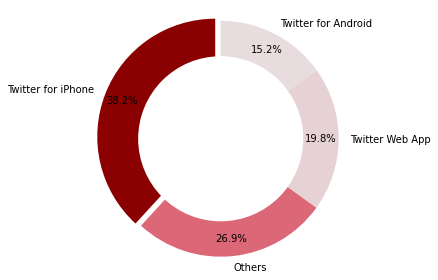

User Location

``` python
# Importing required library
from pyecharts.charts import Bar
from pyecharts import options as opts


# Obtaining x and y axis from Location lists
x_hash,y_hash = zip(*loca)
bar = (
 Bar(init_opts=opts.InitOpts())
 .add_xaxis(x_hash[1:11])
 .add_yaxis("Frequency",y_hash[1:11])
 .set_global_opts(title_opts=opts.TitleOpts(title="Top 10 User Location", subtitle="standardization and removed others"))
)
bar.render_notebook()
```


``` python
plt.xticks(
    rotation=45, 
    horizontalalignment='right',
    fontweight='light',
    fontsize='x-large'  
)

plt.bar(x_hash[1:10], y_hash[1:10])
plt.show()
```
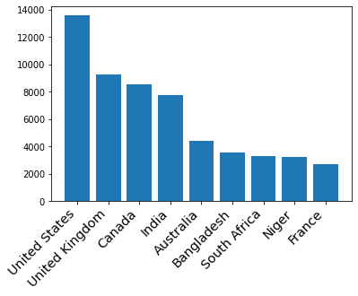


User Verification

``` python
# Plots for verified
x_t,y_t = zip(*verified)

fig1, ax1 = plt.subplots()
explode = (0, 0)
colors = ['#6067e0','#fc0303']
ax1.pie(y_t,labels=x_t, colors = colors, explode = explode, autopct='%1.1f%%',
        shadow=True, startangle=90)
ax1.axis('equal')  # Equal aspect ratio ensures that pie is drawn as a circle.
#draw circle
centre_circle = plt.Circle((0,0),0.70,fc='white')
fig = plt.gcf()
fig.gca().add_artist(centre_circle)

# Equal aspect ratio ensures that pie is drawn as a circle
ax1.axis('equal')  
plt.tight_layout()
plt.show()

plt.show()
```

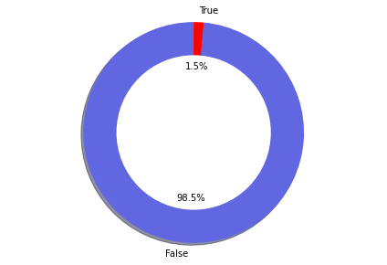


Hashtag (Response Variable)

``` python
# Counting the frequency of each hashtags
x_hash,y_hash = zip(*hashs)
bar = (
 Bar(init_opts=opts.InitOpts())
 .add_xaxis(x_hash[1:11])
 .add_yaxis("Frequency",y_hash[1:11])
 .set_global_opts(title_opts=opts.TitleOpts(title="Top 10 Hashtags in the Tweets"))
)
bar.render_notebook()
```

<script>
    require.config({
        paths: {
            'echarts':'https://assets.pyecharts.org/assets/echarts.min'
        }
    });
</script>

        <div id="8d97781c87bf495ca55aa7e8b30493a5" style="width:900px; height:500px;"></div>

<script>
        require(['echarts'], function(echarts) {
                var chart_8d97781c87bf495ca55aa7e8b30493a5 = echarts.init(
                    document.getElementById('8d97781c87bf495ca55aa7e8b30493a5'), 'white', {renderer: 'canvas'});
                var option_8d97781c87bf495ca55aa7e8b30493a5 = {
    "animation": true,
    "animationThreshold": 2000,
    "animationDuration": 1000,
    "animationEasing": "cubicOut",
    "animationDelay": 0,
    "animationDurationUpdate": 300,
    "animationEasingUpdate": "cubicOut",
    "animationDelayUpdate": 0,
    "color": [
        "#c23531",
        "#2f4554",
        "#61a0a8",
        "#d48265",
        "#749f83",
        "#ca8622",
        "#bda29a",
        "#6e7074",
        "#546570",
        "#c4ccd3",
        "#f05b72",
        "#ef5b9c",
        "#f47920",
        "#905a3d",
        "#fab27b",
        "#2a5caa",
        "#444693",
        "#726930",
        "#b2d235",
        "#6d8346",
        "#ac6767",
        "#1d953f",
        "#6950a1",
        "#918597"
    ],
    "series": [
        {
            "type": "bar",
            "name": "Frequency",
            "legendHoverLink": true,
            "data": [
                171516,
                76007,
                41042,
                33246,
                22127,
                20762,
                18837,
                17877,
                14717,
                12045
            ],
            "showBackground": false,
            "barMinHeight": 0,
            "barCategoryGap": "20%",
            "barGap": "30%",
            "large": false,
            "largeThreshold": 400,
            "seriesLayoutBy": "column",
            "datasetIndex": 0,
            "clip": true,
            "zlevel": 0,
            "z": 2,
            "label": {
                "show": true,
                "position": "top",
                "margin": 8
            }
        }
    ],
    "legend": [
        {
            "data": [
                "Frequency"
            ],
            "selected": {
                "Frequency": true
            },
            "show": true,
            "padding": 5,
            "itemGap": 10,
            "itemWidth": 25,
            "itemHeight": 14
        }
    ],
    "tooltip": {
        "show": true,
        "trigger": "item",
        "triggerOn": "mousemove|click",
        "axisPointer": {
            "type": "line"
        },
        "showContent": true,
        "alwaysShowContent": false,
        "showDelay": 0,
        "hideDelay": 100,
        "textStyle": {
            "fontSize": 14
        },
        "borderWidth": 0,
        "padding": 5
    },
    "xAxis": [
        {
            "show": true,
            "scale": false,
            "nameLocation": "end",
            "nameGap": 15,
            "gridIndex": 0,
            "inverse": false,
            "offset": 0,
            "splitNumber": 5,
            "minInterval": 0,
            "splitLine": {
                "show": false,
                "lineStyle": {
                    "show": true,
                    "width": 1,
                    "opacity": 1,
                    "curveness": 0,
                    "type": "solid"
                }
            },
            "data": [
                "cryptocurrency",
                "etherenum",
                "dogecoin",
                "binanc",
                "nft",
                "blockchain",
                "gift",
                "shop",
                "altcoin",
                "affiliatemarket"
            ]
        }
    ],
    "yAxis": [
        {
            "show": true,
            "scale": false,
            "nameLocation": "end",
            "nameGap": 15,
            "gridIndex": 0,
            "inverse": false,
            "offset": 0,
            "splitNumber": 5,
            "minInterval": 0,
            "splitLine": {
                "show": false,
                "lineStyle": {
                    "show": true,
                    "width": 1,
                    "opacity": 1,
                    "curveness": 0,
                    "type": "solid"
                }
            }
        }
    ],
    "title": [
        {
            "text": "Top 10 Hashtags in the Tweets",
            "padding": 5,
            "itemGap": 10
        }
    ]
};
                chart_8d97781c87bf495ca55aa7e8b30493a5.setOption(option_8d97781c87bf495ca55aa7e8b30493a5);
        });
    </script>


The non-interactive plot when the above interactive plot fail to load

``` python
plt.xticks(
    rotation=45, 
    horizontalalignment='right',
    fontweight='light',
    fontsize='x-large'  
)

plt.bar(x_hash[1:10], y_hash[1:10])
plt.show()
```

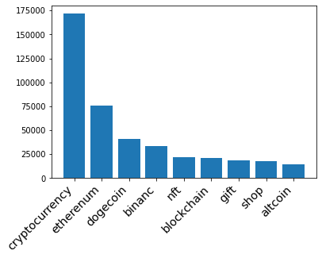


We decides to use four of the most frequent hashtags and \"bitcoin\" as
our five response variables for text classification in supervised
learning. Therefore, the goal is to classify each tweet into one of the
five categories using the trained model in the future sections.

### Numerical Variables

Performing calculation on numerical variables in the dataset, such as
\"Post date\", \"user created date\", \"Number of followers\", and
others. Obtaining the frequency of possible values in the samples.

Number of tweets in recent two years

``` python
date_count = tweets.select("date").rdd.flatMap(lambda row: [(row[0], 1)]).\
    reduceByKey(lambda x,y: x+y).sortBy(lambda x: x[0]).collect()
date_x, date_y = zip(*date_count)
plt.figure(figsize=(15, 5))
plt.plot(date_x, date_y)
plt.title('Total tweets by Date')
plt.xlabel('Date')
plt.ylabel('Number of Tweets')
plt.show()
```

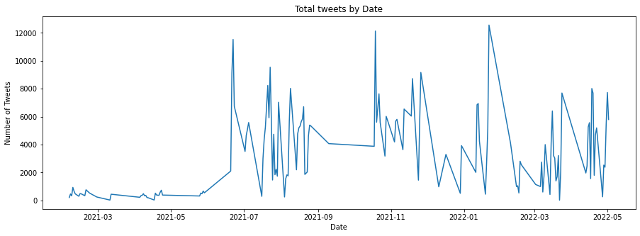


We also performed the time series decomposition on the samples to check
possible seasonal patterns and trends.

``` python
import pandas as pd
from statsmodels.tsa.seasonal import seasonal_decompose
series = pd.DataFrame(date_count)
result = seasonal_decompose(series[1], model='additive', freq=12)
result.plot()
plt.show()
```

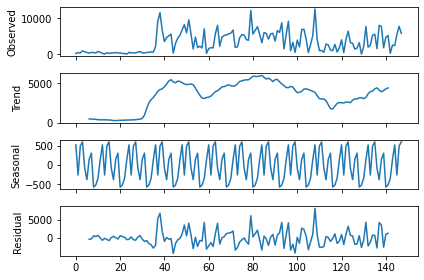

There is an increasing trend at the beginning of the plot with a very
low residual. However, there is no clear pattern after 07/2021.

}
Account Created Date

Applying Log transformation to the number of account.

``` python
from numpy import log as ln
created_count = tweets.select("user_created").rdd.flatMap(lambda row: [(row[0], 1)]).\
reduceByKey(lambda x,y: x+y).sortBy(lambda x: x[0]).collect()
#Convert list of tuple into two lists
date_x, date_y = zip(*created_count )
plt.figure(figsize=(15, 5))
plt.plot(date_x, ln(date_y))
plt.title('Total Account Created by Date')
plt.xlabel('Date')
plt.ylabel('Number of Account')
plt.show()
```

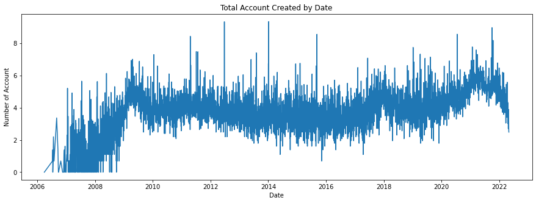

``` python
series = pd.DataFrame(created_count)
result = seasonal_decompose(ln(series[1]), model='additive', freq=12)
result.plot()
plt.show()
```
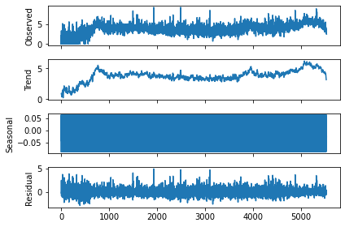

There is no significant evidence in the time series decomposition to
support the existence of a seasonal pattern in the samples.

Number of followers of each tweet user

``` python
#Get the count of number of friends for the accounts
def checker(x):
  if x[0] < 50:
    return ('1',x[1])
  elif x[0] < 100:
    return ('2',x[1])
  elif x[0] < 200:
    return ('3',x[1])
  elif x[0] < 1000:
    return ('4',x[1])
  else:
    return ('5',x[1])
friends = tweets.select("user_friends").rdd.flatMap(lambda row: [(row[0], 1)])\
    .map(lambda x: checker(x)).reduceByKey(lambda x,y: x+y).collect()
#Convert list of tuple into two lists
friends_x, friends_y = zip(*friends)
fig1, ax1 = plt.subplots()
colors = ['#ffbaba','#ff7b7b','#ff5252','#ff0000','#a70000']
ax1.pie(friends_y,labels=['< 50','50-100','100-200','200-1000','>1000'], \
        autopct='%1.1f%%', colors = colors, startangle=90, pctdistance=0.85)

#draw circle
centre_circle = plt.Circle((0,0),0.70,fc='white')
fig = plt.gcf()
fig.gca().add_artist(centre_circle)

# Equal aspect ratio ensures that pie is drawn as a circle
ax1.axis('equal')  

plt.tight_layout()
plt.title('Total number of followers')
plt.show()
```

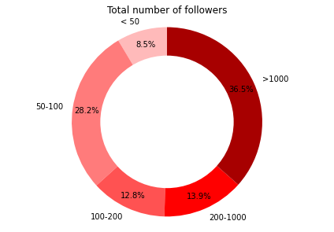

## Data cleaning for text classification

After data analysis, we found that some variables can be cleaned into a
more suitable format for machine learning. For example, the response
variables \"hashtag\" can be eliminated into five categories. And the
variable \"sources\" is a categorical variable with four levels. We
converted it into indicator variables.

``` python
from pyspark.sql.functions import when
from pyspark.sql.functions import monotonically_increasing_id
from pyspark.sql.functions import udf
from pyspark.sql.functions import year,month
from pyspark.sql import functions as F

# Cleaning response variables
tweet_ml = tweets.withColumn('hashtags', when(tweets.hashtags.contains("dog"),'Dogecoin').\
                              when(tweets.hashtags.contains("eth"),'Etherenum').\
                              when(tweets.hashtags.contains("bnb"),"binance").\
                              when(tweets.hashtags.contains("bin"),"binance").\
                              when(tweets.hashtags.contains("crypto"),'Cryptocurrency').\
                              when(tweets.hashtags.contains("btc"),'Bitcoin').\
                              otherwise('other'))

# Assigning unique_id to each row
unique_id = monotonically_increasing_id()
tweet_ml = tweet_ml.select("*").withColumn("id", unique_id)

# Cleaning locations
import pycountry
def get_country(x):
  for country in pycountry.countries:
    if country.name in x:
      return country.name
  return "others"
get_countryudf = udf(lambda z: get_country(z))

#Creating indicator variables for categorical variables data
tweet_ml = tweet_ml.na.drop().withColumn("user_location", get_countryudf("user_location"))\
.withColumn('user_verified', when(tweets.user_verified.contains("True"),1).otherwise(0))\
.withColumn("source_Iphone", when(tweets.source.contains("iPhone"),1).otherwise(0))\
.withColumn("source_Web", when(tweets.source.contains("Web"),1).otherwise(0))\
.withColumn("source_Android", when(tweets.source.contains("Android"),1).otherwise(0))\
.withColumn("post_year",year(tweet_ml.date))\
.withColumn("post_month",month(tweet_ml.date))\
.withColumn("created_year",year(tweet_ml.user_created))\
.withColumn("created_month",month(tweet_ml.user_created)).drop('is_retweet','user_name',"user_created","date","source")
# better visual
tweet_ml.limit(5).toPandas()
```

  <div id="df-eca29686-df36-4fbd-afd5-c88e322b5724">
    <div class="colab-df-container">
      <div>
<style scoped>
    .dataframe tbody tr th:only-of-type {
        vertical-align: middle;
    }

    .dataframe tbody tr th {
        vertical-align: top;
    }

    .dataframe thead th {
        text-align: right;
    }
</style>
<table border="1" class="dataframe">
  <thead>
    <tr style="text-align: right;">
      <th></th>
      <th>user_location</th>
      <th>user_description</th>
      <th>user_followers</th>
      <th>user_friends</th>
      <th>user_favourites</th>
      <th>user_verified</th>
      <th>text</th>
      <th>hashtags</th>
      <th>id</th>
      <th>source_Iphone</th>
      <th>source_Web</th>
      <th>source_Android</th>
      <th>post_year</th>
      <th>post_month</th>
      <th>created_year</th>
      <th>created_month</th>
    </tr>
  </thead>
  <tbody>
    <tr>
      <th>0</th>
      <td>others</td>
      <td>Biz Consultant, real estate, fintech, startups...</td>
      <td>8534</td>
      <td>7605</td>
      <td>4838</td>
      <td>0</td>
      <td>Blue Ridge Bank shares halted by NYSE after #b...</td>
      <td>other</td>
      <td>0</td>
      <td>0</td>
      <td>1</td>
      <td>0</td>
      <td>2021</td>
      <td>2</td>
      <td>2009</td>
      <td>4</td>
    </tr>
    <tr>
      <th>1</th>
      <td>others</td>
      <td>Biz Consultant, real estate, fintech, startups...</td>
      <td>8534</td>
      <td>7605</td>
      <td>4838</td>
      <td>0</td>
      <td>.@Tesla’s #bitcoin investment is revolutionary...</td>
      <td>Cryptocurrency</td>
      <td>1</td>
      <td>0</td>
      <td>1</td>
      <td>0</td>
      <td>2021</td>
      <td>2</td>
      <td>2009</td>
      <td>4</td>
    </tr>
    <tr>
      <th>2</th>
      <td>others</td>
      <td>Persistent. to the extreme... #FREEPALESTINE #...</td>
      <td>1159</td>
      <td>2185</td>
      <td>30852</td>
      <td>0</td>
      <td>Annnd #btc #Bitcoin is headed even higher now....</td>
      <td>Bitcoin</td>
      <td>2</td>
      <td>0</td>
      <td>1</td>
      <td>0</td>
      <td>2021</td>
      <td>2</td>
      <td>2009</td>
      <td>1</td>
    </tr>
    <tr>
      <th>3</th>
      <td>others</td>
      <td>#Bitcoin</td>
      <td>4</td>
      <td>32</td>
      <td>139</td>
      <td>0</td>
      <td>Buy #Bitcoin with 5% LIFETIME cashback on fees...</td>
      <td>Cryptocurrency</td>
      <td>3</td>
      <td>0</td>
      <td>1</td>
      <td>0</td>
      <td>2021</td>
      <td>2</td>
      <td>2010</td>
      <td>7</td>
    </tr>
    <tr>
      <th>4</th>
      <td>others</td>
      <td>Biz Consultant, real estate, fintech, startups...</td>
      <td>8534</td>
      <td>7605</td>
      <td>4838</td>
      <td>0</td>
      <td>#Bitcoin institutional demand accelerates in 2...</td>
      <td>Cryptocurrency</td>
      <td>4</td>
      <td>0</td>
      <td>1</td>
      <td>0</td>
      <td>2021</td>
      <td>2</td>
      <td>2009</td>
      <td>4</td>
    </tr>
    <tr>
      <th>5</th>
      <td>others</td>
      <td>CEO &amp; PRESIDENT SG GROUP</td>
      <td>62</td>
      <td>288</td>
      <td>2656</td>
      <td>0</td>
      <td>#Bitcoin #BTC #ADA #DOT Mastercard Will Let Me...</td>
      <td>other</td>
      <td>5</td>
      <td>1</td>
      <td>0</td>
      <td>0</td>
      <td>2021</td>
      <td>2</td>
      <td>2009</td>
      <td>6</td>
    </tr>
    <tr>
      <th>6</th>
      <td>others</td>
      <td>Biz Consultant, real estate, fintech, startups...</td>
      <td>8534</td>
      <td>7605</td>
      <td>4838</td>
      <td>0</td>
      <td>After @Tesla: @Twitter considers adding #bitco...</td>
      <td>other</td>
      <td>6</td>
      <td>0</td>
      <td>1</td>
      <td>0</td>
      <td>2021</td>
      <td>2</td>
      <td>2009</td>
      <td>4</td>
    </tr>
    <tr>
      <th>7</th>
      <td>Portugal</td>
      <td>#bitcoin Entrepreneur, Master in Communication...</td>
      <td>872</td>
      <td>158</td>
      <td>1080</td>
      <td>0</td>
      <td>#BTC/USD 4H. #Bitcoin consolidating between su...</td>
      <td>other</td>
      <td>7</td>
      <td>0</td>
      <td>0</td>
      <td>0</td>
      <td>2021</td>
      <td>2</td>
      <td>2020</td>
      <td>9</td>
    </tr>
    <tr>
      <th>8</th>
      <td>others</td>
      <td>Biz Consultant, real estate, fintech, startups...</td>
      <td>8534</td>
      <td>7605</td>
      <td>4838</td>
      <td>0</td>
      <td>The @Grayscale #Bitcoin Trust: What it is and ...</td>
      <td>other</td>
      <td>8</td>
      <td>0</td>
      <td>1</td>
      <td>0</td>
      <td>2021</td>
      <td>2</td>
      <td>2009</td>
      <td>4</td>
    </tr>
    <tr>
      <th>9</th>
      <td>others</td>
      <td>One bet every day. Join our team and become pa...</td>
      <td>2019</td>
      <td>104</td>
      <td>71</td>
      <td>0</td>
      <td>We accept #Bitcoin, #BitcoinCash #Litecoin and...</td>
      <td>Dogecoin</td>
      <td>9</td>
      <td>0</td>
      <td>1</td>
      <td>0</td>
      <td>2021</td>
      <td>2</td>
      <td>2014</td>
      <td>12</td>
    </tr>
  </tbody>
</table>
</div>
      <button class="colab-df-convert" onclick="convertToInteractive('df-eca29686-df36-4fbd-afd5-c88e322b5724')"
              title="Convert this dataframe to an interactive table."
              style="display:none;">
        
  <svg xmlns="http://www.w3.org/2000/svg" height="24px"viewBox="0 0 24 24"
       width="24px">
    <path d="M0 0h24v24H0V0z" fill="none"/>
    <path d="M18.56 5.44l.94 2.06.94-2.06 2.06-.94-2.06-.94-.94-2.06-.94 2.06-2.06.94zm-11 1L8.5 8.5l.94-2.06 2.06-.94-2.06-.94L8.5 2.5l-.94 2.06-2.06.94zm10 10l.94 2.06.94-2.06 2.06-.94-2.06-.94-.94-2.06-.94 2.06-2.06.94z"/><path d="M17.41 7.96l-1.37-1.37c-.4-.4-.92-.59-1.43-.59-.52 0-1.04.2-1.43.59L10.3 9.45l-7.72 7.72c-.78.78-.78 2.05 0 2.83L4 21.41c.39.39.9.59 1.41.59.51 0 1.02-.2 1.41-.59l7.78-7.78 2.81-2.81c.8-.78.8-2.07 0-2.86zM5.41 20L4 18.59l7.72-7.72 1.47 1.35L5.41 20z"/>
  </svg>
      </button>
      
  <style>
    .colab-df-container {
      display:flex;
      flex-wrap:wrap;
      gap: 12px;
    }

    .colab-df-convert {
      background-color: #E8F0FE;
      border: none;
      border-radius: 50%;
      cursor: pointer;
      display: none;
      fill: #1967D2;
      height: 32px;
      padding: 0 0 0 0;
      width: 32px;
    }

    .colab-df-convert:hover {
      background-color: #E2EBFA;
      box-shadow: 0px 1px 2px rgba(60, 64, 67, 0.3), 0px 1px 3px 1px rgba(60, 64, 67, 0.15);
      fill: #174EA6;
    }

    [theme=dark] .colab-df-convert {
      background-color: #3B4455;
      fill: #D2E3FC;
    }

    [theme=dark] .colab-df-convert:hover {
      background-color: #434B5C;
      box-shadow: 0px 1px 3px 1px rgba(0, 0, 0, 0.15);
      filter: drop-shadow(0px 1px 2px rgba(0, 0, 0, 0.3));
      fill: #FFFFFF;
    }
  </style>

  <script>
    const buttonEl =
      document.querySelector('#df-eca29686-df36-4fbd-afd5-c88e322b5724 button.colab-df-convert');
    buttonEl.style.display =
      google.colab.kernel.accessAllowed ? 'block' : 'none';

    async function convertToInteractive(key) {
      const element = document.querySelector('#df-eca29686-df36-4fbd-afd5-c88e322b5724');
      const dataTable =
        await google.colab.kernel.invokeFunction('convertToInteractive',
                                                  [key], {});
      if (!dataTable) return;

      const docLinkHtml = 'Like what you see? Visit the ' +
        '<a target="_blank" href=https://colab.research.google.com/notebooks/data_table.ipynb>data table notebook</a>'
        + ' to learn more about interactive tables.';
      element.innerHTML = '';
      dataTable['output_type'] = 'display_data';
      await google.colab.output.renderOutput(dataTable, element);
      const docLink = document.createElement('div');
      docLink.innerHTML = docLinkHtml;
      element.appendChild(docLink);
    }
  </script>
</div>
</div>

## Nature Language Processing on user descriptions and tweets: Tokens

The user descriptions and tweets can be considered natural human
language. They both share some same characteristics: long sentences,
emojis, and containing some unwanted symbols.

To analyze these two variables, we first convert all texts into bags of
words, including stemming, converting to lowercase, and deleting all
possible stopwords.

Then we calculate the Frequency for each words and selected the highest
20 words to be included in our text classification model.

``` python
from CryptoTweets.simple_tokenize import simple_tokenize
from nltk.stem import PorterStemmer
import re
# Top 20 words
n = 20
#Take the text
tweets_text = tweet_ml.select("text")
#Take the user description
tweets_ud = tweet_ml.select("user_description")
# Stemming using Porter Stemmer
st = PorterStemmer()
#stop words
with open('CryptoTweets/CommonEnglishWord.txt') as f:
  lines = f.readlines()
  lst = list(map(lambda x: x[0:len(x)-1].lower(),lines))
  lst.append('')
  lst.append('-')
  lst.append("it's")
  lst.append("going")
  lst.append("it’s")
  lst.append("via")
  lst.append("|")
  lst.append("&")
  lst.append("/")
  lst.append('•')
  lst.append('http')
# Remove emoji since it beyonds the scope of this scope
def deEmojify(text):
    regrex_pattern = re.compile(pattern = "["
        u"\U0001F600-\U0001F64F"  # emoticons
        u"\U0001F300-\U0001F5FF"  # symbols & pictographs
        u"\U0001F680-\U0001F6FF"  # transport & map symbols
        u"\U0001F1E0-\U0001F1FF"  # flags (iOS)
                           "]+", flags = re.UNICODE)
    return regrex_pattern.sub(r'',text)
# Bag of words, stemming, lowercase, stop words
rddtext = tweets_text.rdd.flatMap(lambda x: simple_tokenize(deEmojify(x[0]))).\
  map(lambda x: st.stem(x)).filter(lambda x: x not in lst).filter(lambda x: len(x) > 1).\
  map(lambda x: (x.lower(),1)).reduceByKey(lambda x,y: x+y).sortBy(lambda x: x[1],ascending=False).cache()
```

Then we created variables for each of top 20 words. The value indicate
the Term Frequency of each words in current text. The following table
shows the resulted variables of first ten samples.

``` python
# Calculate the frequency and return the result as tuple
def calcfreq(t):
  wordtup = t[1]
  wordlist = []
  tweet = t[0].lower()
  for i in wordtup:
    wordlist.append(list(i))
  for i in wordlist:
    if i[0] in tweet:
      i[1] += 1
  result = [t[0]]
  for i in wordlist:
    result.append(i[1])
  return tuple(result)

reinit_list = rddtext.map(lambda x: (x[0], 0)).take(n)
most_frequent_tweet = rddtext.take(n)
words, freq = zip(*most_frequent_tweet)
words = list(words)
words.insert(0,'text')
reinit_rdd = tweets_text.rdd.map(lambda x:x[0]).map(lambda x: (x, reinit_list))
calc = reinit_rdd.map(lambda x: calcfreq(x))
table_tweet = calc.toDF(words)
table_tweet.limit(5).toPandas()
```

  <div id="df-7da8d144-8147-406a-bb19-8c320269f662">
    <div class="colab-df-container">
      <div>
<style scoped>
    .dataframe tbody tr th:only-of-type {
        vertical-align: middle;
    }

    .dataframe tbody tr th {
        vertical-align: top;
    }

    .dataframe thead th {
        text-align: right;
    }
</style>
<table border="1" class="dataframe">
  <thead>
    <tr style="text-align: right;">
      <th></th>
      <th>text</th>
      <th>bitcoin</th>
      <th>co</th>
      <th>btc</th>
      <th>crypto</th>
      <th>thi</th>
      <th>cryptocurr</th>
      <th>eth</th>
      <th>ethereum</th>
      <th>price</th>
      <th>...</th>
      <th>binanc</th>
      <th>blockchain</th>
      <th>dogecoin</th>
      <th>ha</th>
      <th>gift</th>
      <th>amp</th>
      <th>wa</th>
      <th>invest</th>
      <th>altcoin</th>
      <th>doge</th>
    </tr>
  </thead>
  <tbody>
    <tr>
      <th>0</th>
      <td>Blue Ridge Bank shares halted by NYSE after #b...</td>
      <td>1</td>
      <td>1</td>
      <td>0</td>
      <td>0</td>
      <td>0</td>
      <td>0</td>
      <td>0</td>
      <td>0</td>
      <td>0</td>
      <td>...</td>
      <td>0</td>
      <td>0</td>
      <td>0</td>
      <td>1</td>
      <td>0</td>
      <td>0</td>
      <td>0</td>
      <td>0</td>
      <td>0</td>
      <td>0</td>
    </tr>
    <tr>
      <th>1</th>
      <td>.@Tesla’s #bitcoin investment is revolutionary...</td>
      <td>1</td>
      <td>1</td>
      <td>0</td>
      <td>1</td>
      <td>0</td>
      <td>0</td>
      <td>0</td>
      <td>0</td>
      <td>0</td>
      <td>...</td>
      <td>0</td>
      <td>0</td>
      <td>0</td>
      <td>0</td>
      <td>0</td>
      <td>0</td>
      <td>0</td>
      <td>1</td>
      <td>0</td>
      <td>0</td>
    </tr>
    <tr>
      <th>2</th>
      <td>Annnd #btc #Bitcoin is headed even higher now....</td>
      <td>1</td>
      <td>1</td>
      <td>1</td>
      <td>0</td>
      <td>0</td>
      <td>0</td>
      <td>0</td>
      <td>0</td>
      <td>0</td>
      <td>...</td>
      <td>0</td>
      <td>0</td>
      <td>0</td>
      <td>1</td>
      <td>0</td>
      <td>0</td>
      <td>0</td>
      <td>0</td>
      <td>0</td>
      <td>0</td>
    </tr>
    <tr>
      <th>3</th>
      <td>Buy #Bitcoin with 5% LIFETIME cashback on fees...</td>
      <td>1</td>
      <td>1</td>
      <td>0</td>
      <td>1</td>
      <td>0</td>
      <td>1</td>
      <td>0</td>
      <td>0</td>
      <td>0</td>
      <td>...</td>
      <td>0</td>
      <td>0</td>
      <td>0</td>
      <td>1</td>
      <td>0</td>
      <td>0</td>
      <td>0</td>
      <td>0</td>
      <td>0</td>
      <td>0</td>
    </tr>
    <tr>
      <th>4</th>
      <td>#Bitcoin institutional demand accelerates in 2...</td>
      <td>1</td>
      <td>1</td>
      <td>1</td>
      <td>1</td>
      <td>0</td>
      <td>1</td>
      <td>0</td>
      <td>0</td>
      <td>0</td>
      <td>...</td>
      <td>0</td>
      <td>0</td>
      <td>0</td>
      <td>0</td>
      <td>0</td>
      <td>0</td>
      <td>1</td>
      <td>0</td>
      <td>0</td>
      <td>0</td>
    </tr>
  </tbody>
</table>
<p>5 rows × 21 columns</p>
</div>
      <button class="colab-df-convert" onclick="convertToInteractive('df-7da8d144-8147-406a-bb19-8c320269f662')"
              title="Convert this dataframe to an interactive table."
              style="display:none;">
        
  <svg xmlns="http://www.w3.org/2000/svg" height="24px"viewBox="0 0 24 24"
       width="24px">
    <path d="M0 0h24v24H0V0z" fill="none"/>
    <path d="M18.56 5.44l.94 2.06.94-2.06 2.06-.94-2.06-.94-.94-2.06-.94 2.06-2.06.94zm-11 1L8.5 8.5l.94-2.06 2.06-.94-2.06-.94L8.5 2.5l-.94 2.06-2.06.94zm10 10l.94 2.06.94-2.06 2.06-.94-2.06-.94-.94-2.06-.94 2.06-2.06.94z"/><path d="M17.41 7.96l-1.37-1.37c-.4-.4-.92-.59-1.43-.59-.52 0-1.04.2-1.43.59L10.3 9.45l-7.72 7.72c-.78.78-.78 2.05 0 2.83L4 21.41c.39.39.9.59 1.41.59.51 0 1.02-.2 1.41-.59l7.78-7.78 2.81-2.81c.8-.78.8-2.07 0-2.86zM5.41 20L4 18.59l7.72-7.72 1.47 1.35L5.41 20z"/>
  </svg>
      </button>
      
  <style>
    .colab-df-container {
      display:flex;
      flex-wrap:wrap;
      gap: 12px;
    }

    .colab-df-convert {
      background-color: #E8F0FE;
      border: none;
      border-radius: 50%;
      cursor: pointer;
      display: none;
      fill: #1967D2;
      height: 32px;
      padding: 0 0 0 0;
      width: 32px;
    }

    .colab-df-convert:hover {
      background-color: #E2EBFA;
      box-shadow: 0px 1px 2px rgba(60, 64, 67, 0.3), 0px 1px 3px 1px rgba(60, 64, 67, 0.15);
      fill: #174EA6;
    }

    [theme=dark] .colab-df-convert {
      background-color: #3B4455;
      fill: #D2E3FC;
    }

    [theme=dark] .colab-df-convert:hover {
      background-color: #434B5C;
      box-shadow: 0px 1px 3px 1px rgba(0, 0, 0, 0.15);
      filter: drop-shadow(0px 1px 2px rgba(0, 0, 0, 0.3));
      fill: #FFFFFF;
    }
  </style>

  <script>
    const buttonEl =
      document.querySelector('#df-7da8d144-8147-406a-bb19-8c320269f662 button.colab-df-convert');
    buttonEl.style.display =
      google.colab.kernel.accessAllowed ? 'block' : 'none';

    async function convertToInteractive(key) {
      const element = document.querySelector('#df-7da8d144-8147-406a-bb19-8c320269f662');
      const dataTable =
        await google.colab.kernel.invokeFunction('convertToInteractive',
                                                  [key], {});
      if (!dataTable) return;

      const docLinkHtml = 'Like what you see? Visit the ' +
        '<a target="_blank" href=https://colab.research.google.com/notebooks/data_table.ipynb>data table notebook</a>'
        + ' to learn more about interactive tables.';
      element.innerHTML = '';
      dataTable['output_type'] = 'display_data';
      await google.colab.output.renderOutput(dataTable, element);
      const docLink = document.createElement('div');
      docLink.innerHTML = docLinkHtml;
      element.appendChild(docLink);
    }
  </script>
</div>
</div>

The follow plot shows the frequency distribution of top 20 words

``` python
x_t,y_t = zip(*most_frequent_tweet)
bar = (
 Bar(init_opts=opts.InitOpts())
 .add_xaxis(x_t)
 .add_yaxis("Frequency",y_t)
 .set_global_opts(title_opts=opts.TitleOpts(title="Top 20 words in the Tweets"))
)
bar.render_notebook()
```

<script>
    require.config({
        paths: {
            'echarts':'https://assets.pyecharts.org/assets/echarts.min'
        }
    });
</script>

        <div id="0c81b88fcab84b0ebc1683a83d5ca866" style="width:900px; height:500px;"></div>

<script>
        require(['echarts'], function(echarts) {
                var chart_0c81b88fcab84b0ebc1683a83d5ca866 = echarts.init(
                    document.getElementById('0c81b88fcab84b0ebc1683a83d5ca866'), 'white', {renderer: 'canvas'});
                var option_0c81b88fcab84b0ebc1683a83d5ca866 = {
    "animation": true,
    "animationThreshold": 2000,
    "animationDuration": 1000,
    "animationEasing": "cubicOut",
    "animationDelay": 0,
    "animationDurationUpdate": 300,
    "animationEasingUpdate": "cubicOut",
    "animationDelayUpdate": 0,
    "color": [
        "#c23531",
        "#2f4554",
        "#61a0a8",
        "#d48265",
        "#749f83",
        "#ca8622",
        "#bda29a",
        "#6e7074",
        "#546570",
        "#c4ccd3",
        "#f05b72",
        "#ef5b9c",
        "#f47920",
        "#905a3d",
        "#fab27b",
        "#2a5caa",
        "#444693",
        "#726930",
        "#b2d235",
        "#6d8346",
        "#ac6767",
        "#1d953f",
        "#6950a1",
        "#918597"
    ],
    "series": [
        {
            "type": "bar",
            "name": "Frequency",
            "legendHoverLink": true,
            "data": [
                442749,
                326597,
                228976,
                104846,
                71983,
                68579,
                44451,
                36081,
                33958,
                28528,
                26239,
                25499,
                22375,
                20703,
                19922,
                18472,
                18026,
                17181,
                16820,
                16101
            ],
            "showBackground": false,
            "barMinHeight": 0,
            "barCategoryGap": "20%",
            "barGap": "30%",
            "large": false,
            "largeThreshold": 400,
            "seriesLayoutBy": "column",
            "datasetIndex": 0,
            "clip": true,
            "zlevel": 0,
            "z": 2,
            "label": {
                "show": true,
                "position": "top",
                "margin": 8
            }
        }
    ],
    "legend": [
        {
            "data": [
                "Frequency"
            ],
            "selected": {
                "Frequency": true
            },
            "show": true,
            "padding": 5,
            "itemGap": 10,
            "itemWidth": 25,
            "itemHeight": 14
        }
    ],
    "tooltip": {
        "show": true,
        "trigger": "item",
        "triggerOn": "mousemove|click",
        "axisPointer": {
            "type": "line"
        },
        "showContent": true,
        "alwaysShowContent": false,
        "showDelay": 0,
        "hideDelay": 100,
        "textStyle": {
            "fontSize": 14
        },
        "borderWidth": 0,
        "padding": 5
    },
    "xAxis": [
        {
            "show": true,
            "scale": false,
            "nameLocation": "end",
            "nameGap": 15,
            "gridIndex": 0,
            "inverse": false,
            "offset": 0,
            "splitNumber": 5,
            "minInterval": 0,
            "splitLine": {
                "show": false,
                "lineStyle": {
                    "show": true,
                    "width": 1,
                    "opacity": 1,
                    "curveness": 0,
                    "type": "solid"
                }
            },
            "data": [
                "bitcoin",
                "co",
                "btc",
                "crypto",
                "thi",
                "cryptocurr",
                "eth",
                "ethereum",
                "price",
                "nft",
                "binanc",
                "blockchain",
                "dogecoin",
                "ha",
                "gift",
                "amp",
                "wa",
                "invest",
                "altcoin",
                "doge"
            ]
        }
    ],
    "yAxis": [
        {
            "show": true,
            "scale": false,
            "nameLocation": "end",
            "nameGap": 15,
            "gridIndex": 0,
            "inverse": false,
            "offset": 0,
            "splitNumber": 5,
            "minInterval": 0,
            "splitLine": {
                "show": false,
                "lineStyle": {
                    "show": true,
                    "width": 1,
                    "opacity": 1,
                    "curveness": 0,
                    "type": "solid"
                }
            }
        }
    ],
    "title": [
        {
            "text": "Top 20 words in the Tweets",
            "padding": 5,
            "itemGap": 10
        }
    ]
};
                chart_0c81b88fcab84b0ebc1683a83d5ca866.setOption(option_0c81b88fcab84b0ebc1683a83d5ca866);
        });
    </script>

The non-interactive plot when the above interactive plot fail to load

``` python
plt.xticks(
    rotation=45, 
    horizontalalignment='right',
    fontweight='light',
    fontsize='x-large'  
)
plt.bar(x_t, y_t)
plt.show()
```

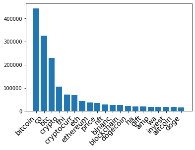

``` python
table_tweet = table_tweet.select("*").withColumn("idtweet", unique_id)
tweet_ml = tweet_ml.join(table_tweet,tweet_ml.id == table_tweet.idtweet,'inner').drop('text','_1','idtweet')
```

Similiar preparation and variable creations for variable \"user
description\"

``` python
udrdd = tweets_ud.rdd.flatMap(lambda x: simple_tokenize(deEmojify(x[0]))).\
  map(lambda x: st.stem(x)).filter(lambda x: x not in lst).filter(lambda x: len(x) > 1).\
  map(lambda x: (x.lower(),1)).reduceByKey(lambda x,y: x+y).sortBy(lambda x: x[1],ascending=False).cache()
reinit_udlist = udrdd.map(lambda x: (x[0],0)).take(n)
most_frequent_ud = udrdd.take(n)
words, freq = zip(*most_frequent_ud)
words = list(words)
words.insert(0,'text')
reinit_udrdd = tweets_ud.rdd.map(lambda x:x[0]).map(lambda x: (x, reinit_udlist))
calcud = reinit_udrdd.map(lambda x: calcfreq(x))
table_ud = calcud.toDF(words)
table_ud = table_ud.select("*").withColumn("idud", unique_id)
table_ud = table_ud.select([F.col(c).alias("ud"+c) for c in table_ud.columns])
tweet_ml = tweet_ml.join(table_ud,tweet_ml.id == table_ud.udidud,'inner').drop('udtext','ud_1','udidud').cache()
```

``` python
x_t,y_t = zip(*most_frequent_ud)
bar = (
 Bar(init_opts=opts.InitOpts())
 .add_xaxis(x_t)
 .add_yaxis("Frequency",y_t)
 .set_global_opts(title_opts=opts.TitleOpts(title="Top 20 words in the User Descriptions"))
)
bar.render_notebook()
```

<script>
    require.config({
        paths: {
            'echarts':'https://assets.pyecharts.org/assets/echarts.min'
        }
    });
</script>

        <div id="381439a01c6c488787d31b7bed284317" style="width:900px; height:500px;"></div>

<script>
        require(['echarts'], function(echarts) {
                var chart_381439a01c6c488787d31b7bed284317 = echarts.init(
                    document.getElementById('381439a01c6c488787d31b7bed284317'), 'white', {renderer: 'canvas'});
                var option_381439a01c6c488787d31b7bed284317 = {
    "animation": true,
    "animationThreshold": 2000,
    "animationDuration": 1000,
    "animationEasing": "cubicOut",
    "animationDelay": 0,
    "animationDurationUpdate": 300,
    "animationEasingUpdate": "cubicOut",
    "animationDelayUpdate": 0,
    "color": [
        "#c23531",
        "#2f4554",
        "#61a0a8",
        "#d48265",
        "#749f83",
        "#ca8622",
        "#bda29a",
        "#6e7074",
        "#546570",
        "#c4ccd3",
        "#f05b72",
        "#ef5b9c",
        "#f47920",
        "#905a3d",
        "#fab27b",
        "#2a5caa",
        "#444693",
        "#726930",
        "#b2d235",
        "#6d8346",
        "#ac6767",
        "#1d953f",
        "#6950a1",
        "#918597"
    ],
    "series": [
        {
            "type": "bar",
            "name": "Frequency",
            "legendHoverLink": true,
            "data": [
                210136,
                129333,
                78451,
                59091,
                58586,
                50059,
                43675,
                42968,
                34820,
                32164,
                31355,
                27193,
                24923,
                24729,
                21688,
                21052,
                20221,
                19947,
                18904,
                17492
            ],
            "showBackground": false,
            "barMinHeight": 0,
            "barCategoryGap": "20%",
            "barGap": "30%",
            "large": false,
            "largeThreshold": 400,
            "seriesLayoutBy": "column",
            "datasetIndex": 0,
            "clip": true,
            "zlevel": 0,
            "z": 2,
            "label": {
                "show": true,
                "position": "top",
                "margin": 8
            }
        }
    ],
    "legend": [
        {
            "data": [
                "Frequency"
            ],
            "selected": {
                "Frequency": true
            },
            "show": true,
            "padding": 5,
            "itemGap": 10,
            "itemWidth": 25,
            "itemHeight": 14
        }
    ],
    "tooltip": {
        "show": true,
        "trigger": "item",
        "triggerOn": "mousemove|click",
        "axisPointer": {
            "type": "line"
        },
        "showContent": true,
        "alwaysShowContent": false,
        "showDelay": 0,
        "hideDelay": 100,
        "textStyle": {
            "fontSize": 14
        },
        "borderWidth": 0,
        "padding": 5
    },
    "xAxis": [
        {
            "show": true,
            "scale": false,
            "nameLocation": "end",
            "nameGap": 15,
            "gridIndex": 0,
            "inverse": false,
            "offset": 0,
            "splitNumber": 5,
            "minInterval": 0,
            "splitLine": {
                "show": false,
                "lineStyle": {
                    "show": true,
                    "width": 1,
                    "opacity": 1,
                    "curveness": 0,
                    "type": "solid"
                }
            },
            "data": [
                "bitcoin",
                "crypto",
                "co",
                "btc",
                "cryptocurr",
                "blockchain",
                "financi",
                "news",
                "eth",
                "advic",
                "investor",
                "trader",
                "tweet",
                "nft",
                "busi",
                "ethereum",
                "enthusiast",
                "invest",
                "latest",
                "doge"
            ]
        }
    ],
    "yAxis": [
        {
            "show": true,
            "scale": false,
            "nameLocation": "end",
            "nameGap": 15,
            "gridIndex": 0,
            "inverse": false,
            "offset": 0,
            "splitNumber": 5,
            "minInterval": 0,
            "splitLine": {
                "show": false,
                "lineStyle": {
                    "show": true,
                    "width": 1,
                    "opacity": 1,
                    "curveness": 0,
                    "type": "solid"
                }
            }
        }
    ],
    "title": [
        {
            "text": "Top 20 words in the User Descriptions",
            "padding": 5,
            "itemGap": 10
        }
    ]
};
                chart_381439a01c6c488787d31b7bed284317.setOption(option_381439a01c6c488787d31b7bed284317);
        });
    </script>

The non-interactive plot when the above interactive plot fail to load

``` python
plt.xticks(
    rotation=45, 
    horizontalalignment='right',
    fontweight='light',
    fontsize='x-large'  
)
plt.bar(x_t, y_t)
plt.show()
```

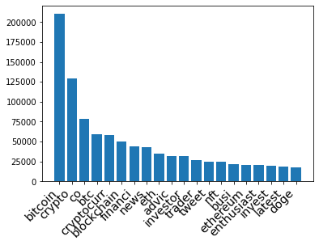

Here are the first five samples of the dataset after applying natural
language processing to tweets and user descriptions.

We can also calculate the TF-IDF to vectorize the top 20 words in each
sample. Compare to frequency, TF-IDF has the advantage by assigning a
larger weight to words that appear less in the documents. It can be a
future improvement.

``` python
tweet_ml = tweet_ml.drop('user_description')
tweet_ml.limit(5).toPandas()
```

  <div id="df-44c66e86-0d6f-4729-9cc9-b9d507066ebe">
    <div class="colab-df-container">
      <div>
<style scoped>
    .dataframe tbody tr th:only-of-type {
        vertical-align: middle;
    }

    .dataframe tbody tr th {
        vertical-align: top;
    }

    .dataframe thead th {
        text-align: right;
    }
</style>
<table border="1" class="dataframe">
  <thead>
    <tr style="text-align: right;">
      <th></th>
      <th>user_location</th>
      <th>user_followers</th>
      <th>user_friends</th>
      <th>user_favourites</th>
      <th>user_verified</th>
      <th>hashtags</th>
      <th>id</th>
      <th>source_Iphone</th>
      <th>source_Web</th>
      <th>source_Android</th>
      <th>...</th>
      <th>udinvestor</th>
      <th>udtrader</th>
      <th>udtweet</th>
      <th>udnft</th>
      <th>udbusi</th>
      <th>udethereum</th>
      <th>udenthusiast</th>
      <th>udinvest</th>
      <th>udlatest</th>
      <th>uddoge</th>
    </tr>
  </thead>
  <tbody>
    <tr>
      <th>0</th>
      <td>others</td>
      <td>8</td>
      <td>0</td>
      <td>49</td>
      <td>0</td>
      <td>Dogecoin</td>
      <td>26</td>
      <td>1</td>
      <td>0</td>
      <td>0</td>
      <td>...</td>
      <td>0</td>
      <td>0</td>
      <td>1</td>
      <td>0</td>
      <td>0</td>
      <td>0</td>
      <td>0</td>
      <td>0</td>
      <td>0</td>
      <td>0</td>
    </tr>
    <tr>
      <th>1</th>
      <td>others</td>
      <td>94</td>
      <td>189</td>
      <td>753</td>
      <td>0</td>
      <td>other</td>
      <td>29</td>
      <td>1</td>
      <td>0</td>
      <td>0</td>
      <td>...</td>
      <td>0</td>
      <td>0</td>
      <td>0</td>
      <td>0</td>
      <td>0</td>
      <td>0</td>
      <td>0</td>
      <td>0</td>
      <td>0</td>
      <td>1</td>
    </tr>
    <tr>
      <th>2</th>
      <td>others</td>
      <td>5366</td>
      <td>927</td>
      <td>34484</td>
      <td>0</td>
      <td>other</td>
      <td>474</td>
      <td>1</td>
      <td>0</td>
      <td>0</td>
      <td>...</td>
      <td>1</td>
      <td>1</td>
      <td>0</td>
      <td>0</td>
      <td>0</td>
      <td>0</td>
      <td>0</td>
      <td>1</td>
      <td>0</td>
      <td>0</td>
    </tr>
    <tr>
      <th>3</th>
      <td>United States</td>
      <td>68</td>
      <td>84</td>
      <td>427</td>
      <td>0</td>
      <td>other</td>
      <td>964</td>
      <td>1</td>
      <td>0</td>
      <td>0</td>
      <td>...</td>
      <td>0</td>
      <td>0</td>
      <td>0</td>
      <td>0</td>
      <td>0</td>
      <td>0</td>
      <td>0</td>
      <td>0</td>
      <td>0</td>
      <td>0</td>
    </tr>
    <tr>
      <th>4</th>
      <td>others</td>
      <td>275</td>
      <td>789</td>
      <td>3654</td>
      <td>0</td>
      <td>other</td>
      <td>1677</td>
      <td>1</td>
      <td>0</td>
      <td>0</td>
      <td>...</td>
      <td>0</td>
      <td>0</td>
      <td>0</td>
      <td>0</td>
      <td>0</td>
      <td>0</td>
      <td>0</td>
      <td>0</td>
      <td>0</td>
      <td>0</td>
    </tr>
  </tbody>
</table>
<p>5 rows × 54 columns</p>
</div>
      <button class="colab-df-convert" onclick="convertToInteractive('df-44c66e86-0d6f-4729-9cc9-b9d507066ebe')"
              title="Convert this dataframe to an interactive table."
              style="display:none;">
        
  <svg xmlns="http://www.w3.org/2000/svg" height="24px"viewBox="0 0 24 24"
       width="24px">
    <path d="M0 0h24v24H0V0z" fill="none"/>
    <path d="M18.56 5.44l.94 2.06.94-2.06 2.06-.94-2.06-.94-.94-2.06-.94 2.06-2.06.94zm-11 1L8.5 8.5l.94-2.06 2.06-.94-2.06-.94L8.5 2.5l-.94 2.06-2.06.94zm10 10l.94 2.06.94-2.06 2.06-.94-2.06-.94-.94-2.06-.94 2.06-2.06.94z"/><path d="M17.41 7.96l-1.37-1.37c-.4-.4-.92-.59-1.43-.59-.52 0-1.04.2-1.43.59L10.3 9.45l-7.72 7.72c-.78.78-.78 2.05 0 2.83L4 21.41c.39.39.9.59 1.41.59.51 0 1.02-.2 1.41-.59l7.78-7.78 2.81-2.81c.8-.78.8-2.07 0-2.86zM5.41 20L4 18.59l7.72-7.72 1.47 1.35L5.41 20z"/>
  </svg>
      </button>
      
  <style>
    .colab-df-container {
      display:flex;
      flex-wrap:wrap;
      gap: 12px;
    }

    .colab-df-convert {
      background-color: #E8F0FE;
      border: none;
      border-radius: 50%;
      cursor: pointer;
      display: none;
      fill: #1967D2;
      height: 32px;
      padding: 0 0 0 0;
      width: 32px;
    }

    .colab-df-convert:hover {
      background-color: #E2EBFA;
      box-shadow: 0px 1px 2px rgba(60, 64, 67, 0.3), 0px 1px 3px 1px rgba(60, 64, 67, 0.15);
      fill: #174EA6;
    }

    [theme=dark] .colab-df-convert {
      background-color: #3B4455;
      fill: #D2E3FC;
    }

    [theme=dark] .colab-df-convert:hover {
      background-color: #434B5C;
      box-shadow: 0px 1px 3px 1px rgba(0, 0, 0, 0.15);
      filter: drop-shadow(0px 1px 2px rgba(0, 0, 0, 0.3));
      fill: #FFFFFF;
    }
  </style>
  <script>
    const buttonEl =
      document.querySelector('#df-44c66e86-0d6f-4729-9cc9-b9d507066ebe button.colab-df-convert');
    buttonEl.style.display =
      google.colab.kernel.accessAllowed ? 'block' : 'none';

    async function convertToInteractive(key) {
      const element = document.querySelector('#df-44c66e86-0d6f-4729-9cc9-b9d507066ebe');
      const dataTable =
        await google.colab.kernel.invokeFunction('convertToInteractive',
                                                [key], {});
      if (!dataTable) return;

      const docLinkHtml = 'Like what you see? Visit the ' +
        '<a target="_blank" href=https://colab.research.google.com/notebooks/data_table.ipynb>data table notebook</a>'
        + ' to learn more about interactive tables.';
      element.innerHTML = '';
      dataTable['output_type'] = 'display_data';
      await google.colab.output.renderOutput(dataTable, element);
      const docLink = document.createElement('div');
      docLink.innerHTML = docLinkHtml;
      element.appendChild(docLink);
    }
  </script>
</div>
</div>


## Training, Testing, and Validation Dataset

Since not all samples belong to these five response variables (hashtags
= \'other\' in above table), we decided to use these un-classified
samples as our testing dataset to demonstrate the outcome of our
training model in future sections.

``` python
tweet_train = tweet_ml.filter(~tweet_ml.hashtags.contains('other')).cache()
tweet_test = tweet_ml.filter(tweet_ml.hashtags.contains('other')).cache()
```

Here is the final distribution of the response variables in the training
set in text classifications.

``` python
hashtag_ml =hashtags(tweet_train).collect()
# Cleaned Hashtag
x_hash = []
y_hash = []
for i in hashtag_ml:
  x_hash.append(i[0])
  y_hash.append(i[1])

plt.xticks(
    rotation=45, 
    horizontalalignment='right',
    fontweight='light',
    fontsize='x-large'  
)

plt.bar(x_hash[1:10], y_hash[1:10])
plt.show()
```

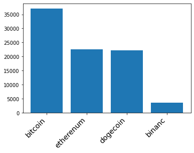

Then spliting training dataset into training data and validation data
(80% and 20%) to test the performance of the training model.

#### Multinomial Regression Model

Setting up the Pyspark Machine Learning environments. Removing user
locations since it has too many levels which leads to extremely high
computational cost.

``` python
from pyspark.ml.classification import LogisticRegression
from pyspark.ml.feature import VectorAssembler
from pyspark.ml.feature import StringIndexer

# Y-variables
stringIndexer = StringIndexer(inputCol="hashtags", outputCol="label")
model = stringIndexer.fit(tweet_train)
td = model.transform(tweet_train)

# X-variables
assembler = VectorAssembler(outputCol= "features")\
.setInputCols(tweet_train.drop('hashtags','id','user_location').columns)

# Setting up Multinomial Logistic Regression
lr = LogisticRegression(maxIter=10,family="multinomial")
assembler_df = assembler.transform(td)
train, validation = assembler_df.randomSplit([0.8,0.2],2022)
```

Fitted a Multinomial Logestic Regression model using training data

``` python
lrModel = lr.fit(train)
```

Tuning the model and checking the performance using validation data

``` python
predictions = lrModel.transform(validation)
accuracy = predictions.filter(predictions.label == predictions.prediction).count()/float(predictions.count())
print("The accuracy of prediction in Validation Data",accuracy)
```

```
The accuracy of prediction in Validation Data 0.6524463640869503
```


#### Random Forest

Using the training set to train a Random Forest with 100 total trees,
and number of sqrt(col) variables to choose in each trees.


``` python
from pyspark.ml.classification import RandomForestClassifier
rf = RandomForestClassifier(featuresCol = 'features', labelCol = 'label',numTrees=100)
rfModel = rf.fit(train)
```


Checking the performance using validation data


``` python
predictions = rfModel.transform(validation)
accuracy = predictions.filter(predictions.label == predictions.prediction).count()/float(predictions.count())
print("The accuracy of prediction in Validation Data",accuracy)
```


    The accuracy of prediction in Validation Data 0.8449691991786448


#### Neural Network with Keras API

Converting to Pandas Dataframe for better compatibility with Keras
Packages. And creating dummy variables for response variables
\"hashtags\" since the neural network requires int variables for
calculation.


``` python
train_df = tweet_train.drop('id').toPandas()
response = train_df.pop('hashtags')
train_df = train_df.drop(columns= 'user_location')
response = pd.get_dummies(response)
```


Setting up the Keras environments and a neural network model with two
hidden layers, have 128 and 256 node. Setting up the Relu activation
functions for non-linearity, and softmax output function for multi-class
classification.


``` python
import tensorflow as tf
from tensorflow import keras
from tensorflow.keras import layers

inputs = keras.Input(shape=(51,))
x = layers.Dense(128, activation="relu", name="dense_1")(inputs)
x = layers.Dense(256, activation="relu", name="dense_2")(x)
outputs = layers.Dense(5, activation="softmax", name="classification")(x)

model = keras.Model(inputs=inputs, outputs=outputs)
model.summary()
```


    Model: "model_1"
    _________________________________________________________________
     Layer (type)                Output Shape              Param #   
    =================================================================
     input_2 (InputLayer)        [(None, 51)]              0         
                                                                     
     dense_1 (Dense)             (None, 128)               6656      
                                                                     
     dense_2 (Dense)             (None, 256)               33024     
                                                                     
     classification (Dense)      (None, 5)                 1285      
                                                                     
    =================================================================
    Total params: 40,965
    Trainable params: 40,965
    Non-trainable params: 0
    _________________________________________________________________


The above shows the structures of our final model. And fitting it with
training data and tunning it with validation splits


``` python
model.compile(optimizer='adam',
              loss='categorical_crossentropy',
              metrics = 'accuracy')
checkpoint_filepath = '/tmp/checkpoint'
model_checkpoint_callback = tf.keras.callbacks.ModelCheckpoint(
    filepath=checkpoint_filepath,
    save_weights_only=True,
    monitor='loss',
    mode='max',
    save_best_only=True)
model.fit(train_df, response, batch_size=32, epochs=20, validation_split=0.2, callbacks=[model_checkpoint_callback])
```


    Epoch 1/20
    3548/3548 [==============================] - 14s 4ms/step - loss: 116.8460 - accuracy: 0.4272 - val_loss: 21.8834 - val_accuracy: 0.4696
    Epoch 2/20
    3548/3548 [==============================] - 11s 3ms/step - loss: 11.9903 - accuracy: 0.4798 - val_loss: 1.3669 - val_accuracy: 0.4488
    Epoch 3/20
    3548/3548 [==============================] - 11s 3ms/step - loss: 1.2508 - accuracy: 0.4696 - val_loss: 1.6729 - val_accuracy: 0.4723
    Epoch 4/20
    3548/3548 [==============================] - 11s 3ms/step - loss: 1.0349 - accuracy: 0.5547 - val_loss: 0.8407 - val_accuracy: 0.6537
    Epoch 5/20
    3548/3548 [==============================] - 13s 4ms/step - loss: 0.7887 - accuracy: 0.6968 - val_loss: 0.7531 - val_accuracy: 0.7269
    Epoch 6/20
    3548/3548 [==============================] - 11s 3ms/step - loss: 0.7540 - accuracy: 0.7144 - val_loss: 0.8589 - val_accuracy: 0.6768
    Epoch 7/20
    3548/3548 [==============================] - 11s 3ms/step - loss: 0.7876 - accuracy: 0.7020 - val_loss: 0.7817 - val_accuracy: 0.6801
    Epoch 8/20
    3548/3548 [==============================] - 11s 3ms/step - loss: 0.7321 - accuracy: 0.7294 - val_loss: 0.6161 - val_accuracy: 0.7643
    Epoch 9/20
    3548/3548 [==============================] - 11s 3ms/step - loss: 0.9909 - accuracy: 0.6766 - val_loss: 0.9638 - val_accuracy: 0.6175
    Epoch 10/20
    3548/3548 [==============================] - 10s 3ms/step - loss: 0.8489 - accuracy: 0.6843 - val_loss: 0.7968 - val_accuracy: 0.6997
    Epoch 11/20
    3548/3548 [==============================] - 10s 3ms/step - loss: 0.8047 - accuracy: 0.7123 - val_loss: 0.8172 - val_accuracy: 0.6729
    Epoch 12/20
    3548/3548 [==============================] - 11s 3ms/step - loss: 0.7652 - accuracy: 0.7191 - val_loss: 1.0272 - val_accuracy: 0.5862
    Epoch 13/20
    3548/3548 [==============================] - 11s 3ms/step - loss: 0.8149 - accuracy: 0.6901 - val_loss: 0.6500 - val_accuracy: 0.7623
    Epoch 14/20
    3548/3548 [==============================] - 11s 3ms/step - loss: 0.8350 - accuracy: 0.6905 - val_loss: 0.9390 - val_accuracy: 0.6809
    Epoch 15/20
    3548/3548 [==============================] - 11s 3ms/step - loss: 0.7641 - accuracy: 0.7348 - val_loss: 0.6914 - val_accuracy: 0.7622
    Epoch 16/20
    3548/3548 [==============================] - 10s 3ms/step - loss: 0.7264 - accuracy: 0.7385 - val_loss: 0.6975 - val_accuracy: 0.7328
    Epoch 17/20
    3548/3548 [==============================] - 10s 3ms/step - loss: 0.7544 - accuracy: 0.7320 - val_loss: 0.9025 - val_accuracy: 0.7154
    Epoch 18/20
    3548/3548 [==============================] - 11s 3ms/step - loss: 0.7749 - accuracy: 0.7043 - val_loss: 0.6575 - val_accuracy: 0.7617
    Epoch 19/20
    3548/3548 [==============================] - 11s 3ms/step - loss: 0.7928 - accuracy: 0.7032 - val_loss: 0.9805 - val_accuracy: 0.6677
    Epoch 20/20
    3548/3548 [==============================] - 10s 3ms/step - loss: 0.6914 - accuracy: 0.7542 - val_loss: 0.6055 - val_accuracy: 0.7811


    <keras.callbacks.History at 0x7f1ebf43ec10>


The above plot demonstrates the training process of the neural network
model in each iteration. To avoid overfitting, we need to use the model
with the lowest validated loss (val_loss) in the above result. This
model is stored in memory by checkpoint functions and is callable for
future usage.


#### Prediction

We will use the testing dataset to demonstrate the outcome of three
trained models and how auto-hashtaging system works in incoming tweets.

Logestic Regression


``` python
from pyspark.ml.feature import IndexToString
test = assembler.transform(tweet_test)
test_prediction = lrModel.transform(test)
backtoshash = IndexToString(inputCol="prediction", outputCol="hashes",labels=['Cryptocurrency','Bitcoin','Dogecoin','Etherenum','binance'])
test_prediction = backtoshash.transform(test_prediction)
test_prediction.select('id','probability').show(10,False) 
```


    +----+------------------------------------------------------------------------------------------------------+
    |id  |probability                                                                                           |
    +----+------------------------------------------------------------------------------------------------------+
    |29  |[0.3077313892095184,0.371686180208301,0.16157765845611455,0.15900331096889617,1.4611571697825333E-6]  |
    |474 |[0.33327388585249207,0.3741639190318949,0.1714864279527474,0.12107430591892694,1.4612439387007495E-6] |
    |964 |[0.3913783911510319,0.3027252404883092,0.17921642595022608,0.1266785265102223,1.4159002104801821E-6]  |
    |1677|[0.33295682110539726,0.3273996767104981,0.16134718703164241,0.17829488835432508,1.4267981371979524E-6]|
    |1950|[0.3600914851863604,0.24751148870741563,0.15465675775777693,0.23773885594117347,1.4124072734451633E-6]|
    |2040|[0.42485527012649427,0.26050835049863025,0.16349387679216867,0.1511411729427666,1.3296399402649282E-6]|
    |2214|[0.4419353500007448,0.2527123390106577,0.16882974288092872,0.13652119501290258,1.3730947663475665E-6] |
    |2453|[0.4589381243296783,0.14606804491493697,0.2937284738352546,0.10126408940553218,1.2675145980027649E-6] |
    |2509|[0.3321477952505388,0.37096013204945966,0.16393197503583595,0.13295870829424924,1.389369916457664E-6] |
    |2529|[0.3048276563348717,0.23617205430574892,0.2686116148297133,0.19038718971765053,1.484812015595407E-6]  |
    +----+------------------------------------------------------------------------------------------------------+
    only showing top 10 rows


The hashtags with the highest probabilities will be the classified
categories for the corresponding samples (optimal Bayes)


``` python
test_prediction.select('id','hashes').show(10,False) 
```


    +----+--------------+
    |id  |hashes        |
    +----+--------------+
    |29  |Bitcoin       |
    |474 |Bitcoin       |
    |964 |Cryptocurrency|
    |1677|Cryptocurrency|
    |1950|Cryptocurrency|
    |2040|Cryptocurrency|
    |2214|Cryptocurrency|
    |2453|Cryptocurrency|
    |2509|Bitcoin       |
    |2529|Cryptocurrency|
    +----+--------------+
    only showing top 10 rows


Random Forest Similiar for Random Forest model and Neural Network Model


``` python
test_prediction = rfModel.transform(test)
backtoshash = IndexToString(inputCol="prediction", outputCol="hashes",labels=['Cryptocurrency','Bitcoin','Dogecoin','Etherenum','binance'])
test_prediction = backtoshash.transform(test_prediction)
test_prediction.select('id','probability').show(10,False) 

test_prediction.select('id','hashes').show(10,False) 
```


    +----+-----------------------------------------------------------------------------------------------------+
    |id  |probability                                                                                          |
    +----+-----------------------------------------------------------------------------------------------------+
    |29  |[0.11408553240964694,0.7291978857094307,0.06664959177602166,0.055024281883508205,0.03504270822139252]|
    |474 |[0.1652564305753442,0.6331858397395639,0.08087177629844432,0.037126306578410845,0.08355964680823667] |
    |964 |[0.3305776828116616,0.36432798930213495,0.14284028703120938,0.06453066609337645,0.0977233747616177]  |
    |1677|[0.31612928358927095,0.4227445340598757,0.11989082364177438,0.05751233645147351,0.08372302225760536] |
    |1950|[0.08574619059640502,0.16340390330095428,0.03166511566726569,0.7003261461305691,0.01885864430480592] |
    |2040|[0.5943068155443776,0.2726191016966887,0.07905983918076226,0.03180926486801036,0.022204978710161125] |
    |2214|[0.6667520715299391,0.1644187178079488,0.10068119920639075,0.033609698746054184,0.03453831270966719] |
    |2453|[0.4000689206511194,0.02974922008303281,0.5285874094943018,0.028858445070719826,0.012736004700826165]|
    |2509|[0.1381026785114682,0.739044371954166,0.06888786575378644,0.027324394280704465,0.026640689499874904] |
    |2529|[0.19059071422634632,0.15944406647246737,0.554794414228412,0.05290261631835627,0.042268188754417985] |
    +----+-----------------------------------------------------------------------------------------------------+
    only showing top 10 rows

    +----+--------------+
    |id  |hashes        |
    +----+--------------+
    |29  |Bitcoin       |
    |474 |Bitcoin       |
    |964 |Bitcoin       |
    |1677|Bitcoin       |
    |1950|Etherenum     |
    |2040|Cryptocurrency|
    |2214|Cryptocurrency|
    |2453|Dogecoin      |
    |2509|Bitcoin       |
    |2529|Dogecoin      |
    +----+--------------+
    only showing top 10 rows


Neural Network


``` python
test_df = tweet_test.drop('id').toPandas()
response = test_df.pop('hashtags')
test_df = test_df.drop(columns= 'user_location')
model.load_weights(checkpoint_filepath)
prediction = model.predict(test_df)
prediction[:10]
```


    array([[2.35893115e-01, 3.70337307e-01, 8.22583735e-02, 3.05431724e-01,
            6.07949682e-03],
           [1.47559753e-04, 9.99817193e-01, 1.51092713e-12, 3.53277137e-05,
            2.90755020e-22],
           [3.74551356e-01, 2.91717589e-01, 1.80127278e-01, 1.19809344e-01,
            3.37944217e-02],
           [8.34352300e-02, 4.13003623e-01, 1.82284534e-01, 2.89828300e-01,
            3.14484239e-02],
           [3.59519780e-01, 4.05398160e-01, 1.29304364e-01, 1.38947032e-02,
            9.18831453e-02],
           [0.00000000e+00, 9.99999642e-01, 0.00000000e+00, 4.06629681e-07,
            0.00000000e+00],
           [9.14618373e-02, 5.94880283e-01, 1.25181660e-01, 1.41764238e-01,
            4.67120372e-02],
           [3.66317110e-09, 9.95616674e-01, 1.36035316e-08, 2.10694573e-03,
            2.27643130e-03],
           [5.13970926e-02, 3.42191756e-01, 3.40411484e-01, 9.60622579e-02,
            1.69937387e-01],
           [1.38813183e-01, 2.94758379e-01, 1.67302951e-01, 3.93695772e-01,
            5.42974332e-03]], dtype=float32)


``` python
import numpy as np
label = ['Bitcoin','Cryptocurrency','Dogecoin','Etherenum','binance']
hashtags = []
for prob in prediction:
  index_max = np.argmax(prob)
  hashtags.append(label[index_max])
hashtags[:10]
```


    ['Cryptocurrency',
     'Cryptocurrency',
     'Bitcoin',
     'Cryptocurrency',
     'Cryptocurrency',
     'Cryptocurrency',
     'Cryptocurrency',
     'Cryptocurrency',
     'Cryptocurrency',
     'Etherenum']


#### Conclusion and Possible Improvement

This project demonstrates data analysis of tweets and related
information under Pyspark environments. And performing a simple text
classification using three popular supervised learning models: logistic
regression, Random Forest, and ANN. The Random forest model achieves 84%
accuracy in the hashtag classification of the validation dataset.
Therefore, the prediction can be an important metrics for an automatic
tagging system for new tweets.

There are alterative choices of machine learning models for text
classification in this project. For exmaple, the vectorized version of
the neural network, support vector machine, KNN, and others. Some of
models might have a better performance than the above models. These can
be a possible improvement of this project in future developments.

Also, [Twitter API](https://developer.twitter.com/en/docs/twitter-api)
provides more possibilities for data mining, such as but not limited to
streaming, recent search, and particular user search. Therefore, the
Kaggle dataset in this project can be replace with other sources to
improve the performance.

